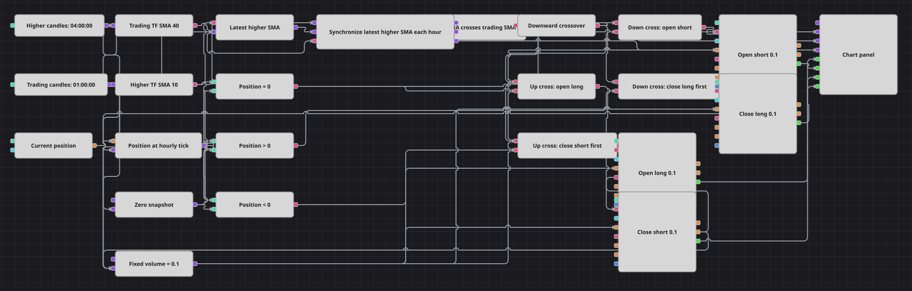

# 跨时间周期移动平均线交叉策略图
[English](README.md) | [Русский](README_ru.md) | [Español](README_es.md) | [Deutsch](README_de.md) | [Português](README_pt.md) | [日本語](README_ja.md)

该图表将已完成四小时K线上的10周期简单移动平均线与已完成一小时K线上的40周期简单移动平均线组合使用。两项设置都代表名义上的40小时回看区间。图表保存最近一个已形成的高周期均线值，并在每根已完成的基础周期K线上将其与当前基础均线配对；交叉方向和当前持仓决定固定0.1数量的市价操作，其中包括在平仓完全成交后执行的两阶段反转。图表显示一小时K线、两条同步均线以及四路成交数据。

## 策略概览

- 已完成四小时K线输入Higher SMA 10，已完成一小时K线输入Base SMA 40并驱动决策周期。使用默认设置时，两条均线都覆盖名义上的40小时：10 × 4小时与40 × 1小时。
- 最近一个已形成的Higher SMA值会被保存。每根一小时K线完成时，图表刷新该保存值和当前Base SMA，随后由间隔为一小时、以基础周期K线为锚点的Sync方块一起输出对齐后的数值。
- 单个Crossing方块在Higher SMA向上穿越Base SMA时输出`true`，向下穿越时输出`false`。NOT方块把向下事件转换为做空路径所需的正触发信号。
- 当前持仓把每次交叉分为无持仓、持有多仓和持有空头仓位三种情况。无持仓时按信号方向开仓0.1；持仓方向已经一致时不执行操作；持仓方向相反时进入分阶段反转。
- 分阶段反转首先提交数量0.1的ReduceOnly市价操作。只有平仓Order完全成交后，才会触发新方向上数量0.1的固定NoCondition市价操作。该顺序按图表以相同Order Volume建立的持仓设计；若实际持仓数量不同，最终敞口可能无法达到目标。图表没有止损或止盈方块。

## 入场与出场规则

- **做多入场**: Crossing输出向上事件时，无持仓分支提交Order Volume 0.1的NoCondition市价买入。若持有空头仓位，则先提交数量0.1的ReduceOnly市价买入；只有该Order完全成交后才触发第二笔数量0.1的NoCondition买入。已有多仓保持不变。
- **做空入场**: Crossing输出向下事件时，NOT激活做空路径。无持仓分支提交Order Volume 0.1的NoCondition市价卖出。若持有多仓，则先提交数量0.1的ReduceOnly市价卖出；只有该Order完全成交后才触发第二笔数量0.1的NoCondition卖出。已有空头仓位保持不变。
- **离场**: 图表没有独立的离场、止损或止盈规则。满足条件的反向交叉会执行固定数量的先平后开顺序。第一步ReduceOnly不能增加或反转敞口，但随后的NoCondition操作不会按外部持仓重新调整数量；若实际持仓数量与Order Volume不同，则无法保证最终达到目标持仓数量。

## 参数

| 参数 | 默认值 | 说明 |
|---|---|---|
| Higher Candles Series | 04:00:00 | Higher SMA使用的四小时K线序列。只有已完成K线才会更新保存的高周期均线。 |
| Base Candles Series | 01:00:00 | Base SMA使用的一小时K线序列。每根已完成K线为一次同步评估提供锚点，并显示在图表上。 |
| Higher SMA Length | 10 | 四小时K线简单移动平均线的周期。十根K线代表名义上的40小时回看区间。 |
| Higher SMA Source | unset | 保持未设置，因此Higher SMA读取每根已完成四小时K线的Close价格。 |
| Base SMA Length | 40 | 一小时K线简单移动平均线的周期。四十根K线代表同样的名义40小时回看区间。 |
| Base SMA Source | unset | 保持未设置，因此Base SMA读取每根已完成一小时K线的Close价格。 |
| Order Volume | 0.1 | 用于空仓入场、ReduceOnly平仓操作以及成交确认后反转第二步的固定数量。 |

## 图表详情

- 两个[K线](https://doc.stocksharp.com/zh/topics/designer/strategies/using_visual_designer/elements/data_sources/candles.html)方块仅输出已完成的四小时与一小时K线。两个独立且仅输出已形成值的[指标](https://doc.stocksharp.com/zh/topics/designer/strategies/using_visual_designer/elements/common/indicator.html)方块按Close价格计算SimpleMovingAverage 10和SimpleMovingAverage 40。
- [变量](https://doc.stocksharp.com/zh/topics/designer/strategies/using_visual_designer/elements/data_sources/variable.html)方块保存最近一个已形成的Higher SMA值。每根已完成基础周期K线先刷新该值和Base SMA，再进入[Sync](https://doc.stocksharp.com/zh/topics/designer/strategies/using_visual_designer/elements/common/sync.html)；其Interval为`01:00:00`，启用ClearSockets，K线输入提供每小时锚点。
- 同步后的数值输出进入一个[交叉](https://doc.stocksharp.com/zh/topics/designer/strategies/using_visual_designer/elements/common/crossing.html)方块。向上的`true`事件驱动做多路径，NOT[逻辑条件](https://doc.stocksharp.com/zh/topics/designer/strategies/using_visual_designer/elements/common/logical_condition.html)把向下的`false`事件转换为正的做空触发信号。
- 当前[持仓](https://doc.stocksharp.com/zh/topics/designer/strategies/using_visual_designer/elements/positions/current.html)在同一个基础K线处理周期内刷新。[比较](https://doc.stocksharp.com/zh/topics/designer/strategies/using_visual_designer/elements/common/comparison.html)方块区分`Position = 0`、`Position > 0`和`Position < 0`，因此方向已经一致的持仓不会再次入场。
- 出现向上事件时，经过外部无持仓筛选的路径调用设置为NoCondition的买入[修改持仓](https://doc.stocksharp.com/zh/topics/designer/strategies/using_visual_designer/elements/positions/modify.html)方块。空头路径先调用ReduceOnly买入方块；只有平仓单完全成交后才输出Order，并触发固定的NoCondition买入。
- 向下路径与此对称：经过外部无持仓筛选的路径用NoCondition开空，多仓先通过卖出操作减少，完全成交后的Order再触发固定的NoCondition卖出。四个操作均使用MarketOrder和Order Volume 0.1。没有止损、止盈或定时离场方块。
- [图表面板](https://doc.stocksharp.com/zh/topics/designer/strategies/using_visual_designer/elements/common/chart.html)接收已完成一小时K线、同步后的Higher SMA和Base SMA数值，以及开多、开空、平空和平多操作的MyTrade输出。

## 使用方法

将 `.json` 文件导入 Designer，在回测器中用历史数据运行，然后根据自己的交易品种调整参数或方块，确认无误后再用于实盘。
