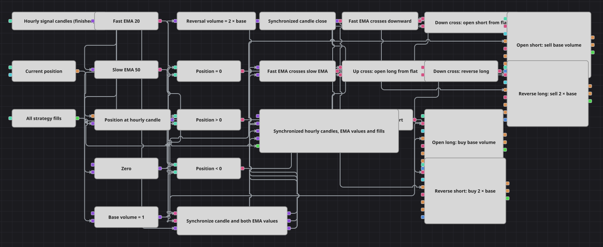

# 同期移動平均クロス・ストラテジー図
[English](README.md) | [Русский](README_ru.md) | [中文](README_zh.md) | [Español](README_es.md) | [Deutsch](README_de.md) | [Português](README_pt.md)

このダイアグラムは、時間足と高速・低速の指数移動平均の確定値を同期してから交差を判定します。最初のシグナルでは1単位を建て、以後の反対シグナルでは基準数量の2倍を使うため、ポジションを増やさずに反転できます。

## 戦略の概要

- 同じ確定1時間足系列を EMA(20) と EMA(50) の両方へ入力し、2本の平均の価格基準をそろえます。
- Sync ブロックはローソク足、高速 EMA、低速 EMA を1時間のグループにまとめ、不完全なグループでは交差を判定しません。
- 高速 EMA が低速 EMA を上抜けると Crossing は `true`、下抜けると `false` を出力し、NOT ブロックが後者をショートトリガーへ変換します。
- ポジション符号の確認により、ゼロからは基準数量で新規建てし、反対側からは基準数量の2倍で反転します。
- チャートには同期済みローソク足、同期済みの2つの EMA 値、ストラテジーの全約定が入力されます。

## エントリーとエグジットの条件

- **ロングエントリー**: 同期済み EMA(20) が EMA(50) を上抜けると、ゼロからは基準数量を1つ、ショートからは基準数量を2つ買い、基準数量1つのロングを残します。
- **ショートエントリー**: 同期済み EMA(20) が EMA(50) を下抜けると、ゼロからは基準数量を1つ、ロングからは基準数量を2つ売り、基準数量1つのショートを残します。
- **エグジット**: 独立したストップ、目標、時間決済はありません。次の反対交差による成行反転が現在の1単位を閉じ、新しい方向へ1単位を建てます。

## パラメーター

| パラメーター | 既定値 | 説明 |
|---|---|---|
| Fast EMA Length | 20 | 高速な指数移動平均の期間です。 |
| Slow EMA Length | 50 | 低速な指数移動平均の期間です。 |
| Candles | 01:00:00 | 両方の平均が使用する確定ローソク足の時間枠です。 |
| Sync interval | 01:00:00 | Sync がローソク足と2つの指標値をまとめる時間範囲です。 |
| Base volume | 1 | ゼロから建てる数量で、反転時は自動的にこの2倍を使います。 |

## ダイアグラムの詳細

- ローソク足出力は最初にポジションのスナップショット、ゼロ定数、数量定数を更新し、次に EMA(20) と EMA(50) を計算します。最後の接続が Sync の第3入力へ入り、両方の計算後に時間グループを完成させます。
- Sync Input 1 は EMA(20)、Input 2 は EMA(50)、Input 3 はローソク足を受け取ります。3組の出力はすべて接続され、完全なグループを出力するたびに内容を消去します。
- Sync Output 1 と Output 2 は Crossing Input Up と Input Down へ入ります。Output 3 は ClosePrice コンバーターを通り、チャートのローソク足系列にも供給されます。
- 4本の論理経路が、2方向の交差についてゼロ、ロング、ショートの状態を区別します。同方向のシグナルで既存ポジションを増やすことはありません。
- 4つの Modify position ブロックが成行注文を送ります。2つの新規建ては基準数量を使い、2つの反転は `2 × 基準数量` の式を使います。
- すべての新規ポジションが基準数量で始まるため、反転数量は `abs(position) + 基準数量` と等しく、エクスポージャーの絶対値を維持します。

## 使い方

`.json` ファイルを Designer に読み込み、バックテスターで過去データを使って実行し、実運用の前にパラメーターやブロック自体を自分の銘柄に合わせて調整してください。
