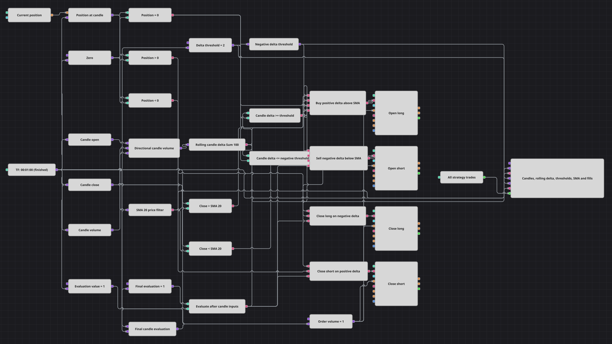

# Diagrama da estratégia de rompimento por delta acumulado
[English](README.md) | [Русский](README_ru.md) | [中文](README_zh.md) | [Español](README_es.md) | [Deutsch](README_de.md) | [日本語](README_ja.md)

O diagrama constrói um delta de volume direcional com velas concluídas de um minuto. O Sum(100) móvel fornece a medida de rompimento, a SMA(20) filtra entradas e o limiar oposto do delta encerra a posição aberta.

## Visão geral da estratégia

- Cada vela concluída é separada em valores Open, Close e TotalVolume.
- Velas de alta e sem variação contribuem com volume positivo, enquanto velas de baixa contribuem com volume negativo.
- Sum(100) agrega os cem valores mais recentes de volume direcional, e SMA(20) acompanha os fechamentos; ambos os indicadores emitem apenas valores formados.
- As verificações de posição permitem entrada apenas quando ela está zerada e encaminham um evento de delta oposto para a saída redutora adequada.
- As quatro ações são operações a mercado de uma unidade, e Strategy trades envia cada execução ao gráfico.

## Regras de entrada e saída

- **Entrada comprada**: Quando o delta móvel é pelo menos +2, Close está acima da SMA(20) e a posição está zerada, comprar uma unidade a mercado.
- **Entrada vendida**: Quando o delta móvel é no máximo -2, Close está abaixo da SMA(20) e a posição está zerada, vender uma unidade a mercado.
- **Saída**: Reduzir uma posição comprada em uma unidade quando o delta chega a -2 ou menos, e reduzir uma posição vendida em uma unidade quando chega a +2 ou mais. Os bloqueios de saída não usam a SMA. O diagrama não tem stop-loss nem take-profit.

## Parâmetros

| Parâmetro | Padrão | Descrição |
|---|---|---|
| Candles Series | 00:01:00 | Velas concluídas de um minuto usadas em todos os cálculos e decisões. |
| Delta Sum Length | 100 | Quantidade de valores de volume direcional mantidos pelo indicador Sum móvel. |
| Delta Sum Source | Not set | Nenhum campo alternativo de entrada do indicador está selecionado; a fórmula de volume direcional está ligada diretamente. |
| SMA Length | 20 | Quantidade de fechamentos na média móvel que filtra as entradas. |
| SMA Source | Not set | Nenhum campo alternativo de entrada do indicador está selecionado; Candle close está ligado diretamente. |
| Delta Threshold | 2 | Nível absoluto do delta usado como +2 para eventos de alta e -2 para eventos de baixa. |
| Order Volume | 1 | Volume fixo a mercado para entradas e saídas redutoras. |

## Detalhes do diagrama

- A fórmula de volume direcional é positiva quando Close é maior ou igual a Open, portanto um doji contribui com +TotalVolume; o sinal só muda quando Close fica abaixo de Open.
- O delta é uma soma móvel de cem velas: depois de preencher a janela, cada valor novo substitui o mais antigo.
- Os limiares positivo e negativo vêm de um único valor exposto, e uma fórmula aplica o sinal negativo ao ramo de baixa.
- O pulso final de avaliação chega às quatro portas AND depois da atualização dos campos da vela, indicadores, comparações e retrato da posição.
- Não há período de espera por quantidade de velas. Os bloqueios de posição zerada, comprada e vendida impedem acréscimos e selecionam a ação válida para cada vela.
- O gráfico recebe seis fluxos: velas, delta móvel, limiar positivo, limiar negativo, SMA(20) e todas as execuções de entrada e saída.

## Uso

Importe o arquivo `.json` no Designer, execute-o sobre dados históricos no backtester e depois ajuste os parâmetros ou os próprios blocos ao seu instrumento antes de operar ao vivo.
