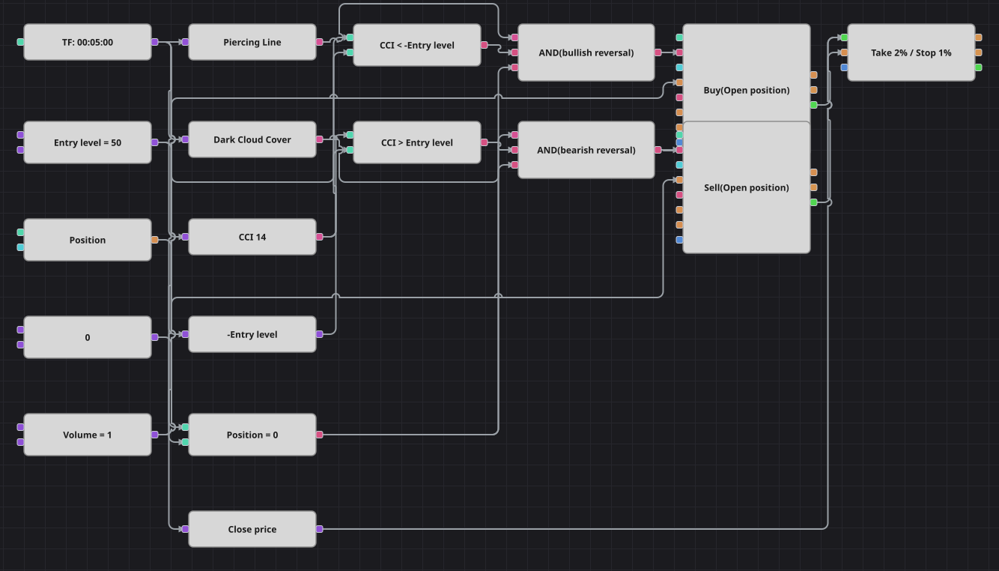

# Diagrama da estratégia Dark Cloud Cover / Piercing Line com CCI
[English](README.md) | [Русский](README_ru.md) | [中文](README_zh.md) | [Español](README_es.md) | [Deutsch](README_de.md) | [日本語](README_ja.md)

Dois padrões clássicos de reversão de dois candles escolhem o lado, e o Commodity Channel Index decide se a reversão vale a pena. Uma Piercing Line só é comprada enquanto o CCI está fundo no território negativo; um Dark Cloud Cover só é vendido enquanto o CCI está esticado para cima. Nenhum sinal encerra a operação: quem faz isso são o take profit e o stop loss colocados na entrada.

## Visão geral da estratégia

- Dois blocos de indicador de padrões de candles carregam expressões escritas à mão que descrevem a figura: a direção do candle anterior, a do atual, onde ele abriu e se fechou além do meio do corpo anterior.
- O Commodity Channel Index de catorze candles funciona como confirmação: o mercado já precisa estar esticado na direção que o padrão reverte, caso contrário a figura é ignorada.
- Uma única constante de nível de entrada atende os dois lados, porque uma fórmula inverte o seu sinal para a comparação de compra.
- Só se entra estando zerado, de modo que um padrão repetido no candle seguinte não dobra a operação.

## Regras de entrada e saída

- **Entrada comprada**: O candle anterior é de baixa, o atual é de alta, abriu abaixo do fechamento anterior e fechou acima do meio do corpo anterior, o CCI está abaixo do nível de entrada negativo e a posição está zerada. A ordem compra um lote a mercado.
- **Entrada vendida**: O candle anterior é de alta, o atual é de baixa, abriu acima do fechamento anterior e fechou abaixo do meio do corpo anterior, o CCI está acima do nível de entrada e a posição está zerada. A ordem vende um lote a mercado.
- **Saída**: Apenas o bloco de proteção da posição: take profit a dois por cento do preço de entrada e stop loss a um por cento. A estratégia original também não tem saída por sinal, portanto nada se perde aqui.

## Parâmetros

| Parâmetro | Padrão | Descrição |
|---|---|---|
| CCI Length | 14 | Período de suavização do Commodity Channel Index. |
| Entry Level | 50 | Quanto o CCI precisa se afastar do zero para o padrão ser confirmado; o lado comprado usa esse número com sinal negativo. |
| Take Profit % | 2 | Distância do take profit em relação ao preço de entrada, em porcentagem. |
| Stop Loss % | 1 | Distância do stop loss em relação ao preço de entrada, em porcentagem. |
| Volume | 1 | Volume da ordem, em lotes. |
| Candles | 00:05:00 | Tempo gráfico dos candles com que todo o diagrama trabalha. |

## Detalhes do diagrama

- O bloco de candles alimenta os dois blocos de padrões, o Commodity Channel Index e o conversor que entrega o preço de fechamento ao bloco de proteção.
- Uma constante guarda o nível de entrada e uma fórmula inverte o seu sinal, de modo que um único número otimizável comanda as duas comparações do CCI.
- Cada E lógico une um padrão, a sua confirmação pelo CCI e a checagem de posição zerada, e aciona um bloco de modificação de posição no modo somente abertura.
- Duas coisas do original foram simplificadas: lá também se exige um gap verdadeiro além da mínima ou da máxima do candle anterior, o que um instrumento negociado continuamente praticamente nunca mostra, e uma pausa de seis candles entre operações, para a qual não existe bloco contador. Por isso aqui basta que a abertura fique do outro lado do fechamento anterior, e todo padrão confirmado é negociado.

## Uso

Importe o arquivo `.json` no Designer, execute-o sobre dados históricos no backtester e depois ajuste os parâmetros ou os próprios blocos ao seu instrumento antes de operar ao vivo.
