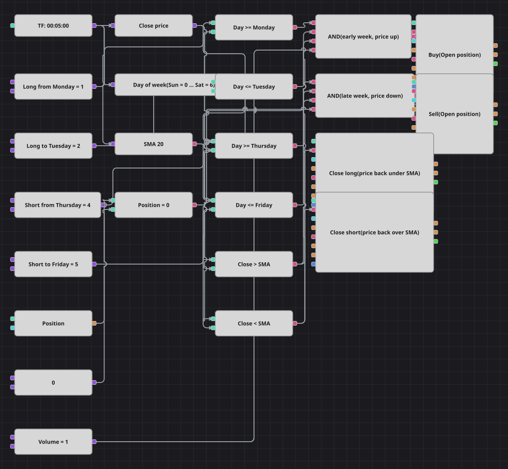

# 曜日アノマリー戦略のダイアグラム
[English](README.md) | [Русский](README_ru.md) | [中文](README_zh.md) | [Español](README_es.md) | [Deutsch](README_de.md) | [Português](README_pt.md)

方向はカレンダーが、タイミングは移動平均が決めます。週の前半は買いだけ、週の後半は売りだけが許され、どちらの場合も終値が単純移動平均の対応する側に来るのを待ってから動きます。曜日はローソク足から直接読み取るため、足をまたいで状態を保持する必要はありません。

## 戦略の概要

- 変換ブロックがローソク足の開始時刻から曜日を数値として取り出します。日曜が0、土曜が6です。
- カレンダーの窓はそれぞれ2つの比較で作られます。ロングは月曜から火曜、ショートは木曜から金曜で、境界はパラメーターとして公開されているため窓をずらしたり広げたりできます。
- 終値の単純移動平均が方向を確認します。カレンダーだけでポジションを建てることはありません。
- 現在のポジションが両方のエントリーに関与するため、すでに持っている建玉に積み増すことはありません。

## エントリーとエグジットの条件

- **ロングエントリー**: ローソク足が週前半の窓に入り、その終値が単純移動平均より上で、かつポジションがゼロのとき。注文は共通数量を成行で買います。
- **ショートエントリー**: ローソク足が週後半の窓に入り、その終値が単純移動平均より下で、かつポジションがゼロのとき。注文は共通数量を成行で売ります。
- **エグジット**: 平均線の下へ引け直せば買い建てを、上へ引け直せば売り建てを閉じます。どちらもクローズモードのポジション変更ブロックです。ポジションがゼロのときクローズブロックは何もしないため、追加のブロックなしで元の戦略のクロス判定を再現できます。元の戦略には足をまたいで保持できないカウンターが2つあり、いずれも外しました。1つは売買ごとの300本の休止、もう1つは同じ曜日での2度目のエントリーを禁じる規則です。これらがないため、同じ窓の中で価格が平均線の正しい側へ戻ればすぐ再エントリーし、元の戦略よりかなり多く売買します。

## パラメーター

| パラメーター | 既定値 | 説明 |
|---|---|---|
| MA Period | 20 | 方向を確認し手仕舞いも担う単純移動平均の期間。 |
| Long day from | 1 | ロングの窓の最初の曜日を数値で。日曜が0で、1は月曜です。 |
| Long day to | 2 | ロングの窓の最後の曜日。2は火曜です。 |
| Short day from | 4 | ショートの窓の最初の曜日。4は木曜です。 |
| Short day to | 5 | ショートの窓の最後の曜日。5は金曜です。 |
| Volume | 1 | 注文数量（ロット）。 |
| Candles | 00:05:00 | ダイアグラム全体が用いるローソク足の時間軸。 |

## ダイアグラムの詳細

- ローソク足ブロックが移動平均と、終値用と開始時刻の曜日用の2つの変換ブロックに値を渡します。
- 4つの比較が曜日を2つのカレンダーの窓の内か外かに振り分け、さらに2つが終値を平均線のどちら側かに置きます。
- それぞれの論理積が窓の両端、平均線に対する位置、ノーポジション判定を束ね、エントリーブロックを起動します。
- 2つのクローズブロックは平均線との比較に直結し、建玉クローズ条件を持つため、それぞれ自分の側だけを手仕舞います。

## 使い方

`.json` ファイルを Designer に読み込み、バックテスターで過去データを使って実行し、実運用の前にパラメーターやブロック自体を自分の銘柄に合わせて調整してください。
