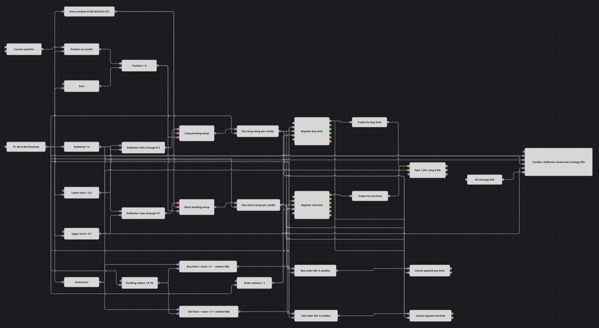

# Diagrama de ordens pendentes com DeMarker
[English](README.md) | [Русский](README_ru.md) | [中文](README_zh.md) | [Español](README_es.md) | [Deutsch](README_de.md) | [日本語](README_ja.md)

Este diagrama transforma cruzamentos dos níveis do DeMarker em ordens limitadas de retração, em vez de entrar imediatamente. Cada ordem pendente dura quatro candles, e a proteção percentual de ganho e perda só é ligada depois que a ordem realmente negocia.

## Visão geral da estratégia

- Candles finalizados de quinze minutos alimentam um oscilador DeMarker de comprimento 14 e um fluxo de preços de fechamento.
- Os níveis inferior e superior são 0,3 e 0,7; os blocos de cruzamento detectam uma queda através do nível inferior e uma alta através do superior.
- As entradas são aceitas somente das 07:00:00 às 20:59:59 pelo horário do candle e apenas quando a posição está zerada.
- Uma nova configuração substitui qualquer entrada pendente anterior, e uma ordem não executada também expira após quatro candles finalizados seguintes.
- O gráfico mostra os candles, o oscilador, os dois níveis e todas as execuções da estratégia.

## Regras de entrada e saída

- **Entrada comprada**: Quando o DeMarker cai através de 0,3 dentro da janela de entrada e a posição está zerada, registra-se uma compra limitada um percentual de afastamento abaixo do fechamento atual.
- **Entrada vendida**: Quando o DeMarker sobe através de 0,7 dentro da janela de entrada e a posição está zerada, registra-se uma venda limitada um percentual de afastamento acima do fechamento atual.
- **Saída**: Um limite não executado é cancelado quando outra configuração o substitui ou quando termina seu contador de quatro candles. Após uma execução, a proteção fecha a posição no alvo de 1,2% ou no stop de 0,6%.

## Parâmetros

| Parâmetro | Padrão | Descrição |
|---|---|---|
| DeMarker Length | 14 | Comprimento de média do oscilador DeMarker. |
| Lower level | 0.3 | Um cruzamento descendente deste valor cria uma configuração comprada. |
| Upper level | 0.7 | Um cruzamento ascendente deste valor cria uma configuração vendida. |
| Pending indent, % | 0.1 | Distância do preço pendente ao fechamento do candle de sinal. |
| Pending life, bars | 4 | Número de candles finalizados seguintes antes de cancelar uma ordem não executada. |
| Entry window start | 07:00:00 | Primeiro horário de candle aceito pelo filtro de entrada. |
| Entry window end | 20:59:59 | Último horário de candle aceito pelo filtro de entrada. |
| Volume | 1 | Tamanho de cada ordem pendente de entrada. |
| Take profit, % | 1.2 | Movimento percentual favorável a partir do preço de entrada executado. |
| Stop loss, % | 0.6 | Movimento percentual adverso a partir do preço de entrada executado. |
| Candles | 00:15:00 | Período dos candles de sinal finalizados. |

## Detalhes do diagrama

- No cruzamento inferior, a constante 0,3 liga-se ao Input Up de Crossing e o DeMarker ao Input Down; no cruzamento superior, o DeMarker ocupa Input Up e 0,7 ocupa Input Down.
- Dois blocos AND combinam o cruzamento correspondente, o resultado do horário operacional e a verificação de posição zerada; flags por candle transformam cada configuração aceita em um único disparo.
- As fórmulas calculam `close × (1 − indent / 100)` para Buy e `close × (1 + indent / 100)` para Sell, e os dois blocos de registro enviam esses preços como ordens limitadas.
- Cada configuração inicia seu próprio contador N values. A saída chega ao bloco de cancelamento correspondente quatro candles depois, e antes de cada nova ordem ambos os blocos recebem a instrução de remover entradas pendentes anteriores.
- Um bloco Trades for order acompanha cada limite registrado. Somente seu evento de execução chega ao Position protection, portanto uma ordem aguardando ou cancelada não pode ativar stop nem alvo.
- Os blocos de registro das versões atuais do Designer também oferecem uma saída MyTrade; os blocos Trades for order separados são mantidos para mostrar claramente a cadeia da ordem até a execução.

## Uso

Importe o arquivo `.json` no Designer, execute-o sobre dados históricos no backtester e depois ajuste os parâmetros ou os próprios blocos ao seu instrumento antes de operar ao vivo.
