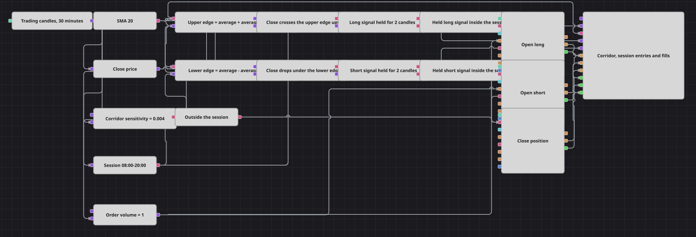

# Delayed Reversal Session Strategy Diagram
[Русский](README_ru.md) | [中文](README_zh.md) | [Español](README_es.md) | [Deutsch](README_de.md) | [Português](README_pt.md) | [日本語](README_ja.md)

This diagram puts two things between a signal and an order: a wait and a clock. A percentage corridor is drawn around a moving average, and price leaving that corridor is treated as a reversal. The reversal is not traded when it happens. It is handed to a delay block that counts a fixed number of finished candles, and only the impulse that comes out the far side is allowed near the order blocks - and only while the working-hours block says the clock is inside the session.

## Strategy Overview

- A single candle series, thirty minutes, finished candles only, drives every branch of the diagram.
- A moving average gives the centre line; a constant holds the sensitivity, and two formulas turn the pair into an upper and a lower edge - the average plus and minus the average times the sensitivity.
- Two crossing blocks watch the close against those edges. One fires when the close crosses the upper edge from below; the other is wired the other way round, with the lower edge on the upward input, so it fires when the close falls through the lower edge.
- Each crossing arms its own delay block. The delay counts finished candles that arrive after the arming and releases a single impulse when the count runs out, so the signal is acted on later, not on the bar that produced it.
- The working-hours block reads the time of every candle and reports whether the moment is inside the session; a logical NOT turns the same flag into an out-of-session flag.
- A logical AND per side joins the released impulse with the session flag, so an impulse that lands outside working hours is dropped instead of queued.
- Entries are market orders through position modify blocks set to open only from flat, so one delayed signal opens one position and repeated impulses in the same direction cannot pyramid.
- A third position modify block closes whatever is open, driven by three sources: the delayed signal of either side and the out-of-session flag; the chart panel draws the candles, the average, both corridor edges, the orders and the fills.

## Entry and Exit Rules

- **Long entry**: The close crosses the upper corridor edge from below, which arms the long delay. A configured number of finished candles later the delay releases its impulse; if the clock is inside the session at that moment, the long position modify block buys the order volume at market. Because the block opens only from flat, the buy is skipped when a position is already open - the same impulse has then already gone to the closing block instead.
- **Short entry**: The close falls through the lower corridor edge, which arms the short delay. A configured number of finished candles later the impulse arrives, and if the clock is inside the session the short position modify block sells the order volume at market, again only from a flat position.
- **Exit**: Two things end a trade. A delayed signal of either side is wired into the closing block as well as into its own entry block, so a held reversal against an open position flattens it at market; the entry that follows waits for the next signal, because the opening blocks only work from flat. The other is the clock: once the working-hours flag goes false the NOT block fires on every candle and the closing block flattens the position and keeps it flat until the session opens again. On a flat position the closing block does nothing. There is no stop-loss and no take-profit block here.

## Parameters

| Parameter | Default | Description |
|---|---|---|
| Candles | 00:30:00 | Time frame of the single candle series everything in the diagram runs on. |
| Average Length | 20 | Length of the moving average that draws the centre of the corridor. |
| Corridor Sensitivity | 0.004 | Half-width of the corridor as a fraction of the average - the default is four tenths of a percent on each side. Raise it for rarer, wider reversals; lower it and the edges are crossed far more often. |
| Long Signal Delay | 2 | Finished candles counted between the upward reversal and the impulse that may buy. One means the next candle; larger values hold the signal longer. |
| Short Signal Delay | 2 | Finished candles counted between the downward reversal and the impulse that may sell. |
| Session Start | 08:00:00 | Start of the working session. Impulses released before it are dropped, and the diagram stays flat. |
| Session End | 20:00:00 | End of the working session. From this moment the out-of-session flag flattens any open position on every candle until the session opens again. |
| Order Volume | 1 | Order size, in lots, sent on entry; the closing block always flattens whatever is open. |

## Diagram Details

- A crossing block is an event, not a state. It speaks only on the candle where the two series change places, so each delay is armed once per reversal rather than re-armed on every candle the price spends outside the corridor.
- The crossing block also reports the opposite direction as a false value, and both the delay arming input and the order trigger ignore false, so the downward half of one crossing block cannot arm or fire the upward branch.
- While a delay is counting, a second arming is ignored. A burst of reversals therefore produces one impulse, not a queue of them, and the count is a genuine pause rather than a tally.
- The candle block emits finished candles only. An update of a forming candle carries the time the bar opened, and an order built from such a value is dated behind the emulator clock and rejected.
- The session is read from the time of the candle itself rather than from the wall clock, so a replay behaves exactly as a live run would and the same diagram can be backtested without changing anything.

## Usage

Import the `.json` file into Designer, run it in the backtester on historical data, then adjust the parameters or the blocks themselves to fit your instrument before trading it live.
