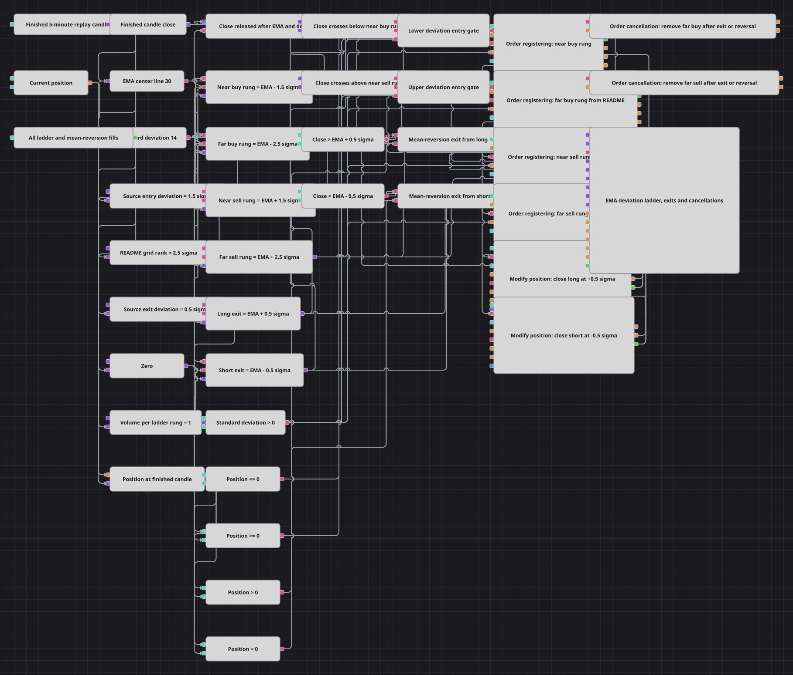

# Схема лестницы отклонений от EMA
[English](README.md) | [中文](README_zh.md) | [Español](README_es.md) | [Deutsch](README_de.md) | [Português](README_pt.md) | [日本語](README_ja.md)

Схема соединяет кодовый сигнал возврата к среднему на EMA(30)/StandardDeviation(14) с сеточной идеей соседнего README. Отклонение 1,5σ взводит маркетабельный ближний лимит и отложенную ступень усреднения 2,5σ, а позиция закрывается на кодовой границе возврата EMA ± 0,5σ.

## Обзор стратегии

- Завершённые пятиминутные replay-свечи обновляют EMA(30), StandardDeviation(14) и синхронизированный close, выпускаемый после обоих индикаторов.
- Пересечение вниз EMA − 1,5σ ставит покупки на −1,5σ и −2,5σ при Position <= 0; верхняя сторона зеркальна при Position >= 0.
- Ближняя ступень в момент подтверждения уже проходит через рынок и обычно исполняется сразу, дальняя ждёт более сильного движения.
- Лонг закрывается при Close > EMA + 0,5σ, шорт — при Close < EMA − 0,5σ, в точности как кодовый возврат к среднему.
- Любой такой выход снимает обе дальние заявки, а встречный сетап удаляет устаревшую дальнюю ступень предыдущей стороны.

## Правила входа и выхода

- **Вход в лонг**: Когда close пересекает вниз EMA − 1,5σ и Position <= 0, регистрируются покупки объёмом один на EMA − 1,5σ и EMA − 2,5σ.
- **Вход в шорт**: Когда close пересекает вверх EMA + 1,5σ и Position >= 0, регистрируются продажи объёмом один на EMA + 1,5σ и EMA + 2,5σ.
- **Выход**: Для лонга Close > EMA + 0,5σ запускает рыночный ClosePosition, для шорта Close < EMA − 0,5σ делает то же. ClosePosition автоматически берёт весь текущий объём, включая две исполненные ступени.

## Параметры

| Параметр | По умолчанию | Описание |
|---|---|---|
| Candle Time Frame | 00:05:00 | Интервал завершённых свечей; пять минут — replay-адаптация четырёхчасового дефолта C#. |
| EMA Length | 30 | Период центральной EMA и один из двух настоящих параметров C#. |
| Standard Deviation Length | 14 | Период оценки ширины; число 14 задано литералом в C#. |
| Near Entry Deviation | 1.5σ | Множитель первой ступени; 1,5 задан литералом в торговом условии исходника. |
| Far Grid Deviation | 2.5σ | Вторая отложенная ступень из README, отсутствующая в исполняемой логике C#. |
| Mean-Reversion Exit Deviation | 0.5σ | Граница возврата кодового выхода; 0,5 — литерал C#. |
| Volume per Rung | 1 | Независимый объём каждой ближней и дальней лимитной ступени. |

## Детали диаграммы

- В C# настоящими StrategyParam являются только EmaLength и CandleType. Период StandardDeviation 14 и множители 1,5 и 0,5 заданы литералами; схема выставляет их наружу для изучения, не называя параметрами исходника.
- Дефолт C# — четырёхчасовые свечи. Пять минут — replay-адаптация, дающая достаточно сформированных индикаторов и событий отклонения за месячную приёмку.
- Исполняемый C# содержит один входной порог 1,5σ, несмотря на имя папки Three Level Grid. Вторая ступень 2,5σ явно взята как ранг исполнения из README и не выдается за скрытую логику кода.
- Исходник разворачивает встречную позицию двумя немедленными рыночными заявками. Схема сохраняет гейты Position <= 0 / >= 0, но упрощает исполнение: ближний лимит может обнулить прежнюю позицию, а дальний позднее завершить разворот.
- Crossing создаёт одну лестницу на проход границы. Order cancellation обязателен: оставшаяся после выхода ступень усреднения позже открыла бы позицию без сопровождения.

## Использование

Импортируйте файл `.json` в Designer, прогоните схему на исторических данных в тестере, затем подстройте параметры или сами кубики под свой инструмент, прежде чем торговать вживую.
