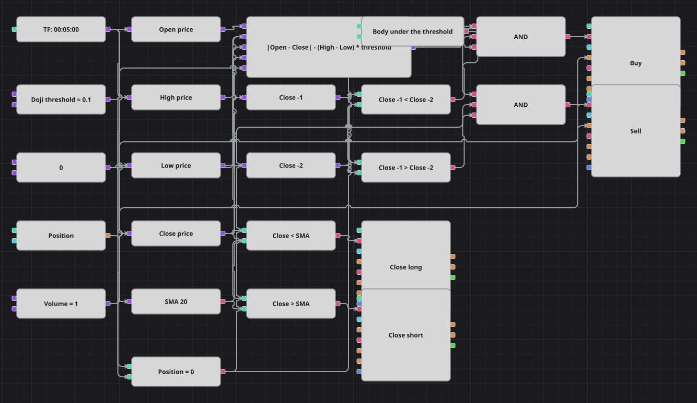

# Diagrama da estratégia de reversão com doji
[English](README.md) | [Русский](README_ru.md) | [中文](README_zh.md) | [Español](README_es.md) | [Deutsch](README_de.md) | [日本語](README_ja.md)

Um doji é um candle que abre e fecha quase no mesmo preço: compradores e vendedores passaram a barra inteira se anulando. O diagrama mede essa indecisão como a razão entre corpo e amplitude total e deixa os dois fechamentos anteriores ao doji decidirem o lado, porque o doji sozinho não diz nada sobre direção. A única saída é uma média móvel simples.

## Visão geral da estratégia

- Um bloco de fórmula calcula o corpo menos a amplitude vezes o limiar: um resultado negativo significa que o corpo é menor que a fração permitida do candle.
- Escrever o teste como multiplicação em vez de divisão também reproduz a proteção do código original: num candle em que a máxima é igual à mínima compara-se zero com zero e nenhum doji é reconhecido.
- Dois blocos de valor anterior leem os fechamentos de um e de dois candles atrás: uma queda entre eles é tratada como perna de baixa e comprada, uma alta como perna de alta e vendida.
- A estratégia original ainda bloqueia todos os sinais por várias centenas de barras após uma execução; aqui não existe bloco contador de barras, então essa pausa foi omitida e está registrada.

## Regras de entrada e saída

- **Entrada comprada**: O candle recém-encerrado é um doji, o fechamento de um candle atrás é menor que o de dois candles atrás e a posição é zero. A ordem compra um lote e abre uma compra.
- **Entrada vendida**: O candle recém-encerrado é um doji, o fechamento de um candle atrás é maior que o de dois candles atrás e a posição é zero. A ordem vende um lote e abre uma venda.
- **Saída**: Uma compra é encerrada por um bloco de modificação de posição em modo de fechamento quando um candle fecha abaixo da média móvel; uma venda é encerrada quando um candle fecha acima dela. A estratégia de origem não tem stop loss nem take profit, e este diagrama também não.

## Parâmetros

| Parâmetro | Padrão | Descrição |
|---|---|---|
| Doji Threshold | 0.1 | Maior razão entre corpo e amplitude total em que um candle ainda conta como doji. |
| SMA Length | 20 | Período da média móvel simples que encerra as operações. |
| Volume | 1 | Volume da ordem, em lotes. |
| Candles | 00:05:00 | Tempo gráfico dos candles de todo o diagrama; o original roda em candles de um minuto e aqui foi ajustado ao histórico de cinco minutos que acompanha a galeria. |

## Detalhes do diagrama

- O bloco de candles alimenta quatro conversores de abertura, máxima, mínima e fechamento, além da média móvel.
- Os quatro preços e a constante de limiar se encontram em um único bloco de fórmula, e uma comparação com zero transforma o resultado no sinalizador de doji.
- O preço de fechamento vai também para dois blocos de valor anterior, cujas saídas são comparadas entre si e dão a direção da última perna.
- Cada E lógico une o sinalizador de doji, uma condição de direção e a verificação de posição, e dispara uma entrada; os dois blocos de fechamento são acionados diretamente pelas comparações com a média móvel.

## Uso

Importe o arquivo `.json` no Designer, execute-o sobre dados históricos no backtester e depois ajuste os parâmetros ou os próprios blocos ao seu instrumento antes de operar ao vivo.
