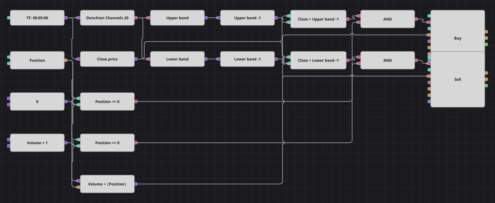

# Donchian Channel Breakout Strategy Diagram
[Русский](README_ru.md) | [中文](README_zh.md) | [Español](README_es.md) | [Deutsch](README_de.md) | [Português](README_pt.md) | [日本語](README_ja.md)

The oldest trend-following idea there is: the Donchian Channels indicator draws the highest high and the lowest low of the last N candles, and the strategy joins the move as soon as a candle closes outside that channel. It is always in the market, flipping from long to short and back on the opposite breakout.

## Strategy Overview

- Donchian Channels are calculated on finished candles; the upper band is the highest high of the period, the lower band the lowest low.
- Both bands are delayed by one candle, so the close of the current candle is compared with a channel that was already closed before it — otherwise the current candle would raise the band it is supposed to break.
- The current position is part of every decision, and the order volume adds the absolute position, so one market order closes the old side and opens the new one.

## Entry and Exit Rules

- **Long entry**: The candle closes above the upper band of the previous candle and the position is not long. The order buys the base volume plus the absolute position, which reverses a short into a long or opens a long from flat.
- **Short entry**: The candle closes below the lower band of the previous candle and the position is not short. The order sells the base volume plus the absolute position, which reverses a long into a short or opens a short from flat.
- **Exit**: There is no stop, no target and no separate exit block: the position is held until the opposite breakout reverses it, exactly as in the original strategy.

## Parameters

| Parameter | Default | Description |
|---|---|---|
| Channel period | 20 | Number of candles the highest high and the lowest low are taken over. |
| Volume | 1 | Base order volume, in lots; the absolute position is added on top of it when reversing. |
| Candles | 00:05:00 | Candle time frame the whole diagram works on. |

## Diagram Details

- The candle block feeds the Donchian Channels indicator and, through a converter, the close price.
- Two converters read the UpperBand and LowerBand values out of the indicator, and two previous-value blocks shift them one candle back.
- Two comparison blocks test the close against the shifted bands; two more compare the position against zero, and a logical AND joins one of each into an entry signal.
- A formula block computes the reversal volume as base volume plus the absolute position and feeds both position modify blocks.
- The original code defaults to a 1000-candle channel on one-minute candles; the diagram uses a 20-candle channel on five-minute candles, the setting the strategy's own README and optimization range describe, so that it actually trades on a month of history.

## Usage

Import the `.json` file into Designer, run it in the backtester on historical data, then adjust the parameters or the blocks themselves to fit your instrument before trading it live.
