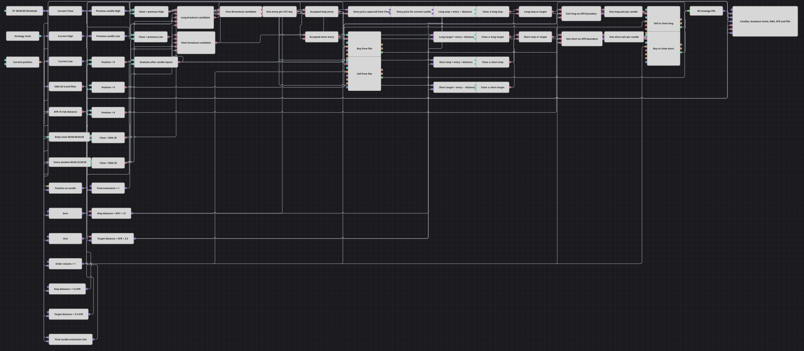

# Strategiediagramm Early Bird Range Latch
[English](README.md) | [Русский](README_ru.md) | [中文](README_zh.md) | [Español](README_es.md) | [Português](README_pt.md) | [日本語](README_ja.md)

Dieses Diagramm handelt einen strikten Ausbruch über das Extrem der vorherigen Fünf-Minuten-Kerze, wenn der Preis zur Richtung des EMA 20 passt. Eine UTC-Tagessperre lässt höchstens eine neue Position pro Tag zu, während der aktuelle ATR 14 die Stop- und Zielgrenzen bestimmt.

## Strategieübersicht

- Abgeschlossene Fünf-Minuten-Kerzen liefern den aktuellen Schlusskurs, Hoch und Tief der vorherigen Kerze, EMA 20 und ATR 14. Die Previous-value-Blöcke verschieben nur die High- und Low-Datenströme, sodass eine Kerze nie mit ihren eigenen Extremen verglichen wird.
- Das Long-Setup verlangt `Close > previous High` und `Close > EMA 20`; das Short-Setup verlangt `Close < previous Low` und `Close < EMA 20`. Alle Vergleiche sind strikt, Gleichheit löst daher kein Signal aus.
- Ein Time-Block steuert das feste tägliche Rücksetzintervall von 00:00:00 bis 00:04:59 UTC. Die Kerzenzeit steuert das feste Einstiegsintervall von 00:05:00 bis 23:59:59, und ein gemeinsamer Flag lässt nach jedem Rücksetzen nur das erste zulässige Richtungssignal durch.
- Ein angenommenes Signal speichert den aktuellen Schlusskurs als Einstiegspreis und eröffnet nur bei einem Positionsstand von null eine Markteinheit. Die Sperre bleibt nach dem Ausstieg verbraucht und verhindert bis zum nächsten UTC-Tagesreset einen weiteren Einstieg.
- Bei jeder späteren abgeschlossenen Kerze berechnen Formeln vier Grenzen aus gespeichertem Einstieg und aktuellem ATR neu: Long-Stop und -Ziel bei `entry − 1.5×ATR` und `entry + 2.5×ATR`, beim Short mit vertauschten Vorzeichen. ReduceOnly-Marktaktionen schließen die passende Seite, sobald eine Grenze erreicht wird.

## Ein- und Ausstiegsregeln

- **Long-Einstieg**: Nach Bildung des EMA 20 senden zwischen 00:05:00 und 23:59:59 UTC eine flache Position, `Close > previous High`, `Close > EMA 20` und ein verfügbarer Tages-Flag einen OpenPosition-Marktkauf über eine Einheit.
- **Short-Einstieg**: Nach Bildung des EMA 20 senden zwischen 00:05:00 und 23:59:59 UTC eine flache Position, `Close < previous Low`, `Close < EMA 20` und ein verfügbarer Tages-Flag einen OpenPosition-Marktverkauf über eine Einheit.
- **Ausstieg**: Für einen Long wird bei `Close ≤ entry − 1.5×current ATR` oder `Close ≥ entry + 2.5×current ATR` ein ReduceOnly-Marktverkauf ausgelöst. Für einen Short wird bei `Close ≥ entry + 1.5×current ATR` oder `Close ≤ entry − 2.5×current ATR` ein ReduceOnly-Marktkauf ausgelöst. Es gibt keinen zeitgesteuerten Ausstieg, kein Trailing, keine Umkehr und keinen erneuten Einstieg am selben Tag.

## Parameter

| Parameter | Standard | Beschreibung |
|---|---|---|
| Candles | 00:05:00 | Zeitrahmen der abgeschlossenen Kerzen, die alle Signal- und Risikoberechnungen anstoßen. |
| EMA Length | 20 | Periode des gebildeten exponentiellen gleitenden Durchschnitts als Richtungsfilter. |
| ATR Length | 14 | Periode des gebildeten Average True Range, der für jede abgeschlossene Kerze neu berechnet wird. |
| Stop ATR Multiplier | 1.5 | Multiplikator des aktuellen ATR für die nachteilige Grenze um den gespeicherten Einstiegspreis. |
| Target ATR Multiplier | 2.5 | Multiplikator des aktuellen ATR für die vorteilhafte Grenze um den gespeicherten Einstiegspreis. |
| Order Volume | 1 | Feste Menge für beide OpenPosition-Einstiege und beide ReduceOnly-Ausstiege. |

## Diagrammdetails

- Der [Candles](https://doc.stocksharp.com/en/topics/designer/strategies/using_visual_designer/elements/data_sources/candles.html)-Block liefert abgeschlossene Fünf-Minuten-Kerzen und kann sie aus der mitgelieferten Minutenhistorie aufbauen.
- Drei [Converter](https://doc.stocksharp.com/en/topics/designer/strategies/using_visual_designer/elements/common/converter.html) extrahieren Close, High und Low. Zwei [Previous value](https://doc.stocksharp.com/en/topics/designer/strategies/using_visual_designer/elements/common/prev_value.html)-Blöcke wenden Shift 1 auf die numerischen High- und Low-Datenströme an.
- Nur nach Bildung ausgebende [Indicator](https://doc.stocksharp.com/en/topics/designer/strategies/using_visual_designer/elements/common/indicator.html)-Blöcke berechnen EMA 20 für die Richtung und ATR 14 für den Risikoabstand. Die EMA-Bereitschaft verhindert zugleich Einstiege, bevor beide Indikatoren genügend Daten besitzen.
- Der [Time](https://doc.stocksharp.com/en/topics/designer/strategies/using_visual_designer/elements/time/time.html)-Datenstrom speist den rücksetzenden [Working time](https://doc.stocksharp.com/en/topics/designer/strategies/using_visual_designer/elements/time/working_time.html)-Block. Ein separater Working-time-Block liest die Kerzenzeit und wirkt direkt in beiden Einstiegsbedingungen mit.
- Ein gemeinsamer [Flag](https://doc.stocksharp.com/en/topics/designer/strategies/using_visual_designer/elements/common/flag.html) verbraucht den ersten Long- oder Short-Kandidaten des UTC-Tages. Variable-Blöcke speichern Position und Schlusskurs des angenommenen Einstiegs; eine zweite Einstiegspreisvariable gibt den gespeicherten Wert für die Risikoformeln bei jeder Kerze erneut aus.
- [Formula](https://doc.stocksharp.com/en/topics/designer/strategies/using_visual_designer/elements/common/formula.html)-, [Comparison](https://doc.stocksharp.com/en/topics/designer/strategies/using_visual_designer/elements/common/comparison.html)- und [Logical condition](https://doc.stocksharp.com/en/topics/designer/strategies/using_visual_designer/elements/common/logical_condition.html)-Blöcke bilden die Ausbruchsfilter und alle vier ATR-Grenzen. Ausstiegs-Flags je Kerze verhindern doppelte Schließungen, wenn mehrere Eingänge während einer Auswertung aktualisiert werden.
- Zwei OpenPosition- und zwei ReduceOnly-[Modify position](https://doc.stocksharp.com/en/topics/designer/strategies/using_visual_designer/elements/positions/modify.html)-Blöcke erledigen Markteinstiege und -ausstiege. Das [Chart panel](https://doc.stocksharp.com/en/topics/designer/strategies/using_visual_designer/elements/common/chart.html) erhält Kerzen, vorheriges High und Low, EMA, ATR und einen Combination-Datenstrom mit allen Ausführungen.

## Verwendung

Importieren Sie die `.json`-Datei in Designer, testen Sie sie im Backtester mit historischen Daten und passen Sie danach Parameter oder Bausteine an Ihr Instrument an, bevor Sie live handeln.
