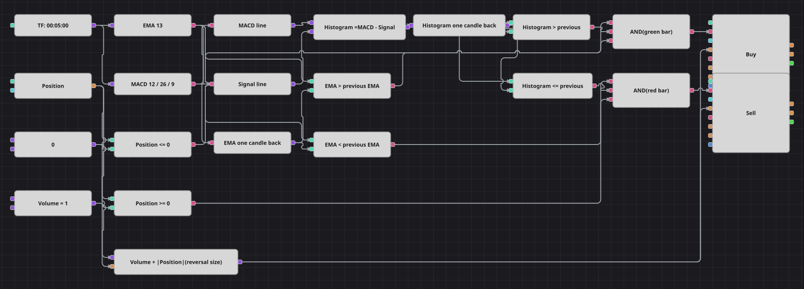

# Elder Impulse System Strategy Diagram
[Русский](README_ru.md) | [中文](README_zh.md) | [Español](README_es.md) | [Deutsch](README_de.md) | [Português](README_pt.md) | [日本語](README_ja.md)

Alexander Elder colours every bar by two things at once: the slope of an exponential moving average, which shows the trend, and the slope of the MACD histogram, which shows the momentum behind it. When both point up the bar is green and the diagram buys; when both point down the bar is red and it sells. Orders are sized to Volume plus the open position, so every signal reverses whatever the strategy is holding.

## Strategy Overview

- The EMA and the MACD lines are both taken from finished candles of one instrument; the histogram is built inside the diagram as MACD minus Signal.
- Two previous-value blocks keep the EMA and the histogram of the last candle, so the diagram can compare the current reading against it and decide which way each of them is sloping.
- The bar colour is the pair of slopes: EMA up and histogram up is green, EMA down and histogram flat or down is red, anything else is neutral and is ignored.
- The original strategy stands aside for 65 bars after a trade. That pause is a counter, and the Designer blocks hold no such state, so the diagram leaves it out; the position check keeps the schema from repeating the same side anyway.

## Entry and Exit Rules

- **Long entry**: The EMA is above its value one candle ago, the histogram is above its value one candle ago and the position is not already long. The order buys Volume plus the absolute position, which opens a long from flat and reverses a short in one go.
- **Short entry**: The EMA is below its value one candle ago, the histogram is at or below its value one candle ago and the position is not already short. The order sells Volume plus the absolute position, opening a short from flat or reversing a long.
- **Exit**: There is no separate exit: the opposite colour reverses the position, and because the order size includes the open position the reversal both closes the old trade and opens the new one. The source strategy has no stop loss or take profit either.

## Parameters

| Parameter | Default | Description |
|---|---|---|
| EMA Length | 13 | Length of the exponential moving average whose slope colours the bar. |
| MACD Fast Length | 12 | Fast moving average of the MACD. |
| MACD Slow Length | 26 | Slow moving average of the MACD. |
| MACD Signal Length | 9 | Signal line length; the histogram is the MACD minus this line. |
| Volume | 1 | Base order volume, in lots; the open position is added on top of it when reversing. |
| Candles | 00:05:00 | Candle time frame the whole diagram works on. |

## Diagram Details

- The candle block feeds two indicator blocks, EMA and MACD with a signal line; two converter blocks pull the MACD and Signal values out and a formula block subtracts them into the histogram.
- Two previous-value blocks, one typed as an indicator value and one as a number, deliver the readings of the previous candle to four comparison blocks that decide the two slopes.
- Each logical AND joins one EMA condition, one histogram condition and one position condition, so an entry is only made when it does not add to the side already held.
- A formula block adds the absolute position to the shared volume constant and feeds both position modify blocks, which is what turns every signal into a reversal.

## Usage

Import the `.json` file into Designer, run it in the backtester on historical data, then adjust the parameters or the blocks themselves to fit your instrument before trading it live.
