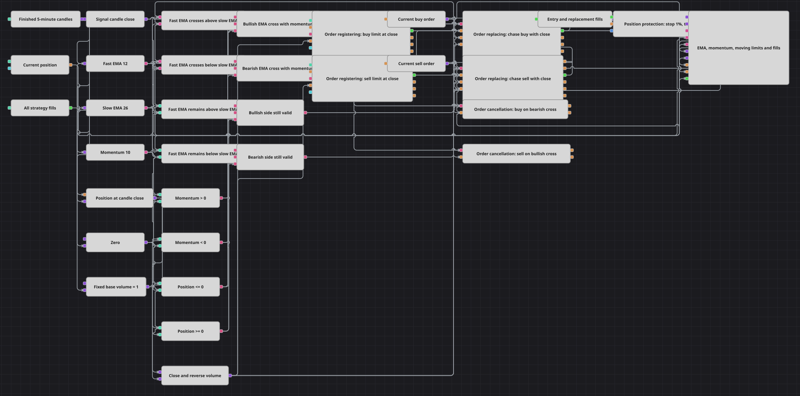

# Nachgezogener EMA-Cross-Limiteinstieg
[English](README.md) | [Русский](README_ru.md) | [中文](README_zh.md) | [Español](README_es.md) | [Português](README_pt.md) | [日本語](README_ja.md)

Das Diagramm behält EMA(12)/EMA(26)-Kreuzung und Momentum(10)-Bestätigung aus Franks4HourLimitOrdersStrategy, zeigt aber die Ausführung: Das Limit startet am Signalschluss, folgt weiteren Schlusskursen per Order replacing und wird beim Gegenkreuz storniert.

## Strategieübersicht

- Fertige Kerzen speisen zwei EMAs und Momentum; Crossing sendet nur bei einem echten Wechsel ihrer Reihenfolge.
- Bullisch verlangt positives Momentum und Position <= 0, bärisch negatives Momentum und Position >= 0.
- Order registering setzt das erste Limit am Schluss der Signalkerze ohne Preisrundung.
- Combination hält die neueste von Order replacing gelieferte Order, damit Aktualisierung und Storno das lebende Objekt treffen.
- Ersetzung ist nur erlaubt, solange EMA- und Momentum-Seite gültig bleiben.

## Ein- und Ausstiegsregeln

- **Long-Einstieg**: EMA(12) kreuzt über EMA(26), Momentum ist positiv und Position null oder short. Das Kauflimit nutzt abs(Position)+1 und verbindet Short-Schluss und Long-Eröffnung zur Netto-Umkehr.
- **Short-Einstieg**: EMA(12) kreuzt unter EMA(26), Momentum ist negativ und Position null oder long. Das Verkaufslimit nutzt dieselbe Netto-Umkehrmenge.
- **Ausstieg**: Das Gegenkreuz storniert das Pending Limit und kann das Gegenlimit senden. Zusätzlich gelten die diagrammeigenen 1% Stop und 3% Ziel; ein Schutzfill storniert verbleibende Pending-Referenzen.

## Parameter

| Parameter | Standard | Beschreibung |
|---|---|---|
| Candle Time Frame | 00:05:00 | Fertiges Intervall: fünf Minuten in der Galerie, vier Stunden als C#-Standard. |
| Fast EMA Length | 12 | Anzahl der Werte in der schnellen ExponentialMovingAverage. |
| Slow EMA Length | 26 | Anzahl der Werte in der langsamen ExponentialMovingAverage. |
| Momentum Length | 10 | Anzahl der Momentumwerte, deren Vorzeichen die Kreuzung bestätigt. |

## Diagrammdetails

- Der C#-Code nutzt Marketorders ohne Pending-Verwaltung; Registrierung, Ersetzung und Storno sind die bewusste Ausführungsanpassung.
- Das offene Limit folgt nur dann jedem neuen Schluss, wenn EMA-Reihenfolge, Momentumzeichen und Positionsseite gültig bleiben.
- Quellstandard sind vier Stunden. Das Beispiel nutzt fünf Minuten, da ein Monat H4 EMA(26) kaum bildet; 04:00:00 bleibt einstellbar.
- Basisvolumen 1 und Position protection mit 1% Stop / 3% Ziel sind feste Diagrammzusätze, keine Konstruktorparameter.

## Verwendung

Importieren Sie die `.json`-Datei in Designer, testen Sie sie im Backtester mit historischen Daten und passen Sie danach Parameter oder Bausteine an Ihr Instrument an, bevor Sie live handeln.
