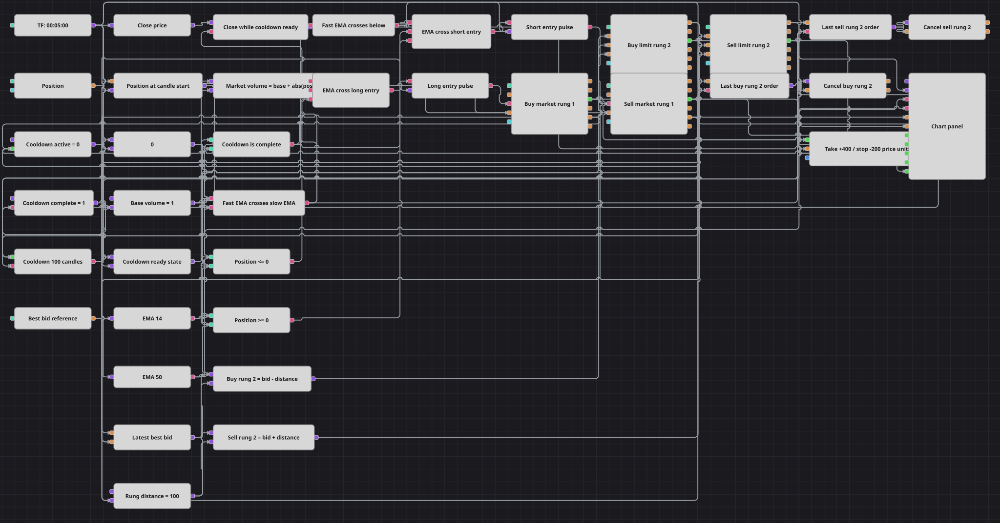

# Diagrama de estrategia de cruce de EMA con escalera de órdenes pendientes
[English](README.md) | [Русский](README_ru.md) | [中文](README_zh.md) | [Deutsch](README_de.md) | [Português](README_pt.md) | [日本語](README_ja.md)

Este diagrama negocia cruces confirmados de EMA con una entrada de dos escalones. Una orden de mercado abre o revierte por completo la posición; tras su ejecución total, se coloca una orden límite más alejada en el mismo sentido desde el último BestBid; una protección por distancias absolutas de precio gestiona la exposición. Una pausa de 100 velas suspende tanto las nuevas entradas del primer escalón como las comprobaciones de precio de la protección sobre cierres finalizados.

## Resumen de la estrategia

- Las velas finalizadas de cinco minutos alimentan la EMA rápida 14 y la EMA lenta 50, que solo emiten valores formados. Crossing genera un evento alcista cuando la EMA rápida supera la lenta y uno bajista cuando cae por debajo.
- Una instantánea de la posición en el momento de la vela y el estado de disponibilidad filtran las entradas. El cruce alcista solo permite comprar con Position <= 0 y el bajista solo permite vender con Position >= 0; el primer escalón de mercado usa Base Volume + abs(Position), por lo que abre desde cero o revierte completamente la exposición contraria.
- Cuando la orden de mercado del primer escalón alcanza Matched, el segundo se ancla al último BestBid muestreado continuamente. La rama larga envía una compra límite a BestBid - 100 y la corta una venta límite a BestBid + 100, ambas por Base Volume 1 y con ShrinkPrice desactivado.
- La última orden registrada del segundo escalón se cancela ante un cruce EMA contrario sin filtrar por la entrada, una ejecución protectora o la finalización de la pausa. Una ejecución del segundo escalón se incorpora a la protección de posición, pero no reinicia la pausa.
- Las ejecuciones de los cuatro bloques de órdenes de entrada alimentan la protección por distancias absolutas con Take Distance 400 y Stop Distance 200. Mientras el estado esté listo, se comprueba cada cierre finalizado y una salida activada se envía a mercado. Una ejecución del primer escalón o una salida protectora inicia la pausa: las 100 velas finalizadas siguientes no permiten una nueva entrada del primer escalón ni una comprobación de precio de la protección; ambas se reanudan en la 101. El gráfico muestra velas, ambas EMA, dos flujos de órdenes límite y cinco flujos de operaciones.

## Reglas de entrada y salida

- **Entrada en largo**: En un cruce de la EMA rápida por encima de la lenta, si la instantánea de posición es menor o igual que cero y la pausa está lista, el diagrama compra a mercado Base Volume + abs(Position). Cuando la orden queda totalmente ejecutada, coloca una compra límite por Base Volume al BestBid guardado menos Rung Distance.
- **Entrada en corto**: En un cruce de la EMA rápida por debajo de la lenta, si la instantánea de posición es mayor o igual que cero y la pausa está lista, el diagrama vende a mercado Base Volume + abs(Position). Cuando la orden queda totalmente ejecutada, coloca una venta límite por Base Volume al BestBid guardado más Rung Distance.
- **Salida**: La protección de posición recibe las ejecuciones de ambos escalones de mercado y ambos escalones límite. Mientras el estado esté listo, se comprueban los cierres de velas finalizadas y la posición sale a mercado si el precio alcanza la distancia favorable de 400 unidades o la desfavorable de 200. Durante las 100 velas finalizadas posteriores a una ejecución del primer escalón o una salida protectora no se comprueba el precio de protección; las comprobaciones se reanudan en la 101. La ejecución protectora cancela el último segundo escalón pendiente, y un cruce contrario sin filtrar también lo cancela con independencia de la disponibilidad de entrada.

## Parámetros

| Parámetro | Por defecto | Descripción |
|---|---|---|
| Candles | 00:05:00 | Marco temporal de cinco minutos; solo las velas finalizadas impulsan el cálculo de EMA, las señales, la protección y el conteo de la pausa. |
| Fast EMA Length | 14 | Longitud de la ExponentialMovingAverage rápida; solo se emiten valores formados. |
| Slow EMA Length | 50 | Longitud de la ExponentialMovingAverage lenta; solo se emiten valores formados. |
| Base Volume | 1 | Cantidad sumada a abs(Position) en el primer escalón de mercado y usada sin ajuste en el segundo escalón límite. |
| Rung Distance | 100 price units | Desplazamiento absoluto desde el BestBid guardado: se resta para la compra límite y se suma para la venta límite. |
| Cooldown | 100 candles | Número de velas finalizadas posteriores en que se bloquean tanto las nuevas entradas del primer escalón como las comprobaciones de precio de la protección; ambas se reanudan en la vela 101. |
| Take Distance | 400 price units | Movimiento absoluto favorable del precio que activa la salida protectora a mercado. |
| Stop Distance | 200 price units | Movimiento absoluto desfavorable del precio que activa la salida protectora a mercado. |

## Detalles del diagrama

- El bloque [Velas](https://doc.stocksharp.com/es/topics/designer/strategies/using_visual_designer/elements/data_sources/candles.html) solo emite velas finalizadas de cinco minutos. Dos bloques [Indicador](https://doc.stocksharp.com/es/topics/designer/strategies/using_visual_designer/elements/common/indicator.html), limitados a valores formados, calculan ExponentialMovingAverage 14 y 50.
- [Cruce](https://doc.stocksharp.com/es/topics/designer/strategies/using_visual_designer/elements/common/crossing.html) emite true para eventos alcistas y false para los bajistas; una [Condición lógica](https://doc.stocksharp.com/es/topics/designer/strategies/using_visual_designer/elements/common/logical_condition.html) NOT vuelve operativo el evento bajista. La [Posición](https://doc.stocksharp.com/es/topics/designer/strategies/using_visual_designer/elements/positions/current.html) se muestrea antes de la ruta EMA, y los bloques de [Comparación](https://doc.stocksharp.com/es/topics/designer/strategies/using_visual_designer/elements/common/comparison.html) combinan Position <= 0 o Position >= 0 con el estado de disponibilidad. Las puertas de entrada Long y Short solo pasan pulsos true a los disparadores del primer escalón.
- Una [Fórmula](https://doc.stocksharp.com/es/topics/designer/strategies/using_visual_designer/elements/common/formula.html) calcula Base Volume + abs(Position). Los bloques de [Registro de orden](https://doc.stocksharp.com/es/topics/designer/strategies/using_visual_designer/elements/orders/register.html) del primer escalón envían órdenes de mercado NoCondition, y sus salidas Matched activan el segundo escalón correspondiente.
- Un bloque [Level1](https://doc.stocksharp.com/es/topics/designer/strategies/using_visual_designer/elements/data_sources/level_1.html) continuo proporciona BestBid, retenido por una [Variable](https://doc.stocksharp.com/es/topics/designer/strategies/using_visual_designer/elements/data_sources/variable.html). Los bloques de [Fórmula](https://doc.stocksharp.com/es/topics/designer/strategies/using_visual_designer/elements/common/formula.html) de precio calculan BestBid - Rung Distance y BestBid + Rung Distance; los bloques de [Registro de orden](https://doc.stocksharp.com/es/topics/designer/strategies/using_visual_designer/elements/orders/register.html) del segundo escalón colocan órdenes límite del mismo sentido con Base Volume y ShrinkPrice false.
- Cada segundo escalón nuevo pasa a ser la orden retenida para [Cancelar orden](https://doc.stocksharp.com/es/topics/designer/strategies/using_visual_designer/elements/trading/cancel_order.html). Su cancelación se activa con el cruce directo hacia el otro lado, una ejecución protectora o el fin de la pausa. Una ejecución del escalón límite se añade a la exposición protegida sin activar la pausa.
- La [Protección de posición](https://doc.stocksharp.com/es/topics/designer/strategies/using_visual_designer/elements/positions/protect.html) consume las ejecuciones de los cuatro bloques de entrada y usa distancias absolutas de beneficio y pérdida antes de enviar su salida a mercado. El cierre guardado de la vela finalizada solo se libera para una comprobación de precio mientras el estado de disponibilidad está activo. Un bloque [N valores](https://doc.stocksharp.com/es/topics/designer/strategies/using_visual_designer/elements/common/delay_value.html) y variables de estado bloquean tanto las entradas del primer escalón como esas comprobaciones durante exactamente las 100 velas finalizadas posteriores a una ejecución del primer escalón o una salida protectora, y restauran ambas para la vela 101.
- El [Panel de gráfico](https://doc.stocksharp.com/es/topics/designer/strategies/using_visual_designer/elements/common/chart.html) recibe velas finalizadas, EMA rápida 14, EMA lenta 50, los flujos Order de límite de compra y de venta, y cinco flujos MyTrade: compra de mercado, venta de mercado, compra límite, venta límite y salida protectora.

## Uso

Importe el archivo `.json` en Designer, ejecútelo sobre datos históricos en el probador y después ajuste los parámetros o los propios bloques a su instrumento antes de operar en real.
