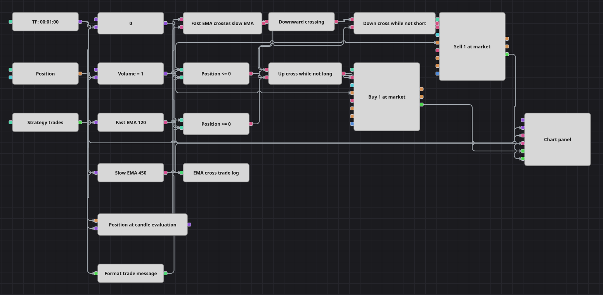

# Diagrama da estratégia de alertas de cruzamento de EMA
[English](README.md) | [Русский](README_ru.md) | [中文](README_zh.md) | [Español](README_es.md) | [Deutsch](README_de.md) | [日本語](README_ja.md)

Este diagrama negocia os cruzamentos para cima e para baixo de uma EMA rápida de 120 períodos e uma EMA lenta de 450 períodos em candles finalizados de um minuto. Um retrato da posição filtra cada sinal, ordens a mercado de volume fixo gerenciam a exposição, cada execução própria é gravada no log e o gráfico mostra candles, as duas EMAs e as execuções de compra e venda.

## Visão geral da estratégia

- Candles finalizados de um minuto alimentam a EMA rápida 120 e a EMA lenta 450. O filtro de valores formados está desativado nos dois indicadores, portanto seus valores ficam disponíveis desde o início do cálculo.
- O bloco Crossing emite `true` quando a EMA rápida cruza a EMA lenta para cima. Um bloco NOT transforma o evento `false` do cruzamento para baixo no acionador positivo do lado vendedor.
- Na avaliação de cada candle, um retrato acionado pelo candle emite a posição atual antes do processamento dos sinais das EMAs. As comparações permitem compra somente com `Position <= 0` e venda somente com `Position >= 0`.
- Os dois blocos de ordens a mercado usam `NoCondition` e Volume fixo de 1. Um sinal contrário pode reduzir ou zerar uma posição e pode atravessar o zero quando seu módulo é menor que Volume, mas não garante uma reversão completa.
- O bloco Strategy trades envia cada execução própria por meio do modelo exato da mensagem de execução para uma notificação Log. O gráfico recebe candles finalizados, as duas EMAs e os fluxos de execuções de compra e venda.

## Regras de entrada e saída

- **Entrada comprada**: Quando a EMA rápida cruza acima da EMA lenta e o retrato da posição no candle é menor ou igual a zero, o diagrama envia uma compra a mercado com Volume 1.
- **Entrada vendida**: Quando a EMA rápida cruza abaixo da EMA lenta e o retrato da posição no candle é maior ou igual a zero, o diagrama envia uma venda a mercado com Volume 1.
- **Saída**: Não há bloco dedicado de saída nem de proteção. Uma ordem posterior de volume fixo na direção contrária pode reduzir a posição atual, zerar uma posição de mesmo tamanho ou atravessar o zero quando a posição é menor que Volume; uma reversão completa não é garantida.

## Parâmetros

| Parâmetro | Padrão | Descrição |
|---|---|---|
| Candles | 00:01:00 | Período de um minuto; somente candles finalizados acionam as EMAs e a cadeia de decisão. |
| Fast EMA Period | 120 | Período da ExponentialMovingAverage rápida; o filtro de valores formados está desativado. |
| Slow EMA Period | 450 | Período da ExponentialMovingAverage lenta; o filtro de valores formados está desativado. |
| Volume | 1 | Quantidade fixa fornecida aos dois blocos de ordens a mercado com NoCondition. |

## Detalhes do diagrama

- O bloco [Candles](https://doc.stocksharp.com/pt/topics/designer/strategies/using_visual_designer/elements/data_sources/candles.html) emite somente candles finalizados de um minuto e aciona o retrato da posição antes de alimentar os cálculos das EMAs.
- Dois blocos de [Indicador](https://doc.stocksharp.com/pt/topics/designer/strategies/using_visual_designer/elements/common/indicator.html) calculam ExponentialMovingAverage com períodos 120 e 450. A opção de valores formados é `false` nos dois, e ambas as saídas também seguem para o gráfico.
- A saída de [Cruzamento](https://doc.stocksharp.com/pt/topics/designer/strategies/using_visual_designer/elements/common/crossing.html) é `true` no cruzamento para cima e `false` no cruzamento para baixo. Uma [Condição lógica](https://doc.stocksharp.com/pt/topics/designer/strategies/using_visual_designer/elements/common/logical_condition.html) NOT transforma o evento de baixa em acionador positivo de venda; blocos AND separados combinam direção e posição.
- A [Posição](https://doc.stocksharp.com/pt/topics/designer/strategies/using_visual_designer/elements/positions/current.html) atual é armazenada continuamente e emitida uma vez por candle antes do caminho das EMAs. Blocos de [Comparação](https://doc.stocksharp.com/pt/topics/designer/strategies/using_visual_designer/elements/common/comparison.html) avaliam `Position <= 0` e `Position >= 0` na mesma cadeia causal do candle que o cruzamento.
- Os blocos de compra e venda [Modificar posição](https://doc.stocksharp.com/pt/topics/designer/strategies/using_visual_designer/elements/positions/modify.html) colocam ordens a mercado com `NoCondition` e o valor fixo Volume compartilhado. Não há stop, alvo de lucro nem bloco de saída separado.
- [Negócios da estratégia](https://doc.stocksharp.com/pt/topics/designer/strategies/using_visual_designer/elements/common/trades_by_strategy.html) emite cada `MyTrade` próprio. O [Formatador de texto](https://doc.stocksharp.com/pt/topics/designer/strategies/using_visual_designer/elements/notifying/string_format.html) usa exatamente `EMA cross fill: {Order.Side} {Trade.TradeVolume:0.########} {Order.Security.Id} @ {Trade.TradePrice:0.########}`.
- O bloco [Notificação](https://doc.stocksharp.com/pt/topics/designer/strategies/using_visual_designer/elements/notifying/notification.html) grava cada execução formatada com Type `Log` e Caption `EMA cross trade`. O gráfico exibe candles, EMA rápida, EMA lenta e fluxos separados de execuções de compra e venda.

## Uso

Importe o arquivo `.json` no Designer, execute-o sobre dados históricos no backtester e depois ajuste os parâmetros ou os próprios blocos ao seu instrumento antes de operar ao vivo.
