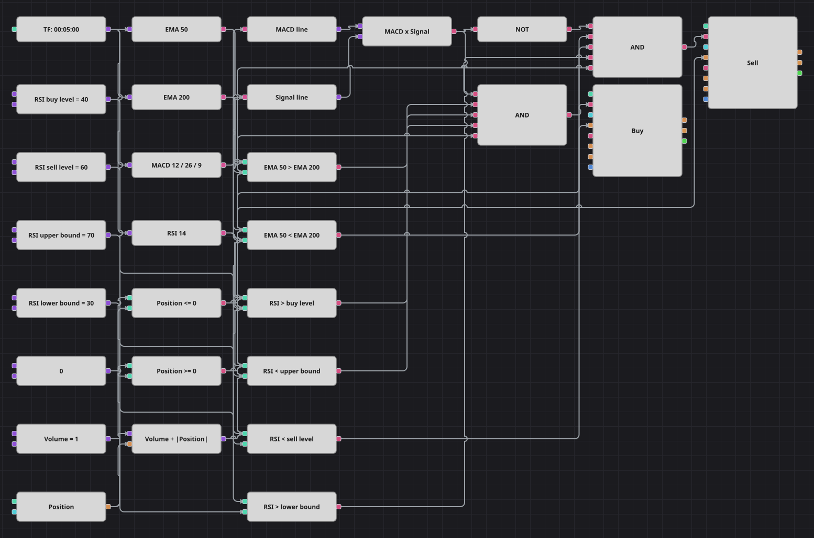

# EMA + MACD + RSI 複合戦略のダイアグラム
[English](README.md) | [Русский](README_ru.md) | [中文](README_zh.md) | [Español](README_es.md) | [Deutsch](README_de.md) | [Português](README_pt.md)

3つの独立した判定がそろって初めて売買します。EMA 50 と EMA 200 の位置関係が取ってよい方向を決め、MACD ラインとシグナルラインの交差がタイミングを決め、さらに RSI が中間帯にあることを求めます。勢いは出ているが行き過ぎてはいない、という状態です。採用されたシグナルは1本の成行注文でドテンします。

## 戦略の概要

- トレンドフィルターは2本の指数移動平均の水準比較です。EMA 50 が EMA 200 より下にある間は買わず、上にある間は売りません。
- エントリーは状態ではなく事象です。MACD ラインがシグナルラインを抜けた足だけが新規建てを許すため、トレンドが続く間ずっと発注し続けることはありません。
- この組み合わせを慎重にしているのが RSI の帯です。ロングは RSI が買い水準より上かつ上限より下、ショートは売り水準より下かつ下限より上を要求し、行き過ぎた動きを見送ります。
- 元の戦略は30分足で動きますが、付属のサンプル履歴に合わせて5分足に縮尺しています。売買後に10本待つ休止はブロックで表現できないため省いており、その分だけ再エントリーが増えます。

## エントリーとエグジットの条件

- **ロングエントリー**: EMA 50 が EMA 200 より上、MACD ラインがシグナルラインを上抜け、RSI が買い水準より上かつ上限より下で、まだ買い持ちではないとき。注文は基準数量に建っている売り玉を加えて買い、1本の成行注文でショートをロングへ反転させます。
- **ショートエントリー**: EMA 50 が EMA 200 より下、MACD ラインがシグナルラインを下抜け、RSI が売り水準より下かつ下限より上で、まだ売り持ちではないとき。注文は基準数量に建っている買い玉を加えて売り、1本の成行注文でロングをショートへ反転させます。
- **エグジット**: 元の戦略と同じくエグジットブロックも保護もありません。反対のシグナルが出るまで建玉を保有し、その注文が決済と新規建てを同時に行います。

## パラメーター

| パラメーター | 既定値 | 説明 |
|---|---|---|
| Fast EMA length | 50 | 短期トレンドを担う短期指数移動平均の期間。 |
| Slow EMA length | 200 | 短期線を測る基準となる長期指数移動平均の期間。 |
| MACD fast length | 12 | MACD 内部の短期 EMA の期間。 |
| MACD slow length | 26 | MACD 内部の長期 EMA の期間。 |
| MACD signal length | 9 | MACD を平滑してシグナルラインにする EMA の期間。 |
| RSI length | 14 | 相対力指数の平滑化期間。 |
| RSI buy level | 40 | ロングを認めるために RSI が上回るべき水準。 |
| RSI sell level | 60 | ショートを認めるために RSI が下回るべき水準。 |
| RSI upper bound | 70 | RSI 帯の上限。これを超えるとロングは遅すぎると判断します。 |
| RSI lower bound | 30 | RSI 帯の下限。これを下回るとショートは遅すぎると判断します。 |
| Volume | 1 | 基準の注文数量（ロット）。ドテン時はこれに建玉が加算されます。 |
| Candles | 00:05:00 | ダイアグラム全体が用いるローソク足の時間軸。 |

## ダイアグラムの詳細

- 1つのローソク足ブロックが4つの指標ブロック、すなわち2本の指数移動平均、シグナルライン付き MACD、相対力指数を駆動します。
- 2つのコンバーターが MACD の値を Macd と Signal に分け、交差ブロックが強気のトリガーを、NOT ブロックがそれを反転した弱気のトリガーを作ります。
- 8つの比較ブロックがフィルターを構成します。移動平均どうしに1組、RSI の帯に4つ、ポジションとゼロの比較に2つです。
- 各論理積が5つの条件を束ねてポジション変更ブロックを起動し、計算式ブロックが基準数量とポジションの絶対値を足すため、1本の成行注文でドテンが完了します。

## 使い方

`.json` ファイルを Designer に読み込み、バックテスターで過去データを使って実行し、実運用の前にパラメーターやブロック自体を自分の銘柄に合わせて調整してください。
