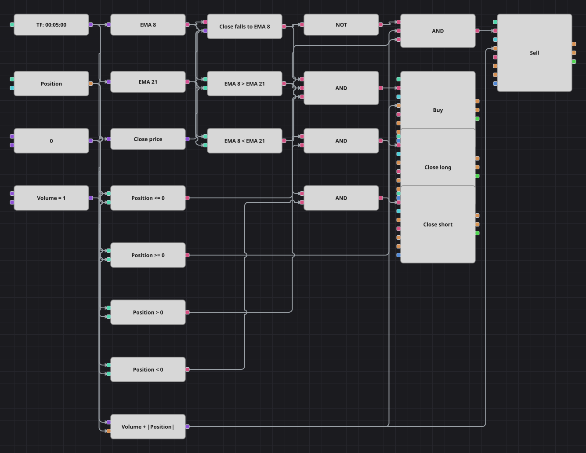

# EMA 回踩入场策略图
[English](README.md) | [Русский](README_ru.md) | [Español](README_es.md) | [Deutsch](README_de.md) | [Português](README_pt.md) | [日本語](README_ja.md)

这是一张拒绝追突破的趋势图。两条指数移动平均线决定方向，入场则等待收盘价回落到快线，从而在已经展开的行情中以更好的价格建仓。离场由趋势本身决定：两条均线互换位置时立即平仓。

## 策略概览

- 基于收盘价的两条指数移动平均线——周期 8 的快线与周期 21 的慢线——决定本图允许交易的方向。
- 交叉方块盯住收盘价与快线的关系，因此回踩只在价格真正回到均线的那根K线上被捕捉，而不是在附近的每根K线上。
- 入场与离场分属不同分支：两个修改持仓方块按下单数量开仓，另外两个只负责平掉已有持仓。

## 入场与出场规则

- **做多入场**: 快速 EMA 在慢速 EMA 之上，收盘价自上而下回到快速 EMA，且持仓不是多头。订单买入 Volume 加当前持仓的绝对值：空仓时开多，持空时直接反手做多。
- **做空入场**: 快速 EMA 在慢速 EMA 之下，收盘价自下而上回到快速 EMA，且持仓不是空头。订单卖出 Volume 加当前持仓的绝对值：空仓时开空，持多时直接反手做空。
- **离场**: 快速 EMA 跌破慢速 EMA 时平掉多头，快速 EMA 升破慢速 EMA 时平掉空头；两个平仓方块都作用于全部持仓，因此空仓时重复出现的信号不会有任何动作。原策略没有保护性止损，本图同样没有。

## 参数

| 参数 | 默认值 | 说明 |
|---|---|---|
| Fast EMA length | 8 | 快速指数移动平均线的周期，也就是价格回踩的那条线。 |
| Slow EMA length | 21 | 慢速指数移动平均线的周期，用于确定趋势方向。 |
| Volume | 1 | 基础下单数量（手）；反手时会加上当前持仓。 |
| Candles | 00:05:00 | 整张图使用的K线周期。 |

## 图表详情

- K线方块同时驱动两条均线以及读取收盘价的转换方块。
- 交叉方块的上输入接快速 EMA、下输入接收盘价，因此其真值输出表示收盘价向下回到均线，取逻辑非则表示向上回到均线。
- 两个比较方块把两条均线互相对比，另外四个把持仓与共享的零常量对比，同时给出入场判断和离场判断。
- 入场分支的数量来自把持仓绝对值加到数量常量上的公式方块，而两个平仓方块设为平掉持仓，完全不需要数量输入。

## 使用方法

将 `.json` 文件导入 Designer，在回测器中用历史数据运行，然后根据自己的交易品种调整参数或方块，确认无误后再用于实盘。
