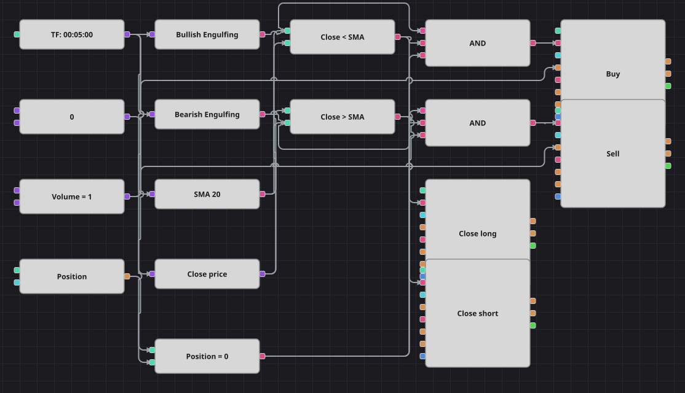

# 包み足（強気）+ SMA フィルター戦略のダイアグラム
[English](README.md) | [Русский](README_ru.md) | [中文](README_zh.md) | [Español](README_es.md) | [Deutsch](README_de.md) | [Português](README_pt.md)

包み足は、前の足を支配していた側が一気に押し戻されたことを示します。それだけでは出現があまりに多いため、単純移動平均線がシグナルを採用する場所を決めます。強気の包み足は平均線より下でのみ買い、弱気の包み足は上でのみ売ります。同じ平均線が手仕舞いの目標にもなります。

## 戦略の概要

- 2つのローソク足パターン指標ブロックが、組み込みの Bullish Engulfing と Bearish Engulfing を保持しているため、独自の数式を書かずに形を認識できます。
- 終値の単純移動平均線が、チャートを割安な側と割高な側に分けます。
- パターンは割安な側でのみ買い、割高な側でのみ売るため、このダイアグラムはブレイクアウトではなく平均回帰の例になります。
- ポジション判定により、ノーポジションのときだけパターンに従って発注します。

## エントリーとエグジットの条件

- **ロングエントリー**: パターンブロックが強気の包み足を報告し、終値が移動平均線を下回り、ポジションがないとき。注文は1ロットを買い、買い建玉を作ります。
- **ショートエントリー**: パターンブロックが弱気の包み足を報告し、終値が移動平均線を上回り、ポジションがないとき。注文は1ロットを売り、売り建玉を作ります。
- **エグジット**: 終値が移動平均線を上回れば買い建玉を、下回れば売り建玉を、いずれもクローズモードのポジション変更ブロックで決済します。元の戦略はエントリーと同じ側で手仕舞い、その間は数百本のバーの休止で建玉を維持しますが、ここにはバーを数えるブロックがないため、平均線への回帰を手仕舞い条件としました。合理的に取引を続けられる最も近い規則です。

## パラメーター

| パラメーター | 既定値 | 説明 |
|---|---|---|
| SMA Length | 20 | パターンを絞り込み、建玉を手仕舞う単純移動平均線の期間。 |
| Volume | 1 | 注文数量（ロット）。 |
| Candles | 00:05:00 | ダイアグラム全体が用いるローソク足の時間軸。 |

## ダイアグラムの詳細

- ローソク足ブロックは4つの枝に分かれ、2つのパターン指標、移動平均線、終値を読む変換ブロックへ渡します。
- 2つの比較ブロックが終値を平均線のどちら側に置くかを決め、同じ2つのシグナルがエントリーのフィルターと手仕舞いのトリガーを兼ねます。
- ポジションブロックはゼロ定数と比較され、その結果が両方のエントリーを守ります。
- それぞれの論理積がパターン、フィルター、ポジション判定を結び、ポジション変更ブロックを起動します。2つのエントリー注文は共通の定数から数量を受け取り、2つの決済ブロックには数量が不要です。

## 使い方

`.json` ファイルを Designer に読み込み、バックテスターで過去データを使って実行し、実運用の前にパラメーターやブロック自体を自分の銘柄に合わせて調整してください。
