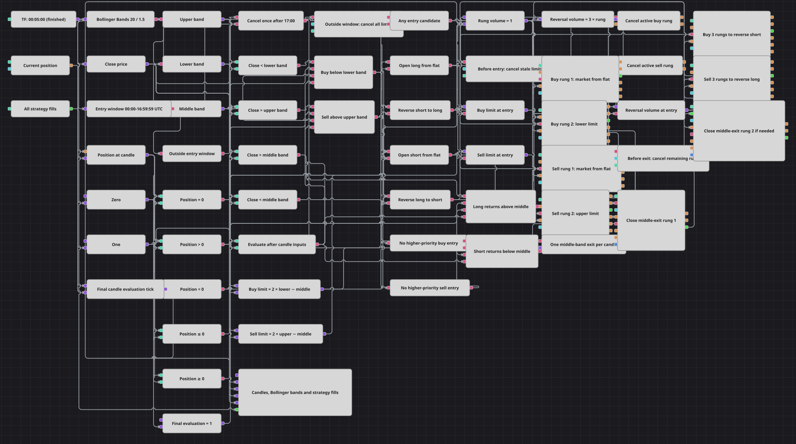

# Envelope Band Ladder ストラテジーダイアグラム
[English](README.md) | [Русский](README_ru.md) | [中文](README_zh.md) | [Español](README_es.md) | [Deutsch](README_de.md) | [Português](README_pt.md)

このダイアグラムは、5分足のボリンジャーバンドで平均回帰を取引し、2段階のエントリー、範囲を限定した反転、中央線での決済、未約定注文の時刻取消を組み合わせます。

## 戦略の概要

- 確定した5分足を期間20、幅1.5の Bollinger Bands に入力します。指標形成後、終値が下限バンドより低い、または上限バンドより高い場合だけを厳密比較で検出します。
- エントリーは 00:00:00 から 16:59:59 UTC まで両端を含めて許可されます。フラット時は第1段を1単位の成行注文、第2段を買いなら `2 × lower − middle`、売りなら `2 × upper − middle` の1単位指値注文として出します。
- 1段または2段の保有に対する反対シグナルでは、古い指値を取り消して3単位の成行注文を出します。これにより、許可されたどちらの保有量も新方向の1単位または2単位へ移し、追加の遠方段は置きません。
- 中央線への戻りによる決済は、同じ足で発生した反対側バンド外エントリーより優先度が低くなります。決済では未約定段を取り消し、1単位の ReduceOnly 成行処理を2つ連結します。第2処理は2単位目が残る場合だけ実行されます。
- エントリー時間外では、日次 Flag が一括取消と個別取消を同時に起動します。時間による強制決済はなく、中央線決済は一日中有効です。

## エントリーとエグジットの条件

- **ロングエントリー**: UTC エントリー時間内で `Close < lower band` かつ `Position ≤ 0` のとき買い候補になります。フラット時は1単位の成行買いと `2 × lower − middle` の1単位遠方指値を出します。ショート保有時は古い指値を取り消し、3単位を買って範囲内で反転します。
- **ショートエントリー**: UTC エントリー時間内で `Close > upper band` かつ `Position ≥ 0` のとき売り候補になります。フラット時は1単位の成行売りと `2 × upper − middle` の1単位遠方指値を出します。ロング保有時は古い指値を取り消し、3単位を売って範囲内で反転します。
- **エグジット**: 優先度の高い反対エントリーがない場合、ロングは `Close > middle band`、ショートは `Close < middle band` の後に決済します。未約定段を先に取り消し、連結した1単位の ReduceOnly 成行処理2つで、フラットを越えずに最大2つの約定段を解消します。時間フィルターは注文だけを取り消し、強制決済は行いません。

## パラメーター

| パラメーター | 既定値 | 説明 |
|---|---|---|
| Candles | 00:05:00 | すべてのシグナル計算に使う確定足の時間枠です。 |
| Bollinger Length | 20 | 形成後のみ出力する Bollinger Bands の参照期間です。 |
| Bollinger Width | 1.5 | 上限バンドと下限バンドに用いる標準偏差の倍率です。 |
| Entry Start | 00:00:00 UTC | 固定 UTC エントリー時間の開始値で、境界を含みます。 |
| Entry End | 16:59:59 UTC | 固定 UTC エントリー時間の終了値で、境界を含みます。この後は未約定指値を取り消します。 |
| Rung Volume | 1 | 通常の各ラダー段と各 ReduceOnly 決済ステップの数量です。 |

## ダイアグラムの詳細

- [Candles](https://doc.stocksharp.com/en/topics/designer/strategies/using_visual_designer/elements/data_sources/candles.html) ブロックは確定した5分足を出力し、同梱の1分履歴から構築できます。[Indicator](https://doc.stocksharp.com/en/topics/designer/strategies/using_visual_designer/elements/common/indicator.html) ブロックが3本のボリンジャー線を計算します。
- [Converter](https://doc.stocksharp.com/en/topics/designer/strategies/using_visual_designer/elements/common/converter.html)、[Comparison](https://doc.stocksharp.com/en/topics/designer/strategies/using_visual_designer/elements/common/comparison.html)、[Logical condition](https://doc.stocksharp.com/en/topics/designer/strategies/using_visual_designer/elements/common/logical_condition.html) ブロックが Close を抽出し、バンド、ポジション、時間、優先度の厳密なゲートを構成します。
- [Working time](https://doc.stocksharp.com/en/topics/designer/strategies/using_visual_designer/elements/time/working_time.html) ブロックはダイアグラム固有の固定フィルターです。Formula と Variable ブロックがエントリー時点の遠方価格と3倍の反転数量を計算して保存します。
- 6つの [Order registering](https://doc.stocksharp.com/en/topics/designer/strategies/using_visual_designer/elements/orders/register.html) ブロックが、フラット時の成行エントリー、範囲を限定した成行反転、2つの未約定指値を担当します。[Mass order cancellation](https://doc.stocksharp.com/en/topics/designer/strategies/using_visual_designer/elements/orders/mass_cancel.html) ブロックが各取消境界を示し、2つの個別取消ブロックが有効な遠方指値を保持して取り消します。
- 2つの [Modify position](https://doc.stocksharp.com/en/topics/designer/strategies/using_visual_designer/elements/positions/modify.html) ブロックが連結した ReduceOnly 決済を実行します。[Chart panel](https://doc.stocksharp.com/en/topics/designer/strategies/using_visual_designer/elements/common/chart.html) は足、3本のバンド、ストラテジー約定ストリームを表示します。

## 使い方

`.json` ファイルを Designer に読み込み、バックテスターで過去データを使って実行し、実運用の前にパラメーターやブロック自体を自分の銘柄に合わせて調整してください。
