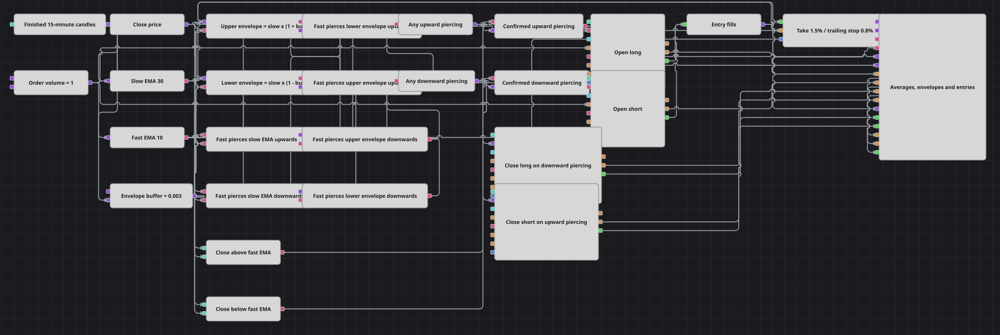

# Envelope Multi Cross 戦略ダイアグラム
[English](README.md) | [Русский](README_ru.md) | [中文](README_zh.md) | [Español](README_es.md) | [Deutsch](README_de.md) | [Português](README_pt.md)

速い平均と遅い平均は、きれいな一点で出会うわけではありません。同じゾーンの周りで触れ、離れ、また触れます。このダイアグラムはそれを前提として、そのゾーンを3つの水準に変えます。遅い平均の上下に引かれた狭いバンドと、遅い平均そのものです。それぞれの水準に専用の交差ブロックが割り当てられ、2つの結合ブロック (Combination) が6つの独立した交差を1本のロングの流れと1本のショートの流れにまとめるので、信号のはしご全体が1組の注文ブロックに届きます。

## 戦略の概要

- 1つの銘柄の確定したローソク足が、速い指数移動平均と遅い指数移動平均、そして同じローソク足から終値を取り出すコンバーターに供給されます。
- 2つの数式が遅い平均を固定の割合で上下にスケールし、上側と下側のエンベロープを作ります。その間に遅い平均があるため、ダイアグラムは水準を1つではなく3つ持ちます。
- 3つの交差ブロックが、速い平均が下側エンベロープを、遅い平均を、上側エンベロープを上抜ける様子を、それぞれ専用の入力ペアで監視します。
- さらに3つの交差ブロックが同じ3つの水準を入力を入れ替えて受け取り（水準が上、速い平均が下）、速い平均がそれらの水準を下抜けることを報告します。
- 1つの結合ブロックが3つの上向きの交差を1本の流れにまとめ、もう1つが3つの下向きの交差をまとめます。そこから先は、はしご全体が方向ごとに1つの信号になります。
- それぞれの流れは終値と速い平均の比較によって確認されるため、突き抜けがエントリーとして数えられるのは、価格が速い線の同じ側にある間だけです。
- エントリーはノーポジションの状態から出される固定数量の成行注文です。反対側の流れはそのまま使われ、単独でポジションクローズのブロックを動かします。
- ポジション保護 (Position protection) がすべてのエントリー約定を引き継ぎ、パーセント指定のテイクプロフィットとトレーリングのストップロスを付けて管理します。

## エントリーとエグジットの条件

- **ロングエントリー**: ロングの流れが発火します。速い平均が下側エンベロープを、遅い平均を、または上側エンベロープを上抜けた場合です。比較がローソク足の終値は速い平均より上だと確認し、2つの答えが論理条件で合流して、ポジション変更ブロック (Position modify) が注文数量を成行で買います。オープンポジションの設定により、この注文はポジションがない間だけ通されます。
- **ショートエントリー**: ショートの流れも同じように、鏡写しの交差で発火します。速い平均が上側エンベロープを、遅い平均を、または下側エンベロープを下抜けた場合です。比較がローソク足の終値は速い平均より下だと確認し、ポジション変更ブロックがノーポジションの状態から注文数量を成行で売ります。
- **エグジット**: 取引を終わらせるものは、独立して2つあります。反対側の流れは価格による確認なしで取り出され、ポジションクローズのブロックを起動します。下向きの突き抜けはロングを、上向きの突き抜けはショートをフラットにします。並行してポジション保護がエントリー約定を監視し、終値を読み取り、テイクプロフィットとトレーリングストップのうち先に到達したほうで取引を閉じます。

## パラメーター

| パラメーター | 既定値 | 説明 |
|---|---|---|
| Candles | 00:15:00 | 他のすべてを計算する土台となるローソク足系列の時間軸。 |
| Fast EMA Length | 10 | 速い指数移動平均の期間 — 突き抜ける側の線です。 |
| Slow EMA Length | 30 | 遅い指数移動平均の期間 — バンドがその周りに引かれる線です。 |
| Envelope Buffer | 0.003 | 遅い平均に対する割合で表したバンドの半値幅。0.003 はエンベロープを遅い平均の上下 0.3% に置きます。 |
| Order Volume | 1 | 両方のエントリー方向で使う注文数量（ロット）。 |
| Take Profit, % | 1.5 | テイクプロフィットまでの距離。エントリー価格に対するパーセント。 |
| Stop Loss, % | 0.8 | ストップロスまでの距離。エントリー価格に対するパーセント。有利に動くポジションの後ろを追随します。 |

## ダイアグラムの詳細

- はしごを読みやすくしているのは、2つの結合ブロックです。これらがなければ6つの交差それぞれが注文ブロックまで自分の配線を必要とし、4つ目の水準を足すにはダイアグラムの右半分を丸ごと引き直すことになります。
- 交差ブロックは交差した方向を報告し、下向きの交差は負の信号として届くため、注文のトリガーはそれを黙って無視します。だからこそ下向きの一式は、上向きの一式を反転させるのではなく、入力を入れ替えた3つの別々のブロックとして組まれています。
- ローソク足は確定したものだけを購読します。形成中のローソク足の更新はその足の始まりの時刻を持つため、現在時刻より前の時刻が付いた注文は拒否されます。
- エントリーはオープンポジションの条件を使うため、取引がすでに動いている間に届いた信号は何のコストにもなりません。ブロックは無効な数量を報告し、注文は送られません。この設定1つが、エントリー条件の中に明示的なポジションフィルターを置くのと同じ働きをします。
- バンドは意図的に狭くしてあります。これはボラティリティのチャネルではなく遅い平均の周りのバッファなので、追加の2つの水準は単純なクロスオーバーのすぐ近くで発火し、信号を置き換えるのではなく厚くします。

## 使い方

`.json` ファイルを Designer に読み込み、バックテスターで過去データを使って実行し、実運用の前にパラメーターやブロック自体を自分の銘柄に合わせて調整してください。
