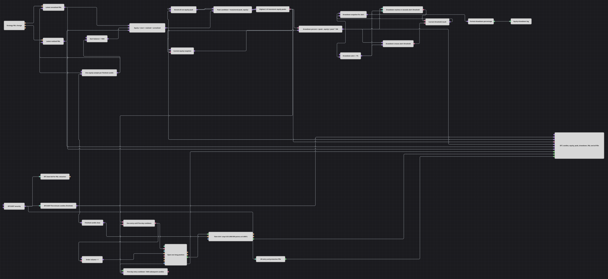

# Контроль просадки капитала
[English](README.md) | [中文](README_zh.md) | [Español](README_es.md) | [Deutsch](README_de.md) | [Português](README_pt.md) | [日本語](README_ja.md)

Эта схема строит кривую капитала по прибыли и убытку стратегии, хранит постоянный максимум, один раз записывает в журнал каждое новое превышение порога просадки и выполняет намеренно редкий защищённый цикл длинных позиций, чтобы значения счёта менялись во время тестирования.

## Обзор стратегии

- Завершённые пятиминутные свечи BTCUSDT задают единый такт выборки. Параллельная подписка Level 1 на лучшую цену покупки поддерживает актуальную оценку нереализованной прибыли и убытка между выборками по свечам.
- Блок изменения прибыли и убытка обновляет скрытые хранилища реализованного и нереализованного результата в своём событийном темпе. На каждой завершённой свече оба последних значения вместе со Start Balance ровно один раз поступают в формулу `Equity = Start Balance + Realized P&L + Unrealized P&L`.
- `max(сохранённый максимум, капитал)` поддерживает максимум капитала за весь прогон. Сформированный Highest(2) подтверждает этот монотонный поток и добавляет прогрев на одну выборку, не сокращая историю максимума.
- Просадка рассчитывается как `(Peak - Equity) / Peak * 100`. Comparison проверяет `Drawdown >= Drawdown Alert`, а Crossing вместе с логическим хранилищем передаёт в журнал только новое пересечение порога снизу вверх.
- Modify position открывает одну рыночную длинную позицию из нулевой позиции. Абсолютная защита закрывает её, а таймер на 1 440 свечей разрешает следующий вход только после пяти дней последующих пятиминутных свечей.

## Правила входа и выхода

- **Длинный вход**: после формирования Highest(2) доступный Flag входа передаёт Volume 1 в блок Modify position с Buy, OpenPosition и MarketOrder. Поэтому первая попытка входа выполняется на второй завершённой свече.
- **Короткий вход**: схема не открывает короткие позиции. Сделки Sell служат защитными выходами из длинной позиции.
- **Выход**: Position protection отправляет рыночный выход после благоприятного движения на 0.04 или неблагоприятного движения на 0.03 в абсолютных единицах цены. Исполнение входа запускает задержку на 1 440 последующих свечей; выход таймера, а не исполнение сделки выхода, сбрасывает Flag входа и повторно разрешает вход.

## Параметры

| Параметр | Значение по умолчанию | Описание |
|---|---|---|
| BTC Data Security | BTCUSDT@BNBFT | Инструмент для подписок Candles, Level 1 и Strategy trades. Для транзакций и расчёта прибыли и убытка задайте Strategy Security тот же инструмент. |
| Candle Series | 00:05:00 | Интервал завершённых свечей и такт выборок капитала и шагов задержки. |
| Start Balance | 1000 | Базовая сумма, добавляемая к реализованной и нереализованной прибыли и убытку при расчёте капитала. |
| Peak Confirmation Length | 2 | Длина Highest для монотонного потока постоянного максимума; торговля задерживается до второй выборки. |
| Drawdown Alert, % | 1 | Запись в журнал создаётся, когда просадка достигает или превышает этот уровень снизу. |
| Volume | 1 | Объём каждого длинного входа. |
| Entry Cooldown N | 1440 | Число последующих завершённых пятиминутных свечей между разрешёнными входами, равное пяти дням. |
| Take Distance | 0.04 | Благоприятное абсолютное расстояние цены, закрывающее длинную позицию по рынку. |
| Stop Distance | 0.03 | Неблагоприятное абсолютное расстояние цены, закрывающее длинную позицию по рынку. |

## Детали схемы

- [Variable](https://doc.stocksharp.com/ru/topics/designer/strategies/using_visual_designer/elements/data_sources/variable.html) BTC передаёт инструмент в завершённые [Candles](https://doc.stocksharp.com/ru/topics/designer/strategies/using_visual_designer/elements/data_sources/candles.html), [Level 1](https://doc.stocksharp.com/ru/topics/designer/strategies/using_visual_designer/elements/data_sources/level_1.html) с лучшей ценой покупки и [Strategy trades](https://doc.stocksharp.com/ru/topics/designer/strategies/using_visual_designer/elements/common/trades_by_strategy.html). Торговые блоки используют Strategy Security и Strategy Portfolio.
- Скрытые хранилища Variable отделяют событийный поток [P&L change](https://doc.stocksharp.com/ru/topics/designer/strategies/using_visual_designer/elements/common/pnl_strategy.html) от такта свечей. Их фиксированный порядок выдачи предоставляет каждой [Formula](https://doc.stocksharp.com/ru/topics/designer/strategies/using_visual_designer/elements/common/formula.html) полный набор входов одной свечи.
- Постоянный максимум начинается с нуля, поэтому изменение Start Balance остаётся корректным. Формула max обновляет это состояние до передачи монотонного результата в сформированный [Indicator](https://doc.stocksharp.com/ru/topics/designer/strategies/using_visual_designer/elements/common/indicator.html) Highest(2).
- [Comparison](https://doc.stocksharp.com/ru/topics/designer/strategies/using_visual_designer/elements/common/comparison.html) и [Crossing](https://doc.stocksharp.com/ru/topics/designer/strategies/using_visual_designer/elements/common/crossing.html) получают порог и просадку в фиксированном порядке. Ложное пересечение при восстановлении игнорируется, а истинное пересечение вверх передаёт сохранённый процент через [String Formatter](https://doc.stocksharp.com/ru/topics/designer/strategies/using_visual_designer/elements/notifying/string_format.html) в [Notification](https://doc.stocksharp.com/ru/topics/designer/strategies/using_visual_designer/elements/notifying/notification.html) типа Log.
- Блок задержки [Delay](https://doc.stocksharp.com/ru/topics/designer/strategies/using_visual_designer/elements/common/delay_value.html) получает каждую свечу до решений той же свечи. Исполнение Buy запускает N = 1440, а выход блока сбрасывает Flag входа до поступления разрешённой свечи в Highest.
- Исполнение Buy из [Modify position](https://doc.stocksharp.com/ru/topics/designer/strategies/using_visual_designer/elements/positions/modify.html) инициализирует локальную [Position protection](https://doc.stocksharp.com/ru/topics/designer/strategies/using_visual_designer/elements/positions/protect.html). На графике показаны свечи, выбранные значения капитала, максимум, просадка, оба компонента прибыли и убытка, исполнения входа, защитные исполнения и все исполнения стратегии.

## Использование

Импортируйте файл `.json` в Designer, задайте Strategy Security равным BTCUSDT@BNBFT и запустите схему на встроенной мартовской истории. Перед применением схемы в реальной торговле проверьте масштаб капитала, абсолютные расстояния защиты, процент оповещения и пятидневную задержку для своего инструмента.
