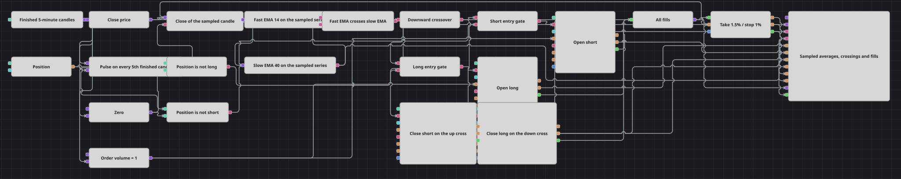

# Схема стратегии «Фильтр каждого N-го бара»
[English](README.md) | [中文](README_zh.md) | [Español](README_es.md) | [Deutsch](README_de.md) | [Português](README_pt.md) | [日本語](README_ja.md)

Две экспоненциальные скользящие средние пересекаются, и одна сторона рынка покупается, а другая продаётся. Суть этой схемы — в том, чем именно питаются средние. Вместо того чтобы читать каждую свечу, они берут одну цену из каждой пятой свечи, а прореживание выполняет блок N values, подключённый так, что поток свечей отсчитывается сам по себе. Всё, что стоит ниже по цепочке — средние, пересечение, входы — живёт по этому замедленному такту, поэтому схема смотрит на рынок один раз за окно выборки, а не один раз за бар.

## Обзор стратегии

- Завершённые пятиминутные свечи поступают в конвертер, который извлекает из каждой свечи цену закрытия, и в блок N values, превращающий тот же поток в импульс выборки.
- Блок N values принимает поток свечей сразу на оба входа: триггер взводит его обратный отсчёт, а вход этот отсчёт уменьшает, поэтому блок выдаёт импульс на каждой пятой завершённой свече и тут же взводится снова.
- Этот импульс служит триггером блока Variable, который держит последнюю цену закрытия. Переменная запоминает каждое закрытие по мере поступления, но ничего не отдаёт до прихода импульса, поэтому на выходе получается прореженный ряд цен — по одному значению на окно выборки.
- Обе скользящие средние читают этот прореженный ряд, а не свечи, поэтому средняя с периодом четырнадцать охватывает семьдесят свечей рыночного времени, а средняя с периодом сорок — двести.
- Блок Crossing следит за быстрой средней относительно медленной и подаёт голос только в момент, когда линии меняются местами: true — когда быстрая пересекает медленную снизу вверх, false — когда сверху вниз. Логическое НЕ превращает нисходящий случай в отдельный сигнал.
- Блок Position сравнивается с нулевой переменной двумя сравнениями — «не в лонге» и «не в шорте», — и каждый результат соединяется со своим сигналом пересечения логическим И, так что для входа нужны свежее пересечение и позиция, которой ещё нет на этой стороне.
- Оба входных блока настроены только на открытие, поэтому схема держит одну позицию за раз и никогда её не наращивает; объём заявки берётся из переменной, обновляемой на каждой свече.
- Обратное пересечение запускает два блока закрытия, Position protection взводится каждой сделкой, а панель графика рисует свечи, обе средние, заявки на вход и выход, защитные заявки и все сделки.

## Правила входа и выхода

- **Вход в лонг**: Быстрая средняя пересекает медленную снизу вверх на импульсе выборки, и позиции в лонге нет. Position modify покупает объём заявки по рынку в режиме только открытия, поэтому вход берётся с нулевой позиции и никогда не добавляется к уже открытой сделке.
- **Вход в шорт**: Быстрая средняя пересекает медленную сверху вниз на импульсе выборки, и позиции в шорте нет. Логическое НЕ превращает нисходящее пересечение в сигнал, и Position modify продаёт объём заявки по рынку в режиме только открытия.
- **Выход**: Выходов два. Position protection, взводимый каждой сделкой, закрывает позицию по прибыли 1.5% или по стопу 1%. Если ни то ни другое не достигнуто до того, как средние поменяются местами обратно, дело берёт на себя обратное пересечение: оно запускает блок закрытия для той стороны, которая удерживается, и этот блок отправляет по рынку всю позицию. Поскольку входные блоки работают только на открытие, пересечение, завершающее сделку, не открывает противоположную — следующий вход ждёт следующего пересечения, которое придёт при нулевой позиции.

## Параметры

| Параметр | По умолчанию | Описание |
|---|---|---|
| Candles | 00:05:00 | Таймфрейм свечей, на которых работает вся схема; окно выборки отсчитывается в этих свечах. |
| Bars Per Sample | 5 | Сколько завершённых свечей составляют одну выборку. Увеличьте значение — и средние будут видеть рынок реже, а сделок станет меньше; поставьте единицу — и схема превратится в обычное пересечение, считаемое на каждой свече. |
| Fast EMA Length | 14 | Период быстрой средней, отсчитываемый в выборках, а не в свечах: при пяти свечах на выборку он охватывает в пять раз больше свечей рыночного времени. |
| Slow EMA Length | 40 | Период медленной средней, в выборках. Держите его с заметным отрывом от быстрого периода, иначе линии будут меняться местами на шуме и пересечения перестанут что-либо значить. |
| Order Volume | 1 | Объём каждой заявки на вход, в единицах инструмента. Блоки закрытия его игнорируют и отправляют весь объём, который держит позиция. |
| Take Profit, % | 1.5 | Дистанция тейк-профита, в процентах от цены исполнения. |
| Stop Loss, % | 1 | Дистанция стоп-лосса, в процентах от цены исполнения. |

## Детали диаграммы

- Блок N values используется здесь как прореживатель, а не как задержка. Оба его входа идут от одного и того же потока свечей, поэтому отсчёт перезапускается в тот же момент, когда истекает, и импульс приходится на каждую пятую завершённую свечу на протяжении всего прогона.
- Именно блок Variable между импульсом и средними делает прореживание настоящим: его вход принимает каждую цену закрытия, выход молчит до прихода триггера, и поэтому средним достаётся одно значение на окно, а промежуточных свечей они не видят.
- Обе средние читают одну и ту же переменную, поэтому они продвигаются в такт, и блок Crossing может сопоставлять их значения по мере поступления. Он сообщает только о той выборке, на которой порядок двух линий изменился, — именно поэтому входы невозможны в свечах между выборками.
- Проверки позиции написаны как «не в лонге» и «не в шорте», а не как «позиции нет», поэтому пересечение, пришедшее при ещё открытой противоположной стороне, всё равно доходит до входного блока; удерживает схему в рамках одной позиции настройка «только открытие», а освобождают её блоки закрытия.
- Каждая сделка — и на входах, и на выходах — объединяется блоком Combination и отправляется в Position protection, поэтому защитная часть всегда видит позицию, которая реально есть на счёте, и снимается, как только пересечение закрыло сделку.

## Использование

Импортируйте файл `.json` в Designer, прогоните схему на исторических данных в тестере, затем подстройте параметры или сами кубики под свой инструмент, прежде чем торговать вживую.
