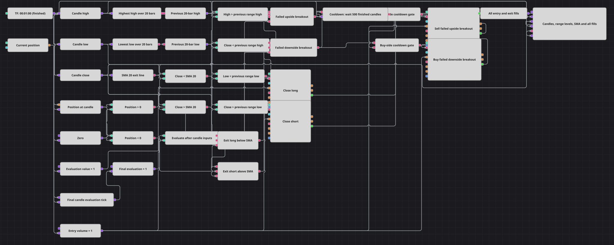

# フォールスブレイクアウト・トラップ戦略のダイアグラム
[English](README.md) | [Русский](README_ru.md) | [中文](README_zh.md) | [Español](README_es.md) | [Deutsch](README_de.md) | [Português](README_pt.md)

このダイアグラムは、価格が境界を一時的に抜けた後、直前20本のローソク足レンジ内へ戻る動きを取引します。方向別の2つのゲートが連続エントリーを制限し、SMA が保有ポジションを直ちに手仕舞います。

## 戦略の概要

- 確定した1分足を High、Low、Close のストリームに分けます。
- Highest(20) と Lowest(20) の後に Shift = 1 の Previous value を置き、現在足を含まないレンジを定義します。
- High が直前レンジ上限を超えて Close が下へ戻れば上方向の失敗、Low について反対なら下方向の失敗です。
- 売り側 Flag と買い側 Flag は、確定足500本を待つ1つの N values を共有し、各側は次の共通リセットまで1回だけ通します。
- ポジションがないときに固定数量1で成行エントリーし、SMA(20) 条件で同じ数量だけポジションを減らします。

## エントリーとエグジットの条件

- **ロングエントリー**: Low が直前20本の安値を下回り、Close が境界の上へ戻り、買い側クールダウンゲートがイベントを受理したとき、ポジションなしの場合だけ1単位を成行買いします。
- **ショートエントリー**: High が直前20本の高値を上回り、Close が境界の下へ戻り、売り側クールダウンゲートがイベントを受理したとき、ポジションなしの場合だけ1単位を成行売りします。
- **エグジット**: Close が SMA(20) を下回ればロングを1単位減らし、Close が SMA(20) を上回ればショートを1単位減らします。手仕舞いは直ちに実行され、エントリーの待機を通りません。ストップロスとテイクプロフィットはありません。

## パラメーター

| パラメーター | 既定値 | 説明 |
|---|---|---|
| Candles Series | 00:01:00 | レンジ、シグナル、手仕舞いの全計算に使う確定1分足です。 |
| Highest Length | 20 | 移動する上限に含めるローソク足高値の本数です。 |
| Highest Source | Not set | 別のインジケーター入力欄は未選択で、Candle high を直接接続します。 |
| Lowest Length | 20 | 移動する下限に含めるローソク足安値の本数です。 |
| Lowest Source | Not set | 別のインジケーター入力欄は未選択で、Candle low を直接接続します。 |
| SMA Length | 20 | 手仕舞い用移動平均に含める終値の本数です。 |
| SMA Source | Not set | 別のインジケーター入力欄は未選択で、Candle close を直接接続します。 |
| Cooldown N | 500 | 共通クールダウンのリセットが出るまでに消費する確定足の本数です。 |
| Entry Volume | 1 | 各エントリーと縮小手仕舞いに使う固定成行数量です。 |

## ダイアグラムの詳細

- Highest と Lowest は数値の High と Low を受け取り、SMA は Close を受け取ります。3つとも形成済みの値だけを出力します。
- Previous value は両方のレンジ指標を1更新ずらすため、判定対象の足は自身の境界計算に入りません。
- 最終評価パルスは、足の各値、指標、ポジション、比較結果が更新された後で2つの失敗判定 AND に届きます。
- フィルター前の失敗イベントはすべて共有 N values を開始します。その出力は続く確定足500本の後に両 Flag をリセットし、それまでは各 Flag が同じ側の繰り返しを抑えます。
- OpenPosition は保有中の新規注文を防ぎます。待機分岐がポジション操作より前にあるため、保有中のイベントでもクールダウンを開始する場合があります。
- 2つの SMA 手仕舞いゲートはポジション方向を確認し、数量1の ReduceOnly 成行操作を使います。Chart には足、2つの直前レンジ境界、SMA、全約定が入ります。

## 使い方

`.json` ファイルを Designer に読み込み、バックテスターで過去データを使って実行し、実運用の前にパラメーターやブロック自体を自分の銘柄に合わせて調整してください。
