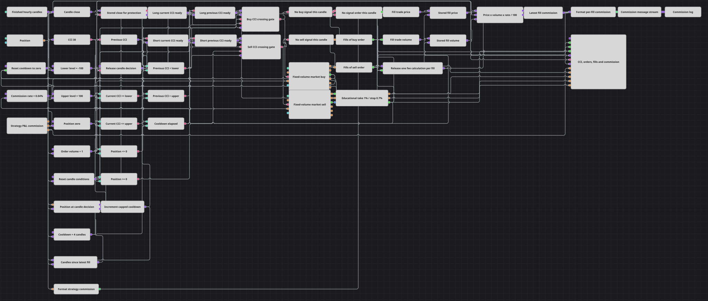

# 約定ごとの手数料計上ストラテジー図
[English](README.md) | [Русский](README_ru.md) | [中文](README_zh.md) | [Español](README_es.md) | [Deutsch](README_de.md) | [Português](README_pt.md)

このダイアグラムは、時間足 CCI(30) がしきい値へ戻ることを確認して固定数量の成行注文を1件送り、観測した各約定の手数料計上を示します。4本のクールダウンが新規シグナルを制御し、学習用の割合指定ポジション保護が決済を行えます。1つのログには、約定ごとの計算額とストラテジーエンジンの累積手数料値が入ります。

## 戦略の概要

- 確定した1時間足を CommodityChannelIndex 30 へ入力します。インジケーターは、期間が完全に形成される前に算出された値も含め、すべての値を出力します。
- 買いには前回 CCI < -100 かつ現在 CCI >= -100 が必要です。売りには前回 CCI > 100 かつ現在 CCI <= 100 が必要です。
- 買い側には Position <= 0、売り側には Position >= 0 も必要で、どちらも4本のクールダウンが完了していなければなりません。
- 有効な各シグナルは、固定 Volume の成行注文をちょうど1件送ります。ポジションがゼロなら示された側を建て、反対側の単位ポジションがある場合はゼロまで決済するだけで、同じシグナルでは逆側を建てません。
- ポジション保護は、1%の利確と0.7%の固定損切りを持つ明示的な学習用レイヤーです。確定足の終値だけを確認し、シグナル注文をすでに発生させた足の終値は確認対象から外します。
- 観測した各約定について Trade.Price × Trade.Volume × Commission Rate % / 100 で模擬手数料を1回計算します。チャートは CCI、注文、約定、2種類の手数料系列を表示し、整形した手数料メッセージを1つのログストリームへ送ります。

## エントリーとエグジットの条件

- **ロングエントリー**: 前回 CCI が -100 未満で、現在 CCI が -100 以上へ戻り、Position <= 0 かつクールダウン完了なら、Volume の成行買いを1件送ります。ポジションがゼロならロングを建て、単位ショートに対してはゼロまで決済するだけです。
- **ショートエントリー**: 前回 CCI が 100 より大きく、現在 CCI が 100 以下へ戻り、Position >= 0 かつクールダウン完了なら、Volume の成行売りを1件送ります。ポジションがゼロならショートを建て、単位ロングに対してはゼロまで決済するだけです。
- **エグジット**: 有効な反対方向の CCI シグナルは、固定数量の成行注文1件で単位ポジションをゼロにできます。これとは別に、学習用保護レイヤーは追跡対象の建玉を1%の利確または0.7%の固定損切りで決済できます。価格入力には、シグナル注文がなかった確定足の終値だけが入ります。

## パラメーター

| パラメーター | 既定値 | 説明 |
|---|---|---|
| Candles | 01:00:00 | 1時間足です。CCI の判断、クールダウンの加算、保護価格の確認は確定足だけで行います。 |
| CCI Length | 30 | CommodityChannelIndex の期間です。ブロックはインジケーターの完全な形成を待たずに値を出力します。 |
| Lower Level | -100 | CCI の下側しきい値です。-100 を上向きに戻ると買い側の交差条件になります。 |
| Upper Level | 100 | CCI の上側しきい値です。100 を下向きに戻ると売り側の交差条件になります。 |
| Cooldown | 4 | 約定後、次のシグナル取引を許可するまでに必要な確定足数です。 |
| Commission Rate % | 0.04 | 表示用の約定別計算式 `Trade.Price × Trade.Volume × rate / 100` だけで使うパーセント率です。 |
| Take Profit % | 1 | 学習用ポジション保護レイヤーで使う有利方向の変化率です。 |
| Stop Loss % | 0.7 | 学習用保護レイヤーの固定・非トレーリング損切りで使う不利方向の変化率です。 |
| Volume | 1 | 買いまたは売りの各シグナル注文に使う固定数量です。 |

## ダイアグラムの詳細

- [ローソク足](https://doc.stocksharp.com/ja/topics/designer/strategies/using_visual_designer/elements/data_sources/candles.html)ブロックは確定した1時間足を出力します。終値は保護用に保存され、[インジケーター](https://doc.stocksharp.com/ja/topics/designer/strategies/using_visual_designer/elements/common/indicator.html)ブロックは形成済み値フィルターを無効にして CCI 30 を計算します。足ごとのフラグは、前回値と現在値に対する4つのしきい値比較を最終判断パルスまで保持します。
- [現在ポジション](https://doc.stocksharp.com/ja/topics/designer/strategies/using_visual_designer/elements/positions/current.html)が Position <= 0 と Position >= 0 のゲートを供給します。クールダウンは4から始まり、各足の判断前に加算して4で上限処理され、シグナル注文の直接約定と保護約定のたびに0へ戻ります。そのため約定後の確定足1、2、3本目は阻止され、4本目から取引できます。
- 2つの[注文登録](https://doc.stocksharp.com/ja/topics/designer/strategies/using_visual_designer/elements/orders/register.html)ブロックが、固定 Volume の成行買いと成行売りを送ります。各ブロックの直接約定出力は保護を更新してクールダウンをリセットし、専用の Trades for order ブロックは登録された Order を監視して、模擬手数料計算とチャートへシグナル約定ストリームを渡します。
- 2つの直接シグナル約定ストリームはどちらも[ポジション保護](https://doc.stocksharp.com/ja/topics/designer/strategies/using_visual_designer/elements/positions/protect.html)へ入り、シグナル決済後に内部ポジションをゼロへ戻します。保護自身の約定出力はこの入力へ戻しません。無シグナルゲートは、その足でどちらのシグナル注文も発生しなかった場合だけ、保存した確定終値を保護確認へ渡します。
- 観測した買い、売り、保護の各約定について、コンバーターが Trade.Price と Trade.Volume を無出力のラッチへ保存します。その後、解放パルスが率、価格、数量の順で出力し、[数式](https://doc.stocksharp.com/ja/topics/designer/strategies/using_visual_designer/elements/common/formula.html)が `a × b × r / 100` を更新します。最後に無出力の手数料状態が、その観測約定に対してちょうど1回だけ値を出します。
- [ストラテジー損益](https://doc.stocksharp.com/ja/topics/designer/strategies/using_visual_designer/elements/common/pnl_strategy.html)の Commission 出力はエンジンの累積手数料であり、テスト環境または実行環境に手数料ルールが設定されていなければゼロのままです。約定別の模擬計算式は表示専用で、そのエンジン値には書き込みません。
- 2つの[文字列フォーマッター](https://doc.stocksharp.com/ja/topics/designer/strategies/using_visual_designer/elements/notifying/string_format.html)出力を Combination<IComparable> で結合し、1つの Log [通知](https://doc.stocksharp.com/ja/topics/designer/strategies/using_visual_designer/elements/notifying/notification.html)へ送ります。Trades for order は登録済み Order を受け取った後に購読するため、登録呼び出し内で注文を完了する実行環境では、監視接続より先に約定が生じる場合があります。その場合も直接約定出力が保護とクールダウンを動かします。

## 使い方

`.json` ファイルを Designer に読み込み、バックテスターで過去データを使って実行し、実運用の前にパラメーターやブロック自体を自分の銘柄に合わせて調整してください。
