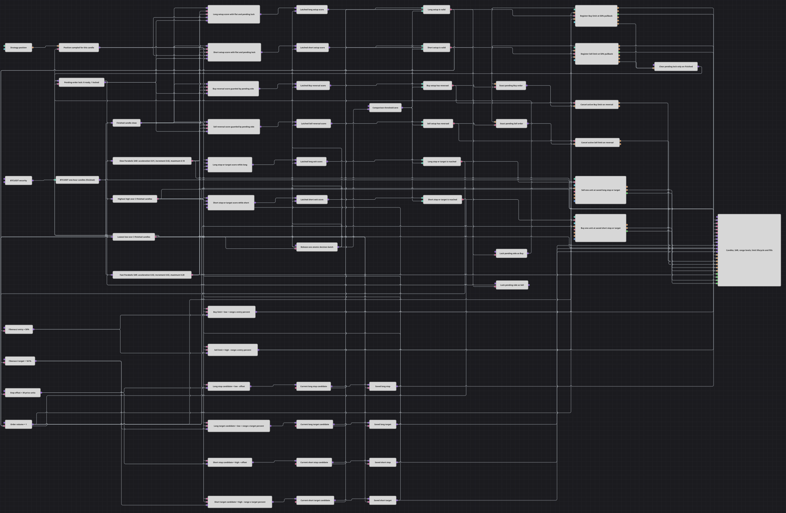

# Ordem limitada no recuo de Fibonacci e SAR
[English](README.md) | [Русский](README_ru.md) | [中文](README_zh.md) | [Español](README_es.md) | [Deutsch](README_de.md) | [日本語](README_ja.md)

Este diagrama combina duas velocidades do Parabolic SAR com a faixa de três velas, mantém apenas uma ordem limitada de recuo de Fibonacci por vez, cancela a ordem pendente quando a condição se inverte e fecha a posição executada nos níveis derivados da faixa e guardados na entrada.

## Visão geral da estratégia

- Velas finalizadas de uma hora do BTCUSDT alimentam os Parabolic SAR rápido e lento, Highest(3) e Lowest(3). As decisões começam somente depois que todos os indicadores estão formados.
- A saída formada de Lowest libera um lote de decisão após capturar Close, ambos os valores SAR, máxima, mínima, posição e estado da ordem pendente da vela atual.
- Um bloqueio global permite somente uma ordem de entrada ativa. Ele é liberado quando a ordem chega ao estado final, enquanto a posição amostrada impede outra entrada depois de uma execução.
- As condições de entrada, cancelamento e saída são armazenadas em acumuladores silenciosos e liberadas uma vez por vela finalizada, sem misturar valores de velas vizinhas.
- O gráfico mostra velas, ambos os SAR, a faixa e os níveis de proteção guardados, limites registrados e cancelados, saídas a mercado e todas as execuções.

## Regras de entrada e saída

- **Entrada comprada**: Quando `Slow SAR < Fast SAR < Close`, a posição está zerada e não há entrada pendente, envia uma ordem limite Buy em `Low3 + (High3 - Low3) * 50%`. Antes da execução, ela é cancelada se `Slow SAR > Fast SAR` ou `Fast SAR >= Close`.
- **Entrada vendida**: Quando `Slow SAR > Fast SAR > Close`, a posição está zerada e não há entrada pendente, envia uma ordem limite Sell em `High3 - (High3 - Low3) * 50%`. Antes da execução, ela é cancelada se `Slow SAR < Fast SAR` ou `Fast SAR <= Close`.
- **Saída**: Ao aceitar o sinal de entrada, os níveis do lado correspondente são guardados. Para uma posição comprada, o stop é `Low3 - 30` e o alvo é `Low3 + (High3 - Low3) * 161%`; para uma posição vendida, o stop é `High3 + 30` e o alvo é `High3 - (High3 - Low3) * 161%`. Quando um Close finalizado alcança um dos níveis guardados, uma ordem a mercado oposta de Volume 1 é enviada.

## Parâmetros

| Parâmetro | Padrão | Descrição |
|---|---|---|
| Security | BTCUSDT@BNBFT | Instrumento usado pela assinatura de velas finalizadas. Defina Strategy Security com o mesmo instrumento para ordens e execuções. |
| Candle Series | 01:00:00 | Velas finalizadas de uma hora para indicadores, decisões, saídas e gráfico. |
| Fast SAR Acceleration | 0.02 | Aceleração inicial do Parabolic SAR rápido. |
| Fast SAR Increment | 0.02 | Incremento da aceleração do Parabolic SAR rápido. |
| Fast SAR Maximum | 0.20 | Aceleração máxima do Parabolic SAR rápido. |
| Slow SAR Acceleration | 0.01 | Aceleração inicial do Parabolic SAR lento. |
| Slow SAR Increment | 0.02 | Incremento da aceleração do Parabolic SAR lento. |
| Slow SAR Maximum | 0.10 | Aceleração máxima do Parabolic SAR lento. |
| High Lookback | 3 | Quantidade de velas finalizadas que Highest usa para `High3`. |
| Low Lookback | 3 | Quantidade de velas finalizadas que Lowest usa para `Low3`. |
| Entry Fibonacci, % | 50 | Posição do preço limite dentro da faixa atual de três velas. |
| Target Fibonacci, % | 161 | Multiplicador da faixa usado em cada alvo de lucro guardado. |
| Stop Offset | 30 | Distância absoluta além da mínima ou máxima de três velas usada no stop guardado. |
| Order Volume | 1 | Quantidade de cada entrada e de cada saída a mercado protegida pelo lado. |

## Detalhes do diagrama

- A [Variable](https://doc.stocksharp.com/pt/topics/designer/strategies/using_visual_designer/elements/data_sources/variable.html) Security configura as [Candles](https://doc.stocksharp.com/pt/topics/designer/strategies/using_visual_designer/elements/data_sources/candles.html) finalizadas; os blocos de transação usam Strategy Security e Strategy Portfolio.
- Quatro blocos [Indicator](https://doc.stocksharp.com/pt/topics/designer/strategies/using_visual_designer/elements/common/indicator.html) que emitem apenas valores formados calculam ambos os Parabolic SAR e, separadamente, a máxima e a mínima de três velas. A saída de Lowest é o relógio comum do lote.
- Os blocos [Formula](https://doc.stocksharp.com/pt/topics/designer/strategies/using_visual_designer/elements/common/formula.html), Variable e [Comparison](https://doc.stocksharp.com/pt/topics/designer/strategies/using_visual_designer/elements/common/comparison.html) alinham entradas numéricas, aplicam proteções de posição zerada e lado pendente e emitem somente pulsos de ação verdadeiros.
- Cada sinal aceito guarda o stop e o alvo calculados antes de acionar seu bloco [Order registering](https://doc.stocksharp.com/pt/topics/designer/strategies/using_visual_designer/elements/orders/register.html). Os valores guardados não se movem enquanto a posição está aberta.
- A referência da ordem registrada é mantida para uma [Order cancellation](https://doc.stocksharp.com/pt/topics/designer/strategies/using_visual_designer/elements/trading/cancel_order.html) direcionada. O bloqueio pendente só é liberado pelo evento Finished do bloco de registro após execução, cancelamento confirmado ou falha de registro.
- Os blocos [Modify position](https://doc.stocksharp.com/pt/topics/designer/strategies/using_visual_designer/elements/positions/modify.html), protegidos pelo lado, enviam uma ordem a mercado oposta e fixa de uma unidade quando o Close finalizado alcança um stop ou alvo guardado. O gráfico recebe todos os fluxos relevantes de preço, ordem, cancelamento e MyTrade.

## Uso

Importe o arquivo `.json` no Designer, defina Strategy Security como BTCUSDT@BNBFT e execute-o em histórico de uma hora. Revise a escala de preço do instrumento, os níveis de Fibonacci, o deslocamento do stop, o ciclo das ordens e a saída a mercado antes de usar o diagrama em negociação ao vivo.
