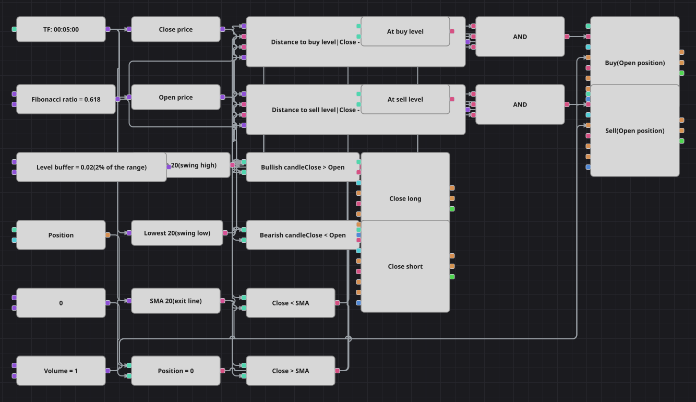

# Диаграмма стратегии разворота на коррекции Фибоначчи
[English](README.md) | [中文](README_zh.md) | [Español](README_es.md) | [Deutsch](README_de.md) | [Português](README_pt.md) | [日本語](README_ja.md)

Размах последних двадцати свечей делится золотым сечением, и полученные уровни коррекции служат зонами разворота. Свеча, закрывшаяся на нижнем уровне бычьим телом, покупается, свеча на верхнем уровне с медвежьим телом продаётся, а момент выхода определяет SimpleMovingAverage.

## Обзор стратегии

- Highest и Lowest на одинаковом окне дают максимум и минимум размаха, а их разность — сам диапазон, в котором отмеряются уровни.
- Уровень покупки лежит на 0.618 диапазона ниже максимума, уровень продажи — на 0.618 диапазона выше минимума; свеча считается стоящей на уровне, пока её закрытие ближе двух процентов диапазона к нему.
- Оба расстояния считаются в долях диапазона, поэтому диаграмма одинаково работает на любом инструменте и любом масштабе цен.
- Для входа дополнительно нужны подтверждающее тело свечи и нулевая позиция; все выходы делает SimpleMovingAverage, так как в исходной стратегии нет ни стопа, ни цели.

## Правила входа и выхода

- **Вход в лонг**: Закрытие попало в буфер вокруг нижнего уровня коррекции, свеча бычья (закрытие выше открытия) и позиция нулевая. Кубик покупает один лот и открывает лонг.
- **Вход в шорт**: Закрытие попало в буфер вокруг верхнего уровня коррекции, свеча медвежья (закрытие ниже открытия) и позиция нулевая. Кубик продаёт один лот и открывает шорт.
- **Выход**: Лонг закрывается, как только свеча закрылась ниже SimpleMovingAverage, шорт — как только выше; оба кубика работают в режиме закрытия позиции и срабатывают, только когда есть что закрывать.

## Параметры

| Параметр | По умолчанию | Описание |
|---|---|---|
| Swing lookback | 20 | Число свечей, по которым берутся максимум и минимум размаха. |
| MA period | 20 | Период SimpleMovingAverage, относительно которой считаются выходы. |
| Fibonacci ratio | 0.618 | Коэффициент коррекции, задающий положение обоих уровней внутри размаха. |
| Level buffer | 0.02 | Полуширина зоны входа вокруг уровня в долях размаха. |
| Volume | 1 | Объём заявки в лотах. |
| Candles | 00:05:00 | Таймфрейм свечей, на котором работает вся диаграмма. |

## Детали диаграммы

- Один кубик свечей питает Highest, Lowest и SimpleMovingAverage, а также два конвертера, вынимающих из свечи цены закрытия и открытия.
- Два формульных кубика превращают цены в расстояние от закрытия до каждого уровня, делённое на диапазон, поэтому одной константы буфера хватает на обе стороны.
- Каждый вход проходит через логическое И из трёх флагов: уровень, тело свечи и позиция, сравненная с нулевой константой.
- Оба кубика выхода запускаются прямо от сравнений со скользящей средней и стоят в режиме закрытия позиции; все четыре торговых кубика берут объём из одной константы.
- Сознательные упрощения: оригинал работает на минутных свечах и после каждой сделки молчит 500 баров, чего кубиками не выразить, поэтому диаграмма считает пятиминутки и торгует снова, как только условия вернулись. Позиции держатся несколько баров, а не дней; увеличение периода средней их удлиняет.

## Использование

Импортируйте файл `.json` в Designer, прогоните схему на исторических данных в тестере, затем подстройте параметры или сами кубики под свой инструмент, прежде чем торговать вживую.
