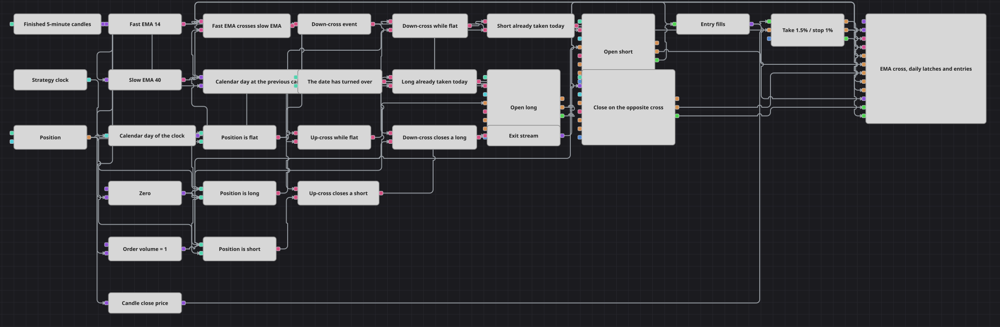

# Strategiediagramm: Erstes Signal des Tages
[English](README.md) | [Русский](README_ru.md) | [中文](README_zh.md) | [Español](README_es.md) | [Português](README_pt.md) | [日本語](README_ja.md)

Zwei exponentielle Durchschnitte, die sich auf Fünf-Minuten-Kerzen kreuzen, sind ein gewöhnliches Signal, und auf einem schnellen Zeitrahmen wiederholt es sich viele Male am Tag. Dieses Diagramm handelt pro Kalendertag nur das jeweils früheste Signal jeder Richtung und lässt jede spätere Kreuzung unangetastet vorbeiziehen. Das Gedächtnis, das dies möglich macht, sind zwei Flag-Blöcke, und was dieses Gedächtnis wieder löscht, ist die Strategieuhr, die bemerkt, dass sich das Datum geändert hat.

## Strategieübersicht

- Abgeschlossene Fünf-Minuten-Kerzen speisen einen schnellen und einen langsamen exponentiellen gleitenden Durchschnitt, und ein Crossing-Block macht aus diesem Paar ein einziges Ereignis: Er liefert true, wenn der schnelle Durchschnitt den langsamen von unten nach oben kreuzt, und false, wenn er ihn von oben nach unten kreuzt.
- Ein logisches Not verwandelt dasselbe Ereignis in ein eigenes Signal für die Abwärtskreuzung, sodass ein einziger Crossing-Block beide Richtungen bedient, ohne dass es eine zweite Kopie der Durchschnitte braucht.
- Der Block Current time leitet die Strategieuhr in einen Konverter, der daraus den Kalendertag ausliest; damit verfügt das Diagramm über eine Tagesnummer, die der Kerzenreihe nichts verdankt.
- Eine Variable hält die Tagesnummer fest und gibt sie beim Schließen einer Kerze frei, trägt also stets den Tag, zu dem die vorherige Kerze gehörte; ein NotEqual-Vergleich mit der aktuellen Tagesnummer ist deshalb genau einmal wahr — bei der ersten Kerze nach Mitternacht.
- Jede Richtung besitzt ein eigenes Flag: Das Einstiegssignal ist sein Trigger, der Impuls des Tageswechsels sein Reset. Ein Flag lässt einen Trigger nur beim ersten Setzen durch, sodass alles nach dem ersten angenommenen Signal des Tages stillschweigend verworfen wird, bis sich das Datum ändert.
- Die Einstiege sind Position modify-Blöcke, die nur aus einer flachen Position heraus eröffnen; so verbrauchen die beiden Latches höchstens einen Long und einen Short pro Tag und stocken die Größe niemals auf.
- Die gegenläufige Kreuzung schließt, was offen ist: Zwei logische Bedingungen treffen in einer Combination zusammen, die ein einziges auf Schließen gesetztes Position modify auslöst, sodass keine der beiden Seiten einen eigenen Ausstiegsblock benötigt.
- Position protection überwacht die Ausführungen der Einstiegsorders und kann einen Trade früher beenden — bei einem festen Take-Profit- oder Stop-Loss-Abstand —, sodass eine Position nie auf eine Kreuzung wartet, die nicht kommt.

## Ein- und Ausstiegsregeln

- **Long-Einstieg**: Der schnelle Durchschnitt kreuzt den langsamen von unten nach oben, während die Position flach ist. Diese Kombination löst das Long-Flag aus, und da ein Flag nur bei seinem ersten Setzen feuert, wird die Kreuzung nur dann ausgeführt, wenn seit dem letzten Datumswechsel noch kein Long eingegangen wurde. Position modify kauft daraufhin zum Marktpreis mit dem konfigurierten Volumen und verweigert die Order rundweg, wenn bereits etwas offen ist.
- **Short-Einstieg**: Der schnelle Durchschnitt kreuzt den langsamen von oben nach unten, während die Position flach ist. Das Signal läuft durch das Short-Flag, das ebenfalls nur sein erstes Setzen des Tages durchlässt, und Position modify verkauft zum Marktpreis mit demselben Volumen. Die beiden Flags sind voneinander unabhängig, sodass ein Tag einen Long und einen Short enthalten kann, in beliebiger Reihenfolge.
- **Ausstieg**: Eine Abwärtskreuzung im Long und eine Aufwärtskreuzung im Short werden von einer Combination gesammelt, die ein einziges auf Schließen gesetztes Position modify auslöst; dieses berechnet das Schließvolumen selbst. Parallel dazu arbeitet Position protection auf den Ausführungen der Einstiegsorders und kann den Trade früher beim Take-Profit- oder beim Stop-Loss-Abstand schließen. Nichts wird in einem einzigen Schritt gedreht: Die Position kehrt zuerst auf flach zurück, und die Gegenseite wird später eröffnet, bei einer Kreuzung, die das Konto leer vorfindet.

## Parameter

| Parameter | Standard | Beschreibung |
|---|---|---|
| Candles | 00:05:00 | Zeitrahmen der Kerzenreihe, auf der das gesamte Diagramm läuft. Eine langsamere Reihe bedeutet weniger Kreuzungen pro Tag und ein Tageslimit, das nur selten greift. |
| Fast EMA Length | 14 | Länge des schnellen exponentiellen gleitenden Durchschnitts. |
| Slow EMA Length | 40 | Länge des langsamen exponentiellen gleitenden Durchschnitts. Halte ihn deutlich über dem schnellen, sonst kreuzen sich die beiden Durchschnitte ständig — und ohnehin überlebt nur die erste Kreuzung jedes Tages den Latch. |
| Volume | 1 | Größe eines Einstiegs, in Einheiten des Instruments. Beide Richtungen verwenden sie. |
| Take Profit, % | 1.5 | Take-Profit-Abstand, in Prozent des Einstiegskurses. |
| Stop Loss, % | 1 | Stop-Loss-Abstand, in Prozent des Einstiegskurses. |

## Diagrammdetails

- Die Tagesnummer stammt von der Uhr und nicht von den Kerzen; deshalb funktioniert der Reset auch in einer Sitzung mit Lücken und hängt nicht davon ab, dass im Moment des Datumswechsels eine Kerze existiert.
- Die Uhr läuft in ihrem eigenen Takt, weitaus häufiger, als Kerzen schließen. Deshalb wird ihr Wert nicht direkt mit einem gespeicherten verglichen: Eine Variable bringt ihn zunächst auf den Kerzentakt, und genau dadurch bedeutet der Vergleich ‚diese Kerze gehört zu einem anderen Tag als die vorherige Kerze‘.
- Ein Flag ignoriert ein false, das an einem seiner beiden Anschlüsse eintrifft; der Vergleich auf Tageswechsel darf deshalb den ganzen Tag über false liefern, ohne den Latch zu stören, und eine logische Bedingung, die zu false ausgewertet wird, kostet nichts.
- Das Einstiegsgatter verlangt eine flache Position, und der Einstiegsblock selbst weigert sich, aus etwas anderem heraus zu arbeiten — das ist Absicht: Der Latch wird vom Signal verbraucht, ein Signal, das nicht ausgeführt werden könnte, würde also den Tag für diese Richtung verbrennen.
- Beide Richtungen teilen sich eine Volumenvariable und einen Schutzblock, sodass Long und Short nach exakt derselben Regel dimensioniert und abgesichert werden.

## Verwendung

Importieren Sie die `.json`-Datei in Designer, testen Sie sie im Backtester mit historischen Daten und passen Sie danach Parameter oder Bausteine an Ihr Instrument an, bevor Sie live handeln.
