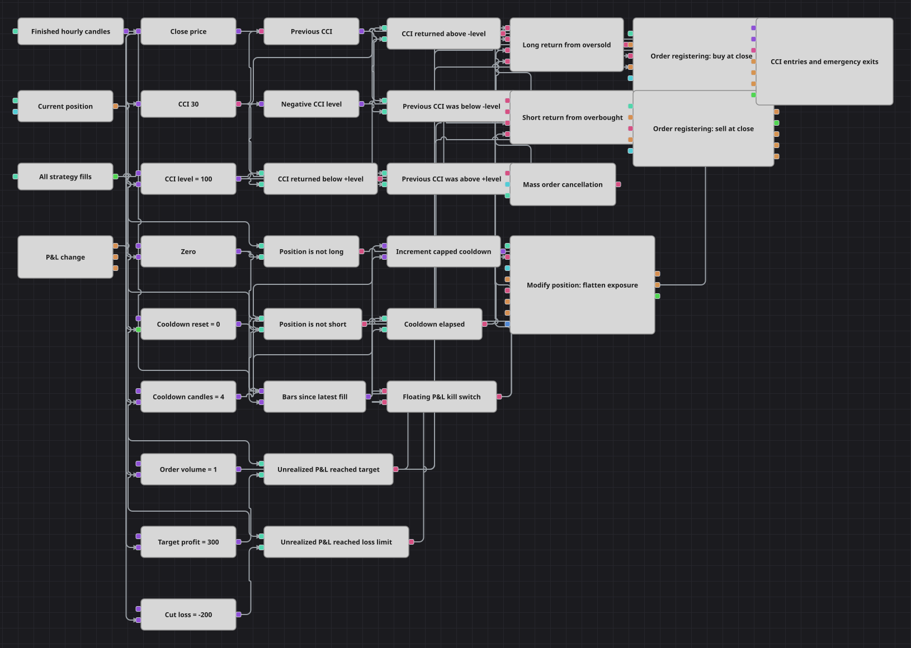

# 浮动盈亏熔断策略图
[English](README.md) | [Русский](README_ru.md) | [Español](README_es.md) | [Deutsch](README_de.md) | [Português](README_pt.md) | [日本語](README_ja.md)

该图在CCI回归信号外增加了按金额触发的紧急保护。入场以小时收盘价限价单呈现；未实现盈亏触及任一边界后，图表先撤销所有活动订单，再按市价将持仓归零。

## 策略概览

- 已完成的一小时K线进入周期30的CommodityChannelIndex，收盘价同时作为限价价格。
- 做多要求前一CCI低于−100、当前CCI回到−100或以上；做空则镜像地从+100上方回落。
- Position <= 0时才可买入，Position >= 0时才可卖出，因此反向信号会减少已有持仓。
- 每次成交把冷却重置为四根K线；封顶计数器达到限制后，入场门才重新开放。
- Order registering按已完成K线收盘价挂限价单，并关闭价格收缩。
- P&L change把未实现盈亏与+300和−200比较；任一边界触发Mass order cancellation和ClosePosition。

## 入场与出场规则

- **做多入场**: 前一CCI低于−100，当前CCI不低于−100，Position不是多头，并且最新成交后已过去四根已完成K线时，在当前收盘价挂买入限价单。
- **做空入场**: 前一CCI高于+100，当前CCI不高于+100，Position不是空头且冷却结束时，在当前收盘价挂卖出限价单。
- **离场**: 没有基于价格的止盈或止损。未实现盈利达到300或亏损达到−200时，熔断器请求撤销本策略所有活动订单，并同时发送市价ClosePosition。

## 参数

| 参数 | 默认值 | 说明 |
|---|---|---|
| Candle Time Frame | 01:00:00 | CCI、冷却和限价价格所使用的已完成K线周期。 |
| CCI Length | 30 | CommodityChannelIndex包含的一小时数据数量。 |
| CCI Level | 100 | 对称用作+Level和−Level的CCI绝对阈值。 |
| Signal Cooldown, candles | 4 | 最新成交后必须等待的已完成K线数。 |
| Order Volume | 1 | 每张限价入场单的数量。 |
| Target Profit, money | 300 | 触发紧急清算的未实现账户货币盈利。 |
| Cut Loss, money | -200 | 未实现账户货币亏损边界，通常为负值。 |

## 图表详情

- Previous value保存前一CCI，因此信号表示穿回阈值，而不是在极端区域内反复触发。
- 冷却从实际成交开始，而不是从信号或下单尝试开始；计数器封顶为四。
- 按收盘价的限价入场有意展示挂单生命周期，未成交订单让Mass order cancellation在清算时具有实际作用。
- 目标和损失阈值是账户货币的未实现金额，是CCI引擎外的紧急层，而不是百分比价格保护。
- 由于Security和Portfolio输入未连接，批量撤单覆盖本策略全部订单，随后Modify position关闭剩余持仓。

## 使用方法

将 `.json` 文件导入 Designer，在回测器中用历史数据运行，然后根据自己的交易品种调整参数或方块，确认无误后再用于实盘。
