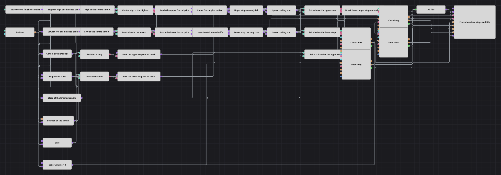

# 分形跟踪止损策略图
[English](README.md) | [Русский](README_ru.md) | [Español](README_es.md) | [Deutsch](README_de.md) | [Português](README_pt.md) | [日本語](README_ja.md)

分形是这样一根K线：它的最高价是五根K线中的最高值，或者它的最低价是五根K线中的最低值；而且只有在它出现之后再过两根K线才能被确认。本图如实保留了这一延迟：它只处理已完成的K线，把每一个分形转换成一个止损价，并且只允许这个价格朝一个方向移动。每一次止损被突破都会反手持仓，而被突破的那个价位会退出使用，直到新的分形重新把它激活。

## 策略概览

- 整张图只由一条K线序列驱动，并且设置为仅输出已完成的K线，因此任何价位和任何订单都不会建立在后续跳价仍可能推翻的价格之上。
- Highest（最高值）与 Lowest（最低值）取最近五根K线的极值，而“前值”（Previous value）返回两根之前的那根K线，再由两个转换器分别读出它的最高价和最低价。
- 当两根之前那根K线的最高价正好是窗口内的最高值时，该K线就是上分形；对最低价做镜像判断则标记出下分形。一个带锁存的变量保存每个分形价格，并且只在判断成立的那根K线上把它放出。
- 一个公式把缓冲百分比加到上分形价格上，并从下分形价格中减去，从而把分形变成止损价。
- 另外两个公式用 min 和 max 对这些价格做棘轮式约束：上方止损只能下移，下方止损只能上移，正是这一点使它们成为跟踪止损，而不是普通的摆动价位。
- 每根已完成K线的收盘价都会与两个止损比较：高于上方止损时，本图反手做多；低于下方止损时，反手做空。
- 一次反手由一对模块完成，一个平掉已有持仓，另一个开出新的方向；而刚刚用过的那个止损会被挪到价格够不到的地方，只要它所开出的持仓还在，就一直如此。
- K线、两条止损线以及每一笔成交都画在同一个图表区域中，因此棘轮效果可以直接从图上读出来。

## 入场与出场规则

- **做多入场**: 已完成K线的收盘价升破上方跟踪止损。若持有空头，处于 Close 模式的“持仓修改”（Position modify）先买回空头；账户一旦变为空仓，处于 Open 模式的“持仓修改”即按订单量买入。
- **做空入场**: 在价格仍低于上方止损的情况下，已完成K线的收盘价跌破下方跟踪止损。同一对模块反向工作：先平掉多头，然后按订单量卖出。
- **离场**: 没有单独的离场规则。持仓一直保留到相反方向的止损被突破为止，而这次突破既平掉原有持仓，又开出反向持仓，因此本图始终处于多头、空头，或距离其中之一仅一笔成交的状态。随着新分形出现，跟踪止损不断收紧，正是它把离场价格跟在持仓后面一步步推进。

## 参数

| 参数 | 默认值 | 说明 |
|---|---|---|
| Candles | 00:05:00 | 唯一那条K线序列的时间周期。只输出已完成的K线，因此每根K线做一次决策。 |
| Upper Fractal Length | 5 | 计算上方极值所用的K线数量。被检验的那根K线位于该窗口的正中间。 |
| Lower Fractal Length | 5 | 下方极值使用的同一个窗口；请与上方保持相等，否则两侧读到的分形宽度会不一致。 |
| Fractal Shift | 2 | 被检验的那根K线向前回溯多少根。它必须处于窗口的中心：窗口为 5 时取 2，窗口为 7 时取 3。 |
| Stop Buffer, % | 0 | 在使用该价位之前，加到上分形价格上、并从下分形价格中减去的百分比。取 0 时止损正好落在分形上；取值越大，止损离价格越远一些。 |
| Order Volume | 1 | 订单规模，以手为单位。两个方向使用相同的规模，因此一次反手就是先平掉原有规模，再按此规模开仓。 |

## 图表详情

- 正是“仅已完成K线”这一点让价位不会重绘。指标模块把送进来的每个值都当作最终值，因此一根仍在形成中的K线会先被写入 Highest 和 Lowest，再在下一次更新时被覆盖；只输出已完成的K线，意味着这两个指标永远不会看到可能变化的值。
- 分形判断用的是“大于等于”而不是“大于”，因此两根K线最高价相同的平顶依然算作分形，最低价一侧的双底也同样成立。
- 分形按其构造天然要晚两根K线才能确认，本图并不试图掩饰这一点：它给出的价位是两根之前成立的那个价位，并从它被确认的那根K线开始使用。
- 持仓期间，开出该持仓的那个止损被挪到远离价格、够不到的地方，等持仓消失之后，由随后形成的第一个分形重新把它激活。否则本图会不断对已经持有的方向重复发出信号，而棘轮机制会把该价位拖得离价格太远，使它再也不可能被穿越。
- 万一两个止损在同一时刻都显示被突破，多头一侧优先：空头分支附带了“价格仍低于上方止损”这一额外条件，因此两者永远不会同时触发。

## 使用方法

将 `.json` 文件导入 Designer，在回测器中用历史数据运行，然后根据自己的交易品种调整参数或方块，确认无误后再用于实盘。
