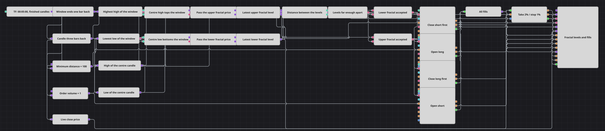

# Diagrama da estratégia de distância mínima entre fractais
[English](README.md) | [Русский](README_ru.md) | [中文](README_zh.md) | [Español](README_es.md) | [Deutsch](README_de.md) | [日本語](README_ja.md)

Um fractal é um candle que fica mais alto, ou mais baixo, do que os dois candles de cada lado dele, e só pode ser identificado depois que esses candles posteriores existem. Este diagrama encontra os dois tipos, guarda o preço do mais recente de cada cor e se recusa a negociar até que os dois estejam suficientemente afastados para valer a pena operar entre eles. Tudo é medido em candles finalizados, portanto um nível fica definido no momento em que é reivindicado e nunca é revisto depois.

## Visão geral da estratégia

- Uma única série de candles alimenta todo o diagrama, e ela entrega apenas candles finalizados, de modo que nenhum nível, nenhuma distância e nenhuma ordem é construída a partir de um preço que um tick posterior ainda poderia desfazer.
- Previous value devolve o candle de uma barra atrás, e Highest e Lowest medem o extremo dos cinco candles que terminam ali — uma janela situada inteiramente no passado.
- Um segundo Previous value devolve o candle de três barras atrás, exatamente o centro dessa janela, e dois conversores leem a sua máxima e a sua mínima.
- Quando a máxima do centro coincide com a máxima da janela, o diagrama tem um fractal superior, e o teste espelhado sobre a mínima marca um fractal inferior. Uma variável de retenção (latch) armazena o preço de cada fractal e, como a retenção ignora uma comparação falsa, o preço armazenado só muda numa barra que realmente imprimiu um fractal.
- Um segundo par de variáveis reemite os dois níveis armazenados a cada candle, de modo que a fórmula que mede a distância entre eles e a comparação com a distância mínima produzem ambas uma resposta em todas as barras, e não apenas nas barras de fractal.
- Cada lado combina o seu próprio teste de fractal com esse teste de distância numa condição lógica; o sinal aceito primeiro fecha a posição oposta e só então abre uma nova, ambas a mercado.
- Position protection acompanha cada execução e precifica a sua saída pelo fechamento de cada candle finalizado, de modo que um take-profit ou um stop-loss é verificado uma vez por barra.
- Os candles, ambos os extremos, ambos os níveis armazenados e todas as execuções são desenhados numa única área do gráfico, de modo que os dois níveis e a distância entre eles podem ser lidos diretamente na imagem.

## Regras de entrada e saída

- **Entrada comprada**: Um fractal inferior é confirmado — a mínima de três barras atrás é a mais baixa da janela de cinco candles que termina uma barra atrás — e a distância entre o último nível superior e o último nível inferior é de pelo menos a distância mínima. O diagrama fecha a posição vendida, se houver uma aberta, e depois compra o volume da ordem a mercado.
- **Entrada vendida**: Um fractal superior é confirmado — a máxima de três barras atrás é a mais alta da mesma janela — sob a mesma condição de distância. O diagrama fecha a posição comprada, se houver uma aberta, e depois vende o volume da ordem a mercado.
- **Saída**: Duas coisas podem encerrar uma operação. Um fractal da cor oposta fecha o que está aberto antes de a nova entrada ser enviada, e é por isso que um bloco de fechamento fica à frente do de abertura em cada sinal. Independentemente disso, Position protection fecha a posição num take-profit ou num stop-loss medidos em percentual do preço de execução, verificados contra o fechamento de cada candle finalizado.

## Parâmetros

| Parâmetro | Padrão | Descrição |
|---|---|---|
| Candles | 00:05:00 | Time frame da única série de candles. Apenas candles finalizados são entregues, portanto uma decisão é tomada uma vez por barra. |
| Upper Fractal Length | 5 | Número de candles da janela contra cuja máxima mais alta o candle central é medido. |
| Lower Fractal Length | 5 | Número de candles da janela contra cuja mínima mais baixa o candle central é medido; mantenha-o igual ao superior para que o fractal permaneça simétrico. |
| Fractal Shift | 3 | A quantas barras atrás fica o candle central. Com uma janela de cinco atrasada em uma barra, três coloca o centro exatamente no meio dela. |
| Minimum Distance | 100 | Menor distância entre o último nível superior e o último nível inferior que ainda permite uma entrada. É uma distância absoluta nas unidades de preço do instrumento, portanto precisa ser reescalada sempre que o diagrama for movido para um instrumento cotado em outra ordem de grandeza. |
| Order Volume | 1 | Tamanho da ordem, em lotes. |
| Take Profit, % | 2 | Distância do take-profit, em percentual do preço de execução, verificada no fechamento de cada candle finalizado. |
| Stop Loss, % | 1 | Distância do stop-loss, em percentual do preço de execução, verificada no fechamento de cada candle finalizado. |

## Detalhes do diagrama

- O bloco de indicador marca tudo o que chega até ele como um valor concluído — não tem como distinguir um candle em formação de um já fechado. Entregar apenas candles finalizados é o que mantém máximas e mínimas ainda incompletas fora da janela, onde elas moveriam silenciosamente o extremo para depois serem sobrescritas na atualização seguinte.
- A mesma assinatura é o que mantém as ordens válidas: uma ordem construída a partir de uma atualização de um candle não finalizado carrega o horário de abertura daquela barra e é recusada por chegar do passado.
- A janela é atrasada em uma barra para que o candle avaliado fique exatamente no meio dela, com dois candles antes e dois depois. Um fractal, portanto, nunca é reivindicado antes de três barras depois de ter acontecido, e nunca é revisto depois disso.
- O gatilho da retenção descarta uma comparação falsa em vez de armazenar um valor, o que transforma “o teste passou nesta barra” em “este é o último preço em que ele passou”. Nenhum dos níveis existe até o seu primeiro fractal, portanto nenhuma entrada é possível antes de as duas cores terem sido vistas.
- Ambos os blocos de entrada negociam a mercado e estão configurados para não exigir que a estratégia esteja online, de modo que o diagrama se comporta da mesma forma em histórico gravado e em negociação real.

## Uso

Importe o arquivo `.json` no Designer, execute-o sobre dados históricos no backtester e depois ajuste os parâmetros ou os próprios blocos ao seu instrumento antes de operar ao vivo.
