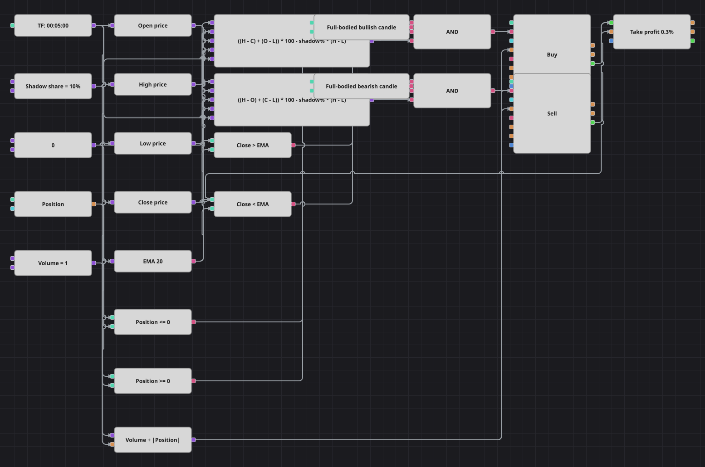

# Диаграмма стратегии импульса на полнотелой свече
[English](README.md) | [中文](README_zh.md) | [Español](README_es.md) | [Deutsch](README_de.md) | [Português](README_pt.md) | [日本語](README_ja.md)

Полнотелая свеча открывается у одного края своего диапазона и закрывается у другого: тени вместе занимают не более небольшой доли расстояния от минимума до максимума. Такой бар — один непрерывный толчок, и схема присоединяется к нему в сторону тела, если экспоненциальная скользящая средняя с этим направлением согласна. Сделке даётся фиксированная цель в доли процента — и больше ничего.

## Обзор стратегии

- Конвертеры читают открытие, максимум, минимум и закрытие завершённой свечи, а два кубика формул измеряют, какую часть диапазона забрали тени.
- Бычья мера — верхняя плюс нижняя тень растущей свечи, умноженная на сто и сопоставленная с долей теней от полного диапазона; медвежья мера зеркальна.
- Экспоненциальная скользящая средняя по цене закрытия работает трендовым фильтром: полнотелые бычьи свечи покупаются только выше неё, медвежьи продаются только ниже.
- Кубик защиты позиции закрывает каждую сделку по фиксированному тейк-профиту — единственному выходу, который есть в исходной стратегии.

## Правила входа и выхода

- **Вход в лонг**: Бычья мера теней меньше нуля, то есть свеча выросла, а её тени уложились в разрешённую долю диапазона; закрытие выше EMA, и позиция не в лонге. Заявка покупает константу объёма плюс открытый шорт, то есть одним приказом переворачивает шорт в лонг.
- **Вход в шорт**: Медвежья мера теней меньше нуля, закрытие ниже EMA, позиция не в шорте. Заявка продаёт константу объёма плюс открытый лонг, одним приказом переворачивая лонг в шорт.
- **Выход**: Кубик защиты позиции фиксирует прибыль в 0,3 процента от цены входа — ровно то число, что зашито в исходной стратегии; стоп-лосса нет, потому что его нет и в оригинале. Два отличия стоит держать в голове. Кубик защиты следит за ценой внутри бара, а оригинал проверяет только закрытие завершённой свечи, поэтому цель здесь срабатывает чуть раньше. И пауза оригинала в пятнадцать свечей после каждой сделки опущена: счётчик баров из кубиков собирается только заведением сигнала обратно в схему, а это замыкает граф в цикл, поэтому сигнал на переворот берётся сразу же.

## Параметры

| Параметр | По умолчанию | Описание |
|---|---|---|
| EMA Length | 20 | Период экспоненциальной скользящей средней, работающей трендовым фильтром. |
| Shadow share, % | 10 | Наибольшая доля диапазона свечи от минимума до максимума в процентах, которую вместе могут занять обе тени. |
| Take profit, % | 0.3 | Расстояние тейк-профита от цены входа в процентах. |
| Volume | 1 | Объём заявки в лотах; заявка на переворот добавляет сверху размер закрываемой позиции. |
| Candles | 00:05:00 | Таймфрейм свечей, на котором работает вся диаграмма. Исходная стратегия считает пятнадцатиминутные свечи; здесь взяты пятиминутные, чтобы паттерн встречался на поставляемой истории достаточно часто. |

## Детали диаграммы

- Каждая формула вычитает разрешённый бюджет теней из фактических, поэтому значение меньше нуля означает полнотелую свечу; константа с долей теней питает обе формулы.
- Отдельного сравнения на направление не нужно: бычья мера написана для растущей свечи и на падающей, как и на свече с нулевым диапазоном, всегда положительна, так что значение ниже нуля само по себе означает рост.
- Кубик позиции идёт двумя путями: в сравнения с нулём, которые защищают входы, и в формулу объёма, где модуль позиции прибавляется к константе, чтобы одна рыночная заявка закрыла встречную сторону и открыла новую.
- Оба кубика входа отдают свои сделки кубику защиты позиции, который выставляет тейк-профит; туда же подаётся цена закрытия как ценовой ориентир.

## Использование

Импортируйте файл `.json` в Designer, прогоните схему на исторических данных в тестере, затем подстройте параметры или сами кубики под свой инструмент, прежде чем торговать вживую.
