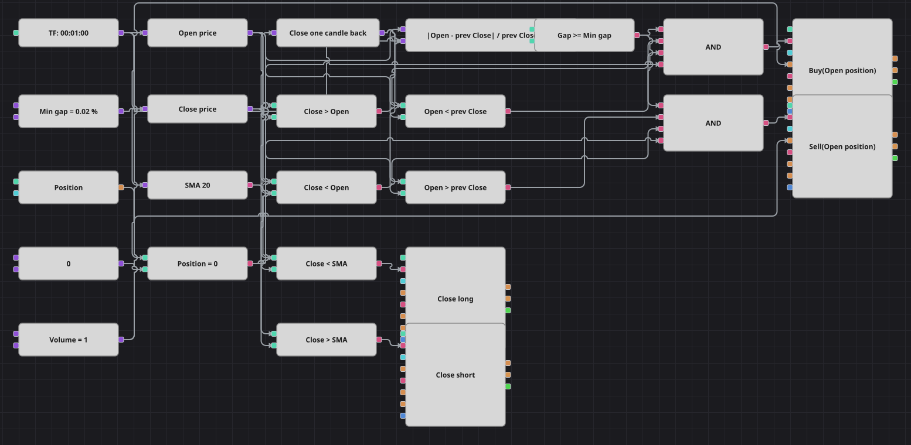

# Diagrama de la estrategia de reversión por cierre de hueco
[English](README.md) | [Русский](README_ru.md) | [中文](README_zh.md) | [Deutsch](README_de.md) | [Português](README_pt.md) | [日本語](README_ja.md)

El diagrama mide el salto entre el cierre de una vela y la apertura de la siguiente y luego espera a que esa vela cierre en sentido contrario. Un hueco a la baja seguido de una vela alcista se compra, un hueco al alza seguido de una vela bajista se vende, y la SimpleMovingAverage decide cuándo termina la operación.

## Resumen de la estrategia

- El hueco se expresa en porcentaje del cierre anterior, así que el mismo umbral conserva su sentido a cualquier nivel de precio.
- El hueco por sí solo no es una señal: la vela que abrió lejos del cierre anterior tiene que volver hacia él, ese es el cuerpo de reversión que da nombre a la estrategia.
- La SimpleMovingAverage es la única línea de salida y sirve a ambos lados; no hay stop de pérdidas ni toma de beneficios, igual que en el código original.
- El diagrama trabaja con velas de un minuto, como la estrategia de la que procede, de modo que aquí el hueco es la pequeña discontinuidad entre dos minutos vecinos y no un hueco de apertura diaria.

## Reglas de entrada y salida

- **Entrada en largo**: La distancia entre la apertura y el cierre anterior es al menos Min Gap %, la apertura queda por debajo del cierre anterior, la vela cierra por encima de su propia apertura y la posición está plana. La orden compra un lote a mercado.
- **Entrada en corto**: La distancia entre la apertura y el cierre anterior es al menos Min Gap %, la apertura queda por encima del cierre anterior, la vela cierra por debajo de su propia apertura y la posición está plana. La orden vende un lote a mercado.
- **Salida**: El largo se entrega en la primera vela que cierra por debajo de la SimpleMovingAverage y el corto en la primera que cierra por encima; ambos bloques de cierre calculan el volumen a partir de la posición abierta.

## Parámetros

| Parámetro | Por defecto | Descripción |
|---|---|---|
| Min Gap % | 0.02 | Distancia mínima entre el cierre anterior y la nueva apertura, en porcentaje del cierre anterior. |
| SMA Length | 20 | Periodo de suavizado de la SimpleMovingAverage que cierra la posición. |
| Volume | 1 | Volumen de la orden, en lotes. |
| Candles | 00:01:00 | Marco temporal de las velas con el que trabaja todo el diagrama. |

## Detalles del diagrama

- Dos bloques convertidores leen la apertura y el cierre de la vela, y un bloque de valor anterior guarda el cierre de la vela precedente.
- El bloque de fórmula convierte la distancia entre la apertura y el cierre anterior en un porcentaje, y una comparación lo contrasta con la constante de umbral.
- Otras cuatro comparaciones aportan el lado del hueco y el lado del cuerpo; cada Y lógica une una condición de hueco, una de cuerpo y la comprobación de posición plana antes del bloque de orden.
- El par de salida compara el cierre con la media móvil y acciona dos bloques de cierre de posición. La pausa de 500 barras entre operaciones del código no tiene equivalente entre los bloques y se omite, por lo que este diagrama opera con más frecuencia.

## Uso

Importe el archivo `.json` en Designer, ejecútelo sobre datos históricos en el probador y después ajuste los parámetros o los propios bloques a su instrumento antes de operar en real.
