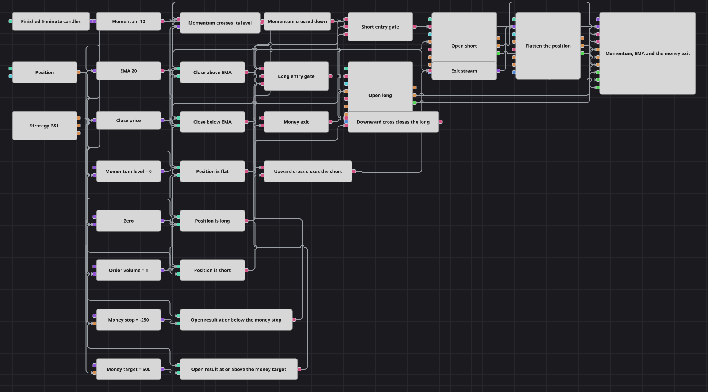

# Схема стратегии Global Stop Timer
[English](README.md) | [中文](README_zh.md) | [Español](README_es.md) | [Deutsch](README_de.md) | [Português](README_pt.md) | [日本語](README_ja.md)

Входы решает цена, выходы решают деньги. Пересечение моментумом его нейтрального уровня открывает позицию в ту сторону, куда уже указывает скользящая средняя, и с этого момента сделкой распоряжается открытый результат стратегии: блок P&L следит за каждым изменением нереализованной величины и закрывает позицию, как только она падает до денежного стопа или достигает денежной цели, что бы ни говорили в этот момент индикаторы.

## Обзор стратегии

- Одна серия свечей, пять минут и только завершённые бары, питает всё: оба индикатора, конвертер цены закрытия и триггеры постоянных переменных.
- Momentum измеряет, насколько далеко ушла цена за собственную длину; блок Crossing сравнивает его с уровнем, который хранится в переменной, и срабатывает только в момент, когда эти двое меняются местами: true при пересечении вверх и false при пересечении вниз.
- Логическое НЕ превращает то же самое пересечение в событие вниз, поэтому один блок Crossing обслуживает оба направления, и сработать на одном баре они не могут.
- Конвертер достаёт из свечи цену закрытия, а два сравнения ставят её выше или ниже скользящей средней — это трендовый фильтр, который обязаны пройти оба входа.
- Блок Position сравнивается с нулём трижды: нулевая позиция защищает входы, длинная и короткая взводят два сигнальных выхода.
- Каждый вход — это логическое И трёх ответов: пересечение, сторона скользящей средней и нулевая позиция, — а сам вход представляет собой рыночную заявку, подаваемую только из нулевой позиции, поэтому сигнал, пришедший во время открытой сделки, ничего не меняет.
- У блока P&L нет ни входов, ни собственного такта свечей: он выдаёт нереализованный результат при каждом изменении, а два сравнения соотносят это число с денежным стопом и денежной целью, которые хранятся в переменных.
- Денежный вердикт и два вердикта обратного пересечения приходят в один блок Combination, который управляет единственным Position modify, настроенным на закрытие: какая бы причина ни наступила первой, позиция закрывается одной и той же рыночной заявкой.

## Правила входа и выхода

- **Вход в лонг**: Momentum пересекает свой уровень вверх, свеча закрывается выше скользящей средней, позиция нулевая. Position modify покупает объём заявки по рынку.
- **Вход в шорт**: Momentum пересекает свой уровень вниз — то же пересечение, прочитанное через логическое НЕ, — свеча закрывается ниже скользящей средней, позиция нулевая. Position modify продаёт объём заявки по рынку.
- **Выход**: Сделку закрывают три причины, и все три сходятся в одном блоке. Нереализованный результат стратегии падает до денежного стопа; или он достигает денежной цели; или моментум пересекает свой уровень в обратную сторону, пока открыта позиция в противоположном направлении. Первые две проверяются при каждом изменении P&L, а не по такту свечей, поэтому быстрое движение отрабатывается внутри бара; третья проверяется один раз на завершённой свече. Объём закрывающей заявки берётся из текущей позиции, поэтому она всегда оставляет стратегию без позиции и никогда не переворачивает её одним шагом.

## Параметры

| Параметр | По умолчанию | Описание |
|---|---|---|
| Candles | 00:05:00 | Таймфрейм серии свечей, на которой работает вся схема; используются только завершённые свечи. |
| Momentum Length | 10 | Длина индикатора моментума — на сколько назад измеряется движение цены. |
| EMA Length | 20 | Длина скользящей средней, которая решает, на какой стороне тренда разрешён вход. |
| Momentum Level | 0 | Уровень, с которым сравнивается моментум. Ноль — его нейтральное значение: выше него цена выше, чем была длину назад, ниже него — ниже. |
| Order Volume | 1 | Объём заявки в лотах для обоих входов. Закрывающая заявка его не учитывает и берёт объём из позиции. |
| Money Stop | -250 | Убыток по открытой позиции в валюте счёта, при котором позиция закрывается. Отрицательный. |
| Money Target | 500 | Прибыль по открытой позиции в валюте счёта, при которой позиция закрывается. |

## Детали диаграммы

- Оба индикатора настроены выдавать только сформированные и финальные значения, поэтому незавершённая свеча не может дать пересечение.
- Уровень, с которым сравнивается моментум, хранится в переменной, а не внутри самого сравнения, — именно это делает его параметром схемы, который можно менять и оптимизировать, не открывая диаграмму.
- У каждой постоянной переменной есть триггер: у трёх свечных — серия свечей, у двух денежных порогов — нереализованный P&L, — потому что переменная хранит своё значение, но выдаёт его только тогда, когда его запрашивают.
- Во входах есть условие по открытой позиции, поэтому они срабатывают только из нулевой позиции. Без него рыночная заявка отправлялась бы при каждом изменении позиции, и прогон наполнился бы ненужными сделками.
- Денежный стоп и денежная цель — это суммы в валюте счёта, а не расстояния в цене, поэтому при переносе схемы на другой инструмент их нужно пересчитывать вместе с объёмом заявки.

## Использование

Импортируйте файл `.json` в Designer, прогоните схему на исторических данных в тестере, затем подстройте параметры или сами кубики под свой инструмент, прежде чем торговать вживую.
