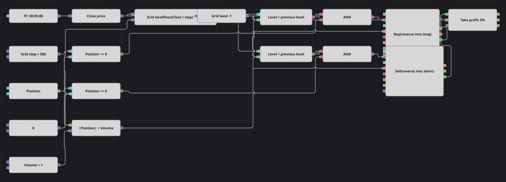

# 网格交易策略图
[English](README.md) | [Русский](README_ru.md) | [Español](README_es.md) | [Deutsch](README_de.md) | [Português](README_pt.md) | [日本語](README_ja.md)

该图把价格切成阶梯：每根K线的收盘价向下取整到网格步长的整数倍，只有跨到新的一级才算信号。上一级做多，下一级做空，持仓方向始终跟随价格穿越网格的方向。

## 策略概览

- 收盘价按 floor(Close / GridStep) * GridStep 离散化，得到市场当前所处的网格级别。
- 前值方块保存上一根K线的级别，因此比较的是级别而不是原始价格，网格单元内部的波动被忽略。
- 下单数量等于当前持仓加基础数量，所以与持仓相反的信号只用一笔市价单就能反手。
- 原策略使用4小时K线并按2000个价格单位的绝对利润平仓；这里改为5分钟K线，止盈按入场价的百分比表示，这样在任何品种上都有意义。

## 入场与出场规则

- **做多入场**: 新的网格级别高于上一个，且持仓不是多头。订单买入基础数量加上已有空头数量，持仓变为一个基础数量的多头。
- **做空入场**: 新的网格级别低于上一个，且持仓不是空头。订单卖出基础数量加上已有多头数量，持仓变为一个基础数量的空头。
- **离场**: 持仓保护方块在达到设定百分比止盈时平仓；与原策略一样没有止损。否则持仓一直保留到价格进入下一个网格单元，由反向信号反手。

## 参数

| 参数 | 默认值 | 说明 |
|---|---|---|
| Grid Step | 500 | 一个网格级别的高度，以品种的价格单位计。 |
| Take Profit, % | 3 | 止盈，按平均入场价的百分比计。 |
| Volume | 1 | 基础下单数量（手）。 |
| Candles | 00:05:00 | 整张图使用的K线周期。 |

## 图表详情

- K线方块把数据送入取收盘价的转换方块，公式方块再把该价格向下取整到网格。
- 前值方块把级别延后一根K线；两个比较方块判断级别是上升还是下降。
- 两个持仓与零的比较通过逻辑与和网格信号合并，因此级别变化不会给同方向的已有持仓继续加仓。
- 第二个公式方块计算 |Position| + Volume，送入两个修改持仓方块的数量输入，这正是反手只需一笔订单的原因。
- 两个修改持仓方块的自有成交送入持仓保护方块，其价格输入取自已完成K线的收盘价。

## 使用方法

将 `.json` 文件导入 Designer，在回测器中用历史数据运行，然后根据自己的交易品种调整参数或方块，确认无误后再用于实盘。
