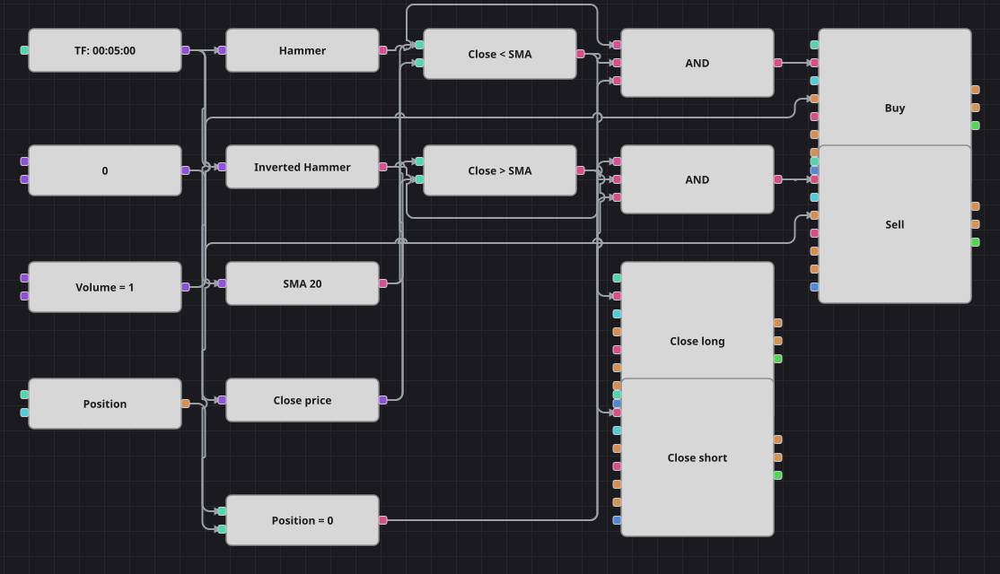

# 锤子线／倒锤线配合 SMA 过滤的策略图
[English](README.md) | [Русский](README_ru.md) | [Español](README_es.md) | [Deutsch](README_de.md) | [Português](README_pt.md) | [日本語](README_ja.md)

锤子线是实体很小、下影线很长而几乎没有上影线的K线：价格在这根K线内被打得很低，收盘前又被买了回来。倒锤线则是它的镜像。这类形态本身随处可见，因此由简单移动平均线决定在哪里值得采用：锤子线只在均线下方买入，倒锤线只在均线上方卖出。

## 策略概览

- 两个K线形态方块使用与原始策略完全相同的公式：实体大于零，一侧影线长于两倍实体，另一侧影线短于半个实体。
- 内置的 Hammer 与 Inverted Hammer 形态被有意弃用，因为它们用K线全长而不是实体来衡量影线。
- 收盘价的简单移动平均线把行情分成便宜的一半和昂贵的一半，既是入场过滤器，也是离场线。
- 持仓判断确保只有空仓时才执行形态信号。

## 入场与出场规则

- **做多入场**: K线形态方块报告出现锤子线，该K线收盘低于移动平均线，且持仓为零。订单买入一手并开多。
- **做空入场**: K线形态方块报告出现倒锤线，该K线收盘高于移动平均线，且持仓为零。订单卖出一手并开空。
- **离场**: 当K线收盘高于移动平均线时平多，收盘低于移动平均线时平空，两者都通过处于平仓模式的修改持仓方块完成。原始策略的离场与入场处在均线的同一侧，靠数百根K线的停顿来持仓；这里没有计数方块，若照搬那种离场，每笔交易都会在下一根K线上被平掉。回到均线另一侧是最接近、又能让持仓维持合理时长的规则。

## 参数

| 参数 | 默认值 | 说明 |
|---|---|---|
| SMA Length | 20 | 过滤形态并平仓所用的简单移动平均线周期。 |
| Volume | 1 | 下单数量（手）。 |
| Candles | 00:05:00 | 整张图使用的K线周期。 |

## 图表详情

- K线方块同时给两个形态方块、移动平均线以及取出收盘价的转换方块供数。
- 两个比较方块把收盘价与均线对比，各自复用两次：作为一侧的入场过滤器，同时作为另一侧的离场触发。
- 持仓方块与零常量比较，每个逻辑与把形态、均线的一侧和该保护合并在一起。
- 两个入场方块都发送市价单，数量取自同一个常量；两个离场方块工作在平仓模式，只有在有持仓可平时才动作。

## 使用方法

将 `.json` 文件导入 Designer，在回测器中用历史数据运行，然后根据自己的交易品种调整参数或方块，确认无误后再用于实盘。
