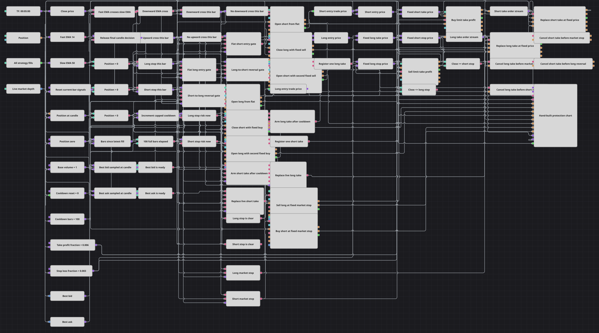

# Diagrama de estrategia con órdenes de protección construidas manualmente
[English](README.md) | [Русский](README_ru.md) | [中文](README_zh.md) | [Deutsch](README_de.md) | [Português](README_pt.md) | [日本語](README_ja.md)

Este diagrama abre o revierte por completo una posición tras cruces confirmados de EMA(14)/EMA(50) y construye la protección con bloques explícitos del ciclo de vida de la orden. La ejecución de entrada aceptada fija ambos niveles de protección. Tras una espera de 100 velas se registra una sola orden límite de beneficio relativa a la entrada; las sustituciones posteriores conservan el mismo precio objetivo, mientras que un stop o una reversión válida solicita primero cancelar la orden de beneficio activa y luego activa el cambio de posición a mercado sin esperar la confirmación de cancelación.

## Resumen de la estrategia

- Las velas de cinco minutos finalizadas alimentan valores formados de la EMA rápida 14 y la EMA lenta 50. Crossing emite el evento alcista cuando la EMA rápida pasa por encima de la lenta y el bajista cuando pasa por debajo.
- Un cruce alcista solo puede actuar con Position <= 0, y uno bajista solo con Position >= 0. Las comparaciones de posición envían una señal desde cero a una orden a mercado de Volume fijo. Ante una posición contraria, la ruta de reversión activa dos órdenes a mercado consecutivas del mismo Volume: la primera cierra el lado existente y la segunda abre el nuevo inmediatamente, sin esperar la primera ejecución.
- Cada nueva ejecución de Strategy trades reinicia el contador en 0 y vuelve a iniciar la espera. Exactamente las 100 velas finalizadas siguientes bloquean nuevas entradas, el registro y la sustitución del beneficio y las comprobaciones de stop; el procesamiento se reanuda en la vela 101 salvo que otra ejecución vuelva a iniciar la ventana.
- Cuando termina la espera, un Flag de un solo uso registra una orden de beneficio de Volume fijo. La disponibilidad del lado necesario del libro no se requiere para este primer registro: solo habilita sustituciones posteriores marcadas por velas finalizadas. Un largo usa una venta límite en Entry Price * (1 + Take Profit fraction); un corto usa una compra límite en Entry Price * (1 - Take Profit fraction).
- Combination solo combina la Order del primer registro y los clones de sustitución en un único flujo de órdenes. Las entradas conectadas replaceOrder.order y cancelOrder.order recuerdan la orden reenviada más reciente. La rama del libro está simplificada deliberadamente: BestBid y BestAsk solo habilitan sustituciones posteriores marcadas por velas finalizadas en el mismo objetivo fijo y nunca mueven ese objetivo. Un stop o una reversión válida solicita primero la cancelación y luego activa la operación a mercado sin esperar confirmación.

## Reglas de entrada y salida

- **Entrada en largo**: Tras un cruce alcista confirmado de las EMA, si Position <= 0 y la espera está lista, desde cero el diagrama envía una compra a mercado de Volume. Desde un corto solicita primero cancelar la orden de beneficio corta y después activa dos compras a mercado del mismo Volume: la primera cierra el corto y la segunda abre el largo inmediatamente sin esperar la ejecución de cierre. Entry Price solo procede de la ejecución de apertura desde cero o de la segunda ejecución, la de apertura, de una reversión.
- **Entrada en corto**: Tras un cruce bajista confirmado de las EMA, si Position >= 0 y la espera está lista, desde cero el diagrama envía una venta a mercado de Volume. Desde un largo solicita primero cancelar la orden de beneficio larga y después activa dos ventas a mercado del mismo Volume: la primera cierra el largo y la segunda abre el corto inmediatamente sin esperar la ejecución de cierre. Entry Price solo procede de la ejecución de apertura desde cero o de la segunda ejecución, la de apertura, de una reversión.
- **Salida**: Después de la espera, la rama larga mantiene una venta límite de Volume fijo en Entry Price * (1 + 0.006), y la rama corta una compra límite de Volume fijo en Entry Price * (1 - 0.006). Un cierre finalizado igual o inferior a Entry Price * (1 - 0.003) detiene un largo; uno igual o superior a Entry Price * (1 + 0.003) detiene un corto. El stop solicita primero cancelar la orden de beneficio activa y luego envía una orden a mercado contraria del mismo Volume fijo sin esperar confirmación. Un cruce contrario válido usa la misma regla de solicitud y activación antes de su reversión de dos órdenes.

## Parámetros

| Parámetro | Por defecto | Descripción |
|---|---|---|
| Candles | 00:05:00 | Marco temporal de cinco minutos; solo las velas finalizadas impulsan las señales EMA, el recuento de espera, las comprobaciones de stop y el reloj del ciclo de la orden. |
| Fast EMA Length | 14 | Longitud de la ExponentialMovingAverage rápida; solo se emiten valores formados. |
| Slow EMA Length | 50 | Longitud de la ExponentialMovingAverage lenta; solo se emiten valores formados. |
| Take Profit fraction | 0.006 | Fracción favorable medida desde Entry Price. El valor 0.006 equivale al 0.6% y da una relación stop-beneficio de 1:2. |
| Stop fraction | 0.003 | Fracción adversa medida desde Entry Price. El valor 0.003 equivale al 0.3%. |
| Volume | 1 | Cantidad fija usada por cada tramo de entrada, el registro y la sustitución del beneficio y el stop a mercado. Una reversión envía dos órdenes a mercado separadas del mismo Volume: primero cerrar y después abrir. |
| Cooldown | 100 | Número de velas finalizadas posteriores bloqueadas tras cada ejecución de Strategy trades. Cada nueva ejecución reinicia el contador en 0; el procesamiento se reanuda en la vela 101 si ninguna ejecución posterior vuelve a iniciar la ventana. |

## Detalles del diagrama

- El bloque [Velas](https://doc.stocksharp.com/es/topics/designer/strategies/using_visual_designer/elements/data_sources/candles.html) emite solo velas de cinco minutos finalizadas. Un conversor del cierre y dos bloques de [Indicador](https://doc.stocksharp.com/es/topics/designer/strategies/using_visual_designer/elements/common/indicator.html) limitados a valores formados proporcionan el cierre, ExponentialMovingAverage 14 y ExponentialMovingAverage 50.
- [Cruce](https://doc.stocksharp.com/es/topics/designer/strategies/using_visual_designer/elements/common/crossing.html), [Posición](https://doc.stocksharp.com/es/topics/designer/strategies/using_visual_designer/elements/positions/current.html) y [Comparación](https://doc.stocksharp.com/es/topics/designer/strategies/using_visual_designer/elements/common/comparison.html) forman las puertas simétricas Position <= 0 y Position >= 0.
- Bloques separados de [Modificar posición](https://doc.stocksharp.com/es/topics/designer/strategies/using_visual_designer/elements/positions/modify.html) implementan OpenPosition desde cero y los tramos NoCondition de cierre y apertura de las reversiones. Todos los bloques reciben el mismo Volume fijo. El tramo de cierre se activa primero, pero el de apertura sigue inmediatamente sin esperar su ejecución, por lo que la ejecución asíncrona puede producir una carrera. Los bloques Formula calculan el estado de espera y los valores de beneficio y stop, nunca una cantidad de orden.
- [Operaciones de la estrategia](https://doc.stocksharp.com/es/topics/designer/strategies/using_visual_designer/elements/common/trades_by_strategy.html) se usa solo para reiniciar la espera tras cada ejecución propia y enviar la operación al gráfico. Solo la salida trade de un bloque de apertura desde cero y la salida trade del segundo tramo, el de apertura, de la reversión entregan la Trade.Price aceptada al estado de protección largo o corto correspondiente; se excluye la primera ejecución, la de cierre, de la reversión.
- La [Profundidad de mercado](https://doc.stocksharp.com/es/topics/designer/strategies/using_visual_designer/elements/data_sources/market_depth.html) aporta la disponibilidad de BestBid y BestAsk. Ninguna cotización participa en las fórmulas del beneficio: ambos objetivos permanecen anclados a Entry Price.
- Las fórmulas de precio larga y corta alimentan sus bloques de [Registro de órdenes](https://doc.stocksharp.com/es/topics/designer/strategies/using_visual_designer/elements/orders/register.html) límite. El Flag permite un registro después de la espera y cada sustitución posterior reutiliza el mismo precio calculado y el mismo Volume fijo.
- La Order del primer registro y cada clon de sustitución entran en un bus Combination<Order>, que solo los combina y reenvía. Las entradas replaceOrder.order conectadas y las entradas cancelOrder.order de [Cancelación de orden](https://doc.stocksharp.com/es/topics/designer/strategies/using_visual_designer/elements/trading/cancel_order.html) recuerdan la orden reenviada más reciente. Mientras una reinscripción sigue en curso, la cancelación puede dirigirse todavía a la referencia de orden reenviada anteriormente. En un stop o una reversión se envía primero la solicitud de cancelación y acto seguido se activa el stop a mercado de Volume fijo o los dos tramos de reversión de Volume fijo sin esperar la confirmación; la atomicidad no está garantizada.

## Uso

Importe el archivo `.json` en Designer, ejecútelo sobre datos históricos en el probador y después ajuste los parámetros o los propios bloques a su instrumento antes de operar en real.
