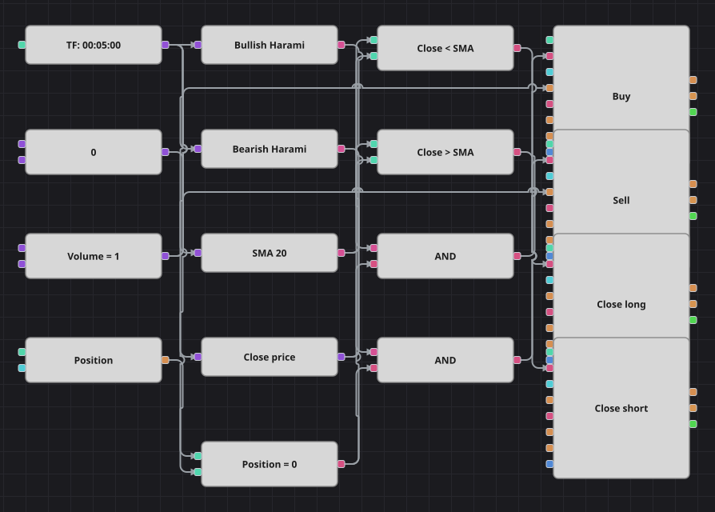

# Diagramm der Strategie zum bullischen Harami
[English](README.md) | [Русский](README_ru.md) | [中文](README_zh.md) | [Español](README_es.md) | [Português](README_pt.md) | [日本語](README_ja.md)

Ein Harami ist eine Kerze, die vollständig in die vorige passt: Die Seite, die den Markt gerade noch getrieben hat, ist außer Atem. Der ursprüngliche Code prüft dieses Enthaltensein an den Extremen und nicht an den Körpern, also wird hier ein Innenstab erkannt, der zusätzlich die Farbe wechselt: Die vorige Kerze lief in die eine Richtung, die kleine Kerze darin läuft in die andere. Diese Wende wird aus der Neutralstellung eingegangen und einem einfachen gleitenden Durchschnitt zum Abschluss überlassen.

## Strategieübersicht

- Zwei Kerzenmuster-Bausteine tragen eigene Muster, genau so geschrieben, wie der ursprüngliche Code sie prüft: Die vorige Kerze hat die eine Farbe, die aktuelle die andere, und ihr Hoch wie ihr Tief liegen innerhalb der vorigen Spanne.
- Der einfache gleitende Durchschnitt des Schlusskurses filtert den Einstieg überhaupt nicht; er ist nur der Schiedsrichter, der entscheidet, wann der Trade vorbei ist.
- Einstiege sind nur bei exakt neutraler Position erlaubt, und genau das macht das Harami zu einem Wendeversuch statt zu einem Mittel, eine laufende Position zu vergrößern.
- Die Ausstiege sind eigene Bausteine zur Positionsänderung im Schließmodus, sodass sie nie versehentlich etwas eröffnen.

## Ein- und Ausstiegsregeln

- **Long-Einstieg**: Der Baustein des bullischen Musters meldet eine bärische Kerze, gefolgt von einer kleineren bullischen Kerze, deren Hoch unter dem vorigen Hoch und deren Tief über dem vorigen Tief liegt, und die Position ist neutral. Die Order kauft ein Lot und eröffnet einen Long.
- **Short-Einstieg**: Der Baustein des bärischen Musters meldet eine bullische Kerze, gefolgt von einer kleineren bärischen Kerze mit derselben Einbettung, und die Position ist neutral. Die Order verkauft ein Lot und eröffnet einen Short.
- **Ausstieg**: Ein Long wird geschlossen, sobald eine Kerze unter dem gleitenden Durchschnitt schließt, ein Short, sobald eine Kerze darüber schließt, beides über Bausteine zur Positionsänderung im Schließmodus, genau wie im Original. Das Original stellt nach jeder Order zusätzlich fünfhundert Kerzen lang den Handel ein; kein Baustein hält einen Balkenzähler über Kerzen hinweg, daher entfällt diese Pause und das Diagramm handelt schlicht jedes Muster, das es in neutraler Stellung findet. Das Original arbeitet auf Minutenkerzen, die mitgelieferte Historie besteht aus Fünf-Minuten-Daten, deshalb läuft das Diagramm auf Fünf-Minuten-Kerzen.

## Parameter

| Parameter | Standard | Beschreibung |
|---|---|---|
| SMA Length | 20 | Glättungsperiode des einfachen gleitenden Durchschnitts, der die Trades schließt. |
| Volume | 1 | Ordervolumen in Lots. |
| Candles | 00:05:00 | Zeiteinheit der Kerzen, mit der das gesamte Diagramm arbeitet. |

## Diagrammdetails

- Der Kerzenbaustein speist beide Musterbausteine, den gleitenden Durchschnitt und einen Konverter, der den Schlusskurs liest.
- Zwei Vergleichsbausteine stellen den Schlusskurs auf die eine oder die andere Seite des Durchschnitts; dieselben zwei Signale treiben beide Schließbausteine an.
- Ein Vergleichsbaustein prüft die Position gegen eine Nullkonstante, und seine Ausgabe teilen sich beide Einstiegsbedingungen.
- Jedes logische UND verbindet ein Muster mit der Neutralprüfung und löst einen Baustein zur Positionsänderung aus, der sein Volumen aus der gemeinsamen Konstante bezieht.

## Verwendung

Importieren Sie die `.json`-Datei in Designer, testen Sie sie im Backtester mit historischen Daten und passen Sie danach Parameter oder Bausteine an Ihr Instrument an, bevor Sie live handeln.
