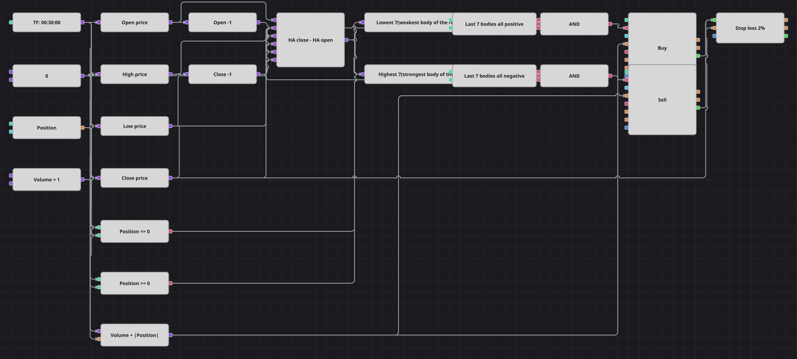

# 平均足（Heikin-Ashi）連続陽線・陰線戦略のダイアグラム
[English](README.md) | [Русский](README_ru.md) | [中文](README_zh.md) | [Español](README_es.md) | [Deutsch](README_de.md) | [Português](README_pt.md)

平均足はノイズを均してしまうため、値動きが本当に続いている間は色が変わりません。このダイアグラムはその持続性を測ります。陽の実体が7本続けば上昇トレンドが定着したとみなして買い、陰の実体が7本続けば売り、パーセント指定の損切りがだましのコストを抑えます。

## 戦略の概要

- 数式ブロックが平均足の実体を「始値・高値・安値・終値の平均 − 前の足の中値」として組み立てます。実体が正なら陽線、負なら陰線です。
- 同色の連続はカウンターを使わずに測ります。直近7本の実体の最小値がゼロより大きければ7本すべてが陽線、最大値がゼロより小さければ7本すべてが陰線です。
- 注文数量は基準数量にポジションの絶対値を加えた値なので、1回の注文で売り建てをそのまま買い建てへ、あるいはその逆へ転換できます。C# の原典と同じです。
- 平均足の始値は本来その前の値で定義されますが、ダイアグラムではブロックの出力を自分自身へ戻せません。そこで前の通常足の中値で代用しているため、ここで見つかる連続は元のコードが数えるものに近いものの一致はしません。

## エントリーとエグジットの条件

- **ロングエントリー**: 直近7本の平均足実体の最小値がゼロより大きく、すなわち7本すべてが陽線で、ポジションが買いではないとき。注文は数量とポジション絶対値の合計を買い、ノーポジションなら新規の買い、売り持ちなら転換になります。
- **ショートエントリー**: 直近7本の平均足実体の最大値がゼロより小さく、すなわち7本すべてが陰線で、ポジションが売りではないとき。注文は数量とポジション絶対値の合計を売り、ノーポジションなら新規の売り、買い持ちなら転換になります。
- **エグジット**: 元の戦略と同じく専用のエグジット条件はありません。ポジションは反対の連続で転換されるか、ポジション保護ブロックの損切りで外れます。損切りは約定価格から一定の割合の位置に置かれ、利食いもトレーリングもありません。

## パラメーター

| パラメーター | 既定値 | 説明 |
|---|---|---|
| Consecutive candles | 7 | 何本の同色平均足が続けばシグナルとするか。Lowest ブロックと Highest ブロックの両方の期間です。 |
| Stop loss, % | 2 | エントリー価格からの損切りまでの距離（パーセント）。 |
| Volume | 1 | 基準の注文数量（ロット）。これにポジションの絶対値が加算され、転換が1回の注文で済みます。 |
| Candles | 00:30:00 | ダイアグラム全体が用いるローソク足の時間軸。元の戦略と同じ30分です。 |

## ダイアグラムの詳細

- ローソク足ブロックが始値・高値・安値・終値の4つの変換ブロックへ、2つの前値ブロックが1本前の足を数式へ渡します。
- 数式の出力は同じ期間の Lowest と Highest に入り、ゼロ定数との2つの比較がそれを2つの連続条件に変えます。
- ポジションブロックはゼロと2回比較され、論理積で各連続条件に結び付くため、すでに正しい向きの建玉へ注文が積み増されることはありません。
- 2つのポジション変更ブロックは、共通数量にポジション絶対値を足す数式から数量を取り、その約定が損切りを持つポジション保護ブロックへ流れます。

## 使い方

`.json` ファイルを Designer に読み込み、バックテスターで過去データを使って実行し、実運用の前にパラメーターやブロック自体を自分の銘柄に合わせて調整してください。
