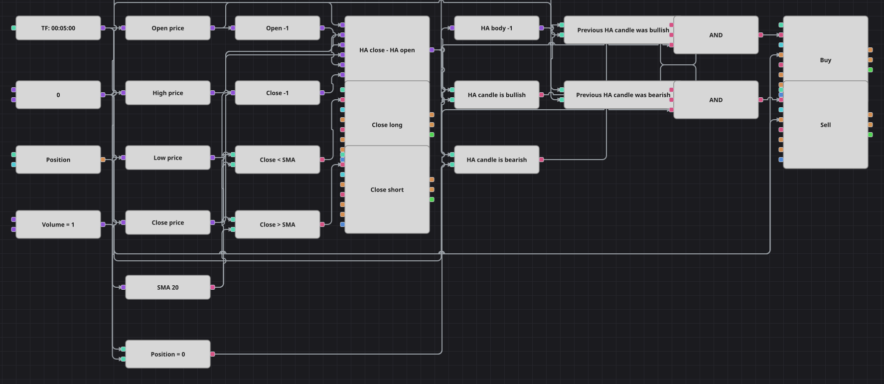

# Diagrama de la estrategia de reversión Heikin-Ashi
[English](README.md) | [Русский](README_ru.md) | [中文](README_zh.md) | [Deutsch](README_de.md) | [Português](README_pt.md) | [日本語](README_ja.md)

Las velas Heikin-Ashi promedian buena parte del ruido, de modo que una serie mantiene el mismo color mientras dura el movimiento y solo cambia cuando el equilibrio se altera de verdad. Este diagrama opera ese giro: la primera vela Heikin-Ashi alcista tras una bajista compra, la primera bajista tras una alcista vende, y una media móvil simple del cierre normal decide cuándo termina la operación.

## Resumen de la estrategia

- Un bloque de fórmula construye el cuerpo Heikin-Ashi como la media de apertura, máximo, mínimo y cierre menos el punto medio de la vela anterior: un cuerpo positivo es una vela Heikin-Ashi alcista, cero o menos una bajista.
- Un bloque de valor anterior guarda el cuerpo de la vela previa, así que las dos comparaciones juntas describen un cambio de color y no solo un color.
- La media móvil y el precio de salida se toman de las velas normales, no de las suavizadas, igual que en la estrategia de origen.
- La apertura Heikin-Ashi se define por su propio valor anterior, algo que un diagrama no puede realimentar a un bloque; en su lugar se usa el punto medio de la vela normal previa, de modo que los cambios de color son parecidos, pero no idénticos, a los del código original.
- La estrategia original congela además todas las señales durante varios cientos de barras tras una ejecución; aquí no existe un bloque contador de barras, así que esa pausa se omite y se documenta.

## Reglas de entrada y salida

- **Entrada en largo**: El cuerpo Heikin-Ashi de la vela recién cerrada es positivo, el de la anterior era cero o negativo y la posición es cero. La orden compra un lote y abre un largo.
- **Entrada en corto**: El cuerpo Heikin-Ashi de la vela recién cerrada es cero o negativo, el de la anterior era positivo y la posición es cero. La orden vende un lote y abre un corto.
- **Salida**: Un largo se cierra con un bloque de modificación de posición en modo cierre cuando una vela normal cierra por debajo de la media móvil; un corto se cierra cuando una cierra por encima. La estrategia de origen no lleva stop loss ni take profit, y este diagrama tampoco.

## Parámetros

| Parámetro | Por defecto | Descripción |
|---|---|---|
| SMA Length | 20 | Periodo de la media móvil simple sobre el cierre normal, que es la que cierra las operaciones. |
| Volume | 1 | Volumen de la orden, en lotes. |
| Candles | 00:05:00 | Marco temporal de las velas de todo el diagrama; el original usa velas de un minuto y aquí se ajusta al histórico de cinco minutos incluido en la galería. |

## Detalles del diagrama

- El bloque de velas alimenta cuatro conversores de apertura, máximo, mínimo y cierre, además de la media móvil.
- Dos bloques de valor anterior entregan a la fórmula la apertura y el cierre de la vela previa, que es con lo que se aproxima la apertura Heikin-Ashi.
- Un tercer bloque de valor anterior retrasa el resultado de la fórmula una vela, y cuatro comparaciones contra una constante cero convierten los dos cuerpos en el color actual y el anterior.
- Cada Y lógica une el color nuevo, el color viejo contrario y el control de posición, y dispara una entrada; los dos bloques de cierre se disparan directamente desde las comparaciones con la media móvil.

## Uso

Importe el archivo `.json` en Designer, ejecútelo sobre datos históricos en el probador y después ajuste los parámetros o los propios bloques a su instrumento antes de operar en real.
