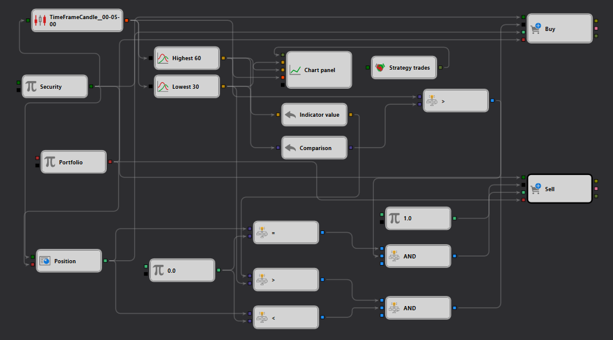

# High Break Strategy Example in StockSharp Strategy Designer

## Overview

The "High Break" strategy depicted in the provided JSON schema is designed to execute trades based on specific conditions related to price movements and time frames, using the StockSharp Strategy Designer. This example showcases how to set up a trading strategy that identifies potential buying opportunities when the price of a security breaks above a predetermined high over a certain period.

## Description of the Schema

The schema provided outlines a sequence of interconnected components designed to capture, analyze, and act upon real-time market data:

1. **Security Node**: Serves as the foundation, specifying the [security](https://doc.stocksharp.com/topics/designer/strategies/using_visual_designer/elements/data_sources/variable.html) (e.g., stock, futures) for which the strategy is applied. This node is critical as it determines the data input for the strategy.

2. **TimeFrameCandle Node**: Processes incoming market data and organizes it into [candles based](https://doc.stocksharp.com/topics/designer/strategies/using_visual_designer/elements/data_sources/candles.html) on a specified time frame. This node is vital for strategies that rely on historical price analysis to make trading decisions.

3. **Highest Node**: Analyzes the candle data to [determine the highest price](https://doc.stocksharp.com/topics/designer/strategies/using_visual_designer/elements/common/indicator.html) reached over a specified length of time (e.g., 60 minutes). This value sets a benchmark for identifying significant price breaks.

4. **Comparison Node**: [Compares](https://doc.stocksharp.com/topics/designer/strategies/using_visual_designer/elements/common/comparison.html) current prices to the historical high determined by the Highest node. If the current price exceeds this high, it triggers a potential trade signal.

5. **Chart Panel Node**: [Visualizes](https://doc.stocksharp.com/topics/designer/strategies/using_visual_designer/elements/common/chart.html) the price data and the strategy's actions, providing a graphical representation of the strategy's operation, which aids in monitoring and adjustments.

6. **Trade Execution Nodes (Buy/Sell)**: Responsible for [executing trades](https://doc.stocksharp.com/topics/designer/strategies/using_visual_designer/elements/trading/register_order.html) when the strategy's conditions are met. For instance, a buy order might be executed when the price breaks above the historical high.

## Workflow

- The **Security Node** feeds market data into the **TimeFrameCandle Node** to create a structured time-based candlestick dataset.
- The **Highest Node** calculates the highest price from these candles over a defined period.
- The **Comparison Node** continuously compares the current price against this high. If the current price exceeds the historical high, it suggests a bullish breakout, potentially triggering a buy signal.
- The **Chart Panel Node** provides real-time visualization, allowing for immediate visual feedback on the strategy’s performance and market conditions.
- When the buy condition is met, the **Trade Execution Node** (Buy) initiates a trade, capitalizing on the expected upward momentum.

## Practical Application

This setup is particularly useful for traders who specialize in breakout strategies, where recognizing and acting upon price movements above certain thresholds can lead to profitable trades. Such strategies are popular in volatile markets where price breakouts can signify strong trends.

## Conclusion

The "High Break" strategy example within the StockSharp Strategy Designer illustrates a sophisticated use of market data to automate trading decisions based on identified price movements. By leveraging real-time data processing and visualization tools, the strategy helps traders to efficiently capitalize on market opportunities presented by price breakouts. This example not only demonstrates the power of the StockSharp platform in developing dynamic trading strategies but also serves as a foundation for further customization and optimization based on individual trading requirements and market conditions.