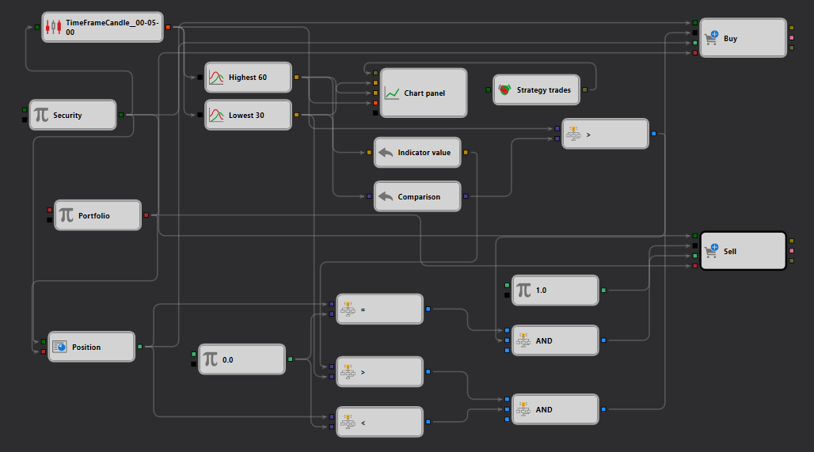

# StockSharp Strategy Designer 中的 High Break 策略示例
[English](README.md) | [Русский](README_ru.md) | [Español](README_es.md) | [Deutsch](README_de.md) | [Português](README_pt.md) | [日本語](README_ja.md)

## 概述

所提供 JSON 方案中描述的"High Break"策略，使用 StockSharp Strategy Designer，旨在根据与价格走势和时间框架相关的特定条件执行交易。本示例展示了如何设置一个交易策略，在证券价格突破一定时期内预设高点时识别潜在买入机会。

## 方案描述

该方案概述了一系列相互关联的组件，旨在捕获、分析并对实时市场数据作出响应：

1. **Security 节点**：作为基础，指定策略所应用的[证券](https://doc.stocksharp.com/topics/designer/strategies/using_visual_designer/elements/data_sources/variable.html)（如股票、期货）。该节点至关重要，因为它决定了策略的数据输入。

2. **TimeFrameCandle 节点**：处理传入的市场数据，并根据指定的时间框架将其组织成[K线](https://doc.stocksharp.com/topics/designer/strategies/using_visual_designer/elements/data_sources/candles.html)。对于依赖历史价格分析进行交易决策的策略，该节点不可或缺。

3. **Highest 节点**：分析K线数据以[确定指定时间段内](https://doc.stocksharp.com/topics/designer/strategies/using_visual_designer/elements/common/indicator.html)（如60分钟）的最高价。该值为识别重要价格突破设立基准。

4. **比较节点**：将当前价格与 Highest 节点确定的历史高点进行[比较](https://doc.stocksharp.com/topics/designer/strategies/using_visual_designer/elements/common/comparison.html)。如果当前价格超过历史高点，则触发潜在交易信号。

5. **图表面板节点**：[可视化](https://doc.stocksharp.com/topics/designer/strategies/using_visual_designer/elements/common/chart.html)价格数据和策略操作，提供策略运行的图形化表示，有助于监控和调整。

6. **交易执行节点（买入/卖出）**：负责在策略条件满足时[执行交易](https://doc.stocksharp.com/topics/designer/strategies/using_visual_designer/elements/positions/modify.html)。例如，当价格突破历史高点时，可能执行买入订单。

## 工作流程

- **Security 节点**将市场数据输入 **TimeFrameCandle 节点**，以创建结构化的基于时间的K线数据集。
- **Highest 节点**计算这些K线在定义时间段内的最高价格。
- **比较节点**持续将当前价格与历史高点进行比较。如果当前价格超过历史高点，则预示看涨突破，可能触发买入信号。
- **图表面板节点**提供实时可视化，允许对策略的表现和市场条件进行即时视觉反馈。
- 当满足买入条件时，**交易执行节点**（买入）发起交易，利用预期的上涨动能。

## 实际应用

该配置对于专注于突破策略的交易者尤为有用——识别并应对价格突破特定阈值的情况可带来盈利交易。这类策略在波动性市场中颇为流行，价格突破可能预示强劲趋势。

## 结论

StockSharp Strategy Designer 中的"High Break"策略示例展示了如何利用市场数据自动化基于已识别价格走势的交易决策。通过利用实时数据处理和可视化工具，该策略帮助交易者有效把握价格突破带来的市场机会。这个示例不仅展示了 StockSharp 平台在开发动态交易策略方面的强大能力，也为根据个人交易需求和市场条件进行进一步定制和优化提供了基础。
