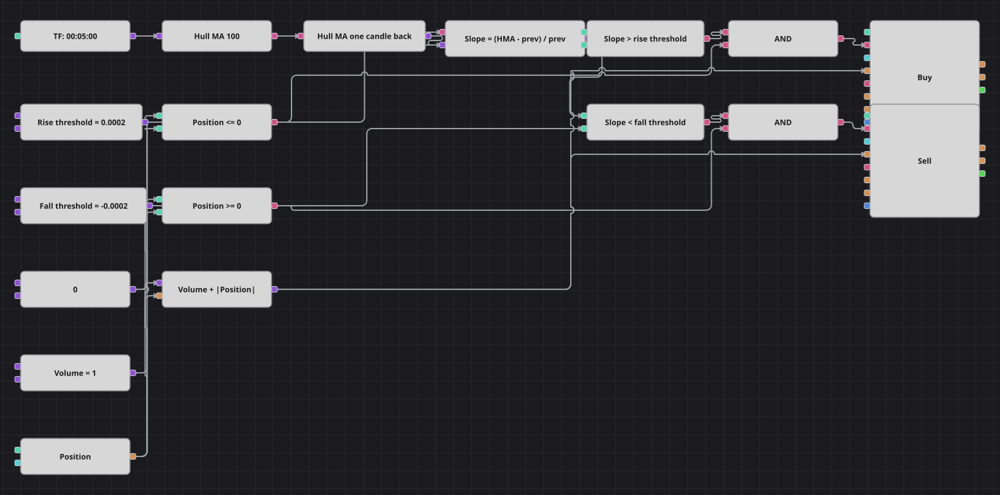

# Диаграмма трендовой стратегии по наклону Hull MA
[English](README.md) | [中文](README_zh.md) | [Español](README_es.md) | [Deutsch](README_de.md) | [Português](README_pt.md) | [日本語](README_ja.md)

Hull Moving Average следует за ценой почти без запаздывания, поэтому направление её собственного наклона уже является трендовым сигналом. Диаграмма измеряет, насколько средняя сдвинулась за одну свечу — в долях от собственного значения — и разворачивает позицию в эту сторону, как только движение превышает небольшой порог. В оригинале период равен 500 минутным свечам; здесь это 100 пятиминутных, тот же отрезок времени на поставляемой истории.

## Обзор стратегии

- Торгуется только наклон Hull Moving Average: сама цена со средней нигде не сравнивается.
- Наклон относительный, выражен долей от предыдущего значения, поэтому один и тот же порог работает на любом уровне цен.
- Выше +0,02% диаграмма хочет быть в лонге, ниже −0,02% — в шорте; внутри этой полосы ничего не происходит и открытая позиция сохраняется.
- После первого сигнала стратегия всегда в рынке: ни стопа, ни тейка, ни нулевой позиции между сделками — ровно как в исходном коде.

## Правила входа и выхода

- **Вход в лонг**: Hull Moving Average выросла за свечу больше, чем порог роста, а позиция не в лонге. Заявка покупает общий объём плюс размер открытого шорта, поэтому одна заявка разворачивает позицию.
- **Вход в шорт**: Hull Moving Average упала за свечу больше, чем порог падения, а позиция не в шорте. Заявка продаёт общий объём плюс размер открытого лонга.
- **Выход**: Отдельного выхода нет: позицию переворачивает противоположный сигнал наклона, а поскольку объём заявки уже включает модуль позиции, одна рыночная заявка закрывает одну сторону и открывает другую.

## Параметры

| Параметр | По умолчанию | Описание |
|---|---|---|
| Hull MA Length | 100 | Период Hull Moving Average, пересчитанный с 500 минутных свечей на 100 пятиминутных. |
| Rise Threshold | 0.0002 | Относительный рост средней за свечу, открывающий лонг; 0,0002 — это 0,02%. |
| Fall Threshold | -0.0002 | Относительное падение средней за свечу, открывающее шорт; зеркальное отражение порога роста. |
| Volume | 1 | Объём заявки в лотах до прибавления открытой позиции. |
| Candles | 00:05:00 | Таймфрейм свечей, на котором работает вся диаграмма. |

## Детали диаграммы

- Кубик предыдущего значения хранит Hull MA прошлой свечи и молчит на первом значении, что повторяет пропуск первого бара в исходном коде.
- Формула наклона вычитает прошлое значение из текущего и делит на прошлое, превращая движение в долю.
- Два сравнения делят эту долю на три состояния с помощью положительной и отрицательной пороговых констант.
- Каждое логическое И соединяет условие наклона с проверкой позиции, а формула объёма прибавляет модуль позиции к общему объёму — именно это превращает вход в разворот.

## Использование

Импортируйте файл `.json` в Designer, прогоните схему на исторических данных в тестере, затем подстройте параметры или сами кубики под свой инструмент, прежде чем торговать вживую.
