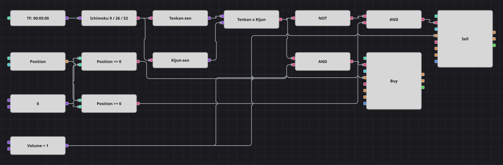

# Diagrama da estratégia de rompimento da nuvem Ichimoku
[English](README.md) | [Русский](README_ru.md) | [中文](README_zh.md) | [Español](README_es.md) | [Deutsch](README_de.md) | [日本語](README_ja.md)

O nome remete à nuvem do Ichimoku, mas a estratégia por trás deste diagrama negocia na verdade o par de linhas mais rápido: Tenkan-sen contra Kijun-sen. Ambas são o ponto médio entre a máxima e a mínima do seu período, de modo que o cruzamento já é um sinal de tendência compacto, e a nuvem fica deliberadamente fora da decisão.

## Visão geral da estratégia

- Um único bloco Ichimoku constrói as cinco linhas; dois conversores extraem apenas Tenkan-sen e Kijun-sen, e as linhas da nuvem não participam das regras.
- O bloco de cruzamento dispara somente no candle em que Tenkan-sen realmente cruza Kijun-sen, então uma tendência que apenas perdura não gera ordens repetidas.
- Cada entrada é combinada com a posição atual, e é isso que impede o diagrama de acumular lotes no lado que já mantém.

## Regras de entrada e saída

- **Entrada comprada**: Tenkan-sen cruza acima de Kijun-sen e a posição não está comprada. A ordem compra o volume fixo: abre uma compra a partir do zero ou encerra uma venda existente.
- **Entrada vendida**: Tenkan-sen cruza abaixo de Kijun-sen e a posição não está vendida. A ordem vende o volume fixo: abre uma venda a partir do zero ou encerra uma compra existente.
- **Saída**: Não há bloco de saída próprio nem stop de proteção: como todas as ordens usam o mesmo volume, o cruzamento contrário devolve a posição ao zero em vez de invertê-la, e o outro lado só é aberto no cruzamento seguinte.

## Parâmetros

| Parâmetro | Padrão | Descrição |
|---|---|---|
| Tenkan period | 9 | Período de Tenkan-sen, o ponto médio entre a máxima e a mínima desse número de candles. |
| Kijun period | 26 | Período de Kijun-sen, construído da mesma forma sobre uma janela mais longa. |
| Senkou Span B period | 52 | Período de Senkou Span B; não faz parte das regras e apenas afeta quantos candles o indicador precisa para se formar. |
| Volume | 1 | Volume da ordem, em lotes; o mesmo valor serve para abrir e para fechar. |
| Candles | 00:05:00 | Tempo gráfico dos candles com que todo o diagrama trabalha. |

## Detalhes do diagrama

- O bloco de candles alimenta um único bloco do indicador Ichimoku, e dois conversores leem os valores de Tenkan e Kijun a partir do valor do indicador complexo.
- As duas linhas se encontram no bloco de cruzamento, cuja saída é o sinal de compra; um NÃO lógico dela dá o sinal de venda.
- O bloco de posição é comparado duas vezes com uma constante zero, o que produz os filtros Posição <= 0 e Posição >= 0.
- Cada E lógico une um sinal de cruzamento a um filtro de posição e aciona um bloco de modificação de posição; ambos enviam ordens a mercado e obtêm o volume de uma constante compartilhada.

## Uso

Importe o arquivo `.json` no Designer, execute-o sobre dados históricos no backtester e depois ajuste os parâmetros ou os próprios blocos ao seu instrumento antes de operar ao vivo.
