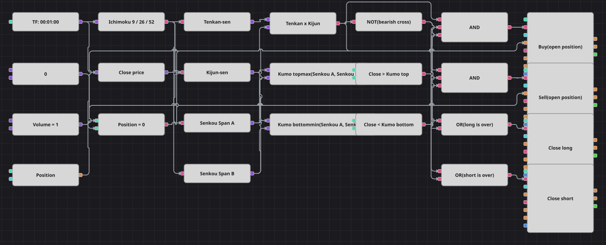

# Диаграмма стратегии пересечения Tenkan и Kijun по Ichimoku
[English](README.md) | [中文](README_zh.md) | [Español](README_es.md) | [Deutsch](README_de.md) | [Português](README_pt.md) | [日本語](README_ja.md)

Система Ichimoku использована здесь полностью: сигнал даёт быстрая пара линий, а разрешение на него — облако. Триггер — пересечение Tenkan-sen и Kijun-sen, а позиция открывается лишь тогда, когда цена закрытия находится с той же стороны облака Kumo, куда указывает пересечение.

## Обзор стратегии

- Один кубик Ichimoku строит все линии, а четыре конвертера достают из его составного значения Tenkan-sen, Kijun-sen, Senkou Span A и Senkou Span B.
- Два кубика формулы сворачивают линии Senkou в верхнюю и нижнюю границы облака, поэтому цену закрытия достаточно сравнить с облаком одним сравнением на сторону.
- Входы выполняются только из нуля, и это проверяется дважды: сравнением позиции с нулём и условием «только открытие» у самого кубика заявки.
- Выходы вынесены в отдельные кубики: обратное пересечение либо возврат закрытия внутрь облака отправляют позицию домой, а объём закрытия берётся из самой позиции.
- Оригинал игнорирует любые сигналы 500 свечей после сделки, задерживая и выходы; счётчика баров из этих кубиков не собрать, поэтому пауза опущена и диаграмма торгует чаще оригинала.

## Правила входа и выхода

- **Вход в лонг**: Tenkan-sen пересекает Kijun-sen снизу вверх, закрытие выше верхней границы облака, а позиция нулевая. Заявка покупает фиксированный объём и открывает лонг.
- **Вход в шорт**: Tenkan-sen пересекает Kijun-sen сверху вниз, закрытие ниже нижней границы облака, а позиция нулевая. Заявка продаёт фиксированный объём и открывает шорт.
- **Выход**: Лонг закрывается, когда Tenkan-sen уходит обратно под Kijun-sen или закрытие опускается ниже нижней границы облака; шорт — зеркально. Объём закрывающей заявки берётся из позиции, поэтому диаграмма возвращается в ноль, а не переворачивается; стоп-лосса и тейк-профита нет, как и в оригинале.

## Параметры

| Параметр | По умолчанию | Описание |
|---|---|---|
| Tenkan period | 9 | Период Tenkan-sen — середины между максимумом и минимумом за указанное число свечей. |
| Kijun period | 26 | Период Kijun-sen, который строится так же, но по более длинному окну. |
| Senkou Span B period | 52 | Период Senkou Span B — более медленной границы облака. |
| Volume | 1 | Объём заявки в лотах для открытия позиции; выходы закрывают столько, сколько открыто. |
| Candles | 00:01:00 | Таймфрейм свечей, на котором работает вся диаграмма. |

## Детали диаграммы

- Кубик свечей питает индикатор Ichimoku и конвертер цены закрытия.
- Tenkan-sen и Kijun-sen встречаются в кубике пересечения, выход которого — бычье пересечение; логическое НЕ от него даёт медвежье.
- Два сравнения с облаком используются и входами, и выходами: положение выше облака открывает лонг и закрывает шорт, ниже облака — наоборот.
- Каждый вход проходит через логическое И вместе с проверкой нулевой позиции, а каждый выход — через логическое ИЛИ, так что достаточно либо пересечения, либо пробоя облака, чтобы запустить кубик закрытия позиции.

## Использование

Импортируйте файл `.json` в Designer, прогоните схему на исторических данных в тестере, затем подстройте параметры или сами кубики под свой инструмент, прежде чем торговать вживую.
