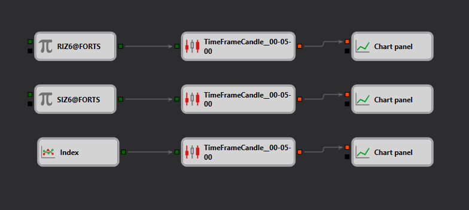

# Index Creation from Multiple Candle Series Diagram

This diagram file illustrates a strategy for creating a composite index from candle series of different financial instruments using the Designer platform's Strategy Gallery. The strategy aggregates data from various securities to form a unified index, which can be used to gauge the overall market sentiment or sector performance.

## Strategy Overview

The strategy involves combining price data from multiple securities into a single [index](https://doc.stocksharp.com/topics/designer/strategies/using_visual_designer/elements/data_sources/index.html). This process typically uses normalization or weighting techniques to ensure that each security contributes proportionally to the final index value.

## Components of the Diagram

- **Data Collection Nodes**: These nodes are responsible for fetching [candle data](https://doc.stocksharp.com/topics/designer/strategies/using_visual_designer/elements/data_sources/candles.html) for each selected security.
- **Normalization Nodes**: Apply normalization to the candle data to ensure uniform impact on the final [index calculation](https://doc.stocksharp.com/topics/designer/strategies/using_visual_designer/elements/data_sources/index.html), mitigating effects of varying price scales.
- **Weighting Nodes**: Assign weights to each security based on predefined criteria such as market capitalization or historical volatility.
- **Index Calculation Node**: Aggregates the normalized and weighted price data to calculate the final index value.

## Entry and Exit Points

- **Entry Points**: Typically, there are no traditional entry points since this strategy does not directly involve trading decisions.
- **Output**: The main output is the real-time index value, which reflects the collective movement of the included securities.

## Usage

Traders and analysts can use this diagram to:
- Monitor the overall performance of a specific sector or market by creating a custom index.
- Compare individual securities against the broader market index to identify overperformance or underperformance.
- Use the custom index as a benchmark for portfolio performance.

## Educational Value

This strategy diagram is especially valuable for educational purposes, providing insights into:
- The mechanics of index calculation and the importance of data normalization and weighting in financial analysis.
- The application of combined data from multiple sources to create meaningful financial metrics.

Users can import this diagram into the Designer platform to explore and modify the approach, adapt it to different sets of securities, or enhance the complexity of the index calculation methodology.

This file forms part of a diverse collection of strategies available in the Designer platform, intended to improve users’ understanding of financial data aggregation and index construction.
