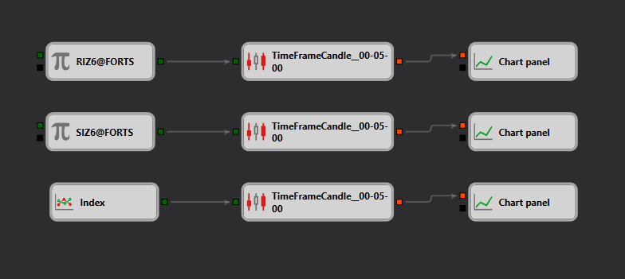

# Diagrama de Creación de Índice Compuesto a partir de Múltiples Series de Velas
[English](README.md) | [Русский](README_ru.md) | [中文](README_zh.md) | [Deutsch](README_de.md) | [Português](README_pt.md) | [日本語](README_ja.md)

Este archivo de diagrama ilustra una estrategia para crear un índice compuesto a partir de series de velas de diferentes instrumentos financieros utilizando la Galería de Estrategias de la plataforma Designer. La estrategia agrega datos de varios valores para formar un índice unificado, que puede utilizarse para evaluar el sentimiento general del mercado o el rendimiento de un sector.

## Descripción General de la Estrategia

La estrategia consiste en combinar los datos de precios de múltiples valores en un único [índice](https://doc.stocksharp.com/topics/designer/strategies/using_visual_designer/elements/data_sources/index.html). Este proceso utiliza normalmente técnicas de normalización o ponderación para garantizar que cada valor contribuya proporcionalmente al valor final del índice.

## Componentes del Diagrama

- **Nodos de Recopilación de Datos**: son responsables de obtener los [datos de velas](https://doc.stocksharp.com/topics/designer/strategies/using_visual_designer/elements/data_sources/candles.html) de cada valor seleccionado.
- **Nodos de Normalización**: aplican normalización a los datos de velas para garantizar un impacto uniforme en el [cálculo del índice](https://doc.stocksharp.com/topics/designer/strategies/using_visual_designer/elements/data_sources/index.html) final, mitigando los efectos de las diferentes escalas de precios.
- **Nodos de Ponderación**: asignan pesos a cada valor en función de criterios predefinidos, como la capitalización de mercado o la volatilidad histórica.
- **Nodo de Cálculo del Índice**: agrega los datos de precios normalizados y ponderados para calcular el valor final del índice.

## Puntos de Entrada y Salida

- **Puntos de Entrada**: generalmente no existen puntos de entrada tradicionales, ya que esta estrategia no implica decisiones de trading directas.
- **Salida**: la salida principal es el valor del índice en tiempo real, que refleja el movimiento colectivo de los valores incluidos.

## Uso

Los traders y analistas pueden utilizar este diagrama para:
- monitorear el rendimiento general de un sector o mercado específico creando un índice personalizado;
- comparar valores individuales con el índice de mercado más amplio para identificar un rendimiento superior o inferior;
- utilizar el índice personalizado como referencia para el rendimiento de la cartera.

## Valor Educativo

Este diagrama de estrategia es especialmente valioso con fines educativos, ya que proporciona información sobre:
- la mecánica del cálculo de índices y la importancia de la normalización y ponderación de datos en el análisis financiero;
- la aplicación de datos combinados de múltiples fuentes para crear métricas financieras significativas.

Los usuarios pueden importar este diagrama en la plataforma Designer para explorar y modificar el enfoque, adaptarlo a diferentes conjuntos de valores o aumentar la complejidad de la metodología de cálculo del índice.

Este archivo forma parte de una colección diversa de estrategias disponibles en la plataforma Designer, destinada a mejorar la comprensión de los usuarios sobre la agregación de datos financieros y la construcción de índices.
