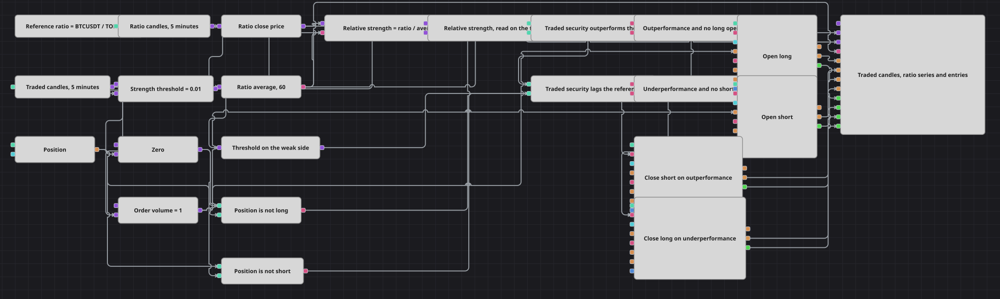

# Схема относительной силы по отношению к эталонному инструменту
[English](README.md) | [中文](README_zh.md) | [Español](README_es.md) | [Deutsch](README_de.md) | [Português](README_pt.md) | [日本語](README_ja.md)

Эта схема строит синтетический инструмент из отношения торгуемого инструмента к эталонному, измеряет, насколько это отношение ушло от собственной простой скользящей средней с периодом 60, и торгует торгуемым инструментом по полученному результату. Отношение на один процент выше своей средней означает, что торгуемый инструмент опережает эталонный, и схема открывает длинную позицию; на один процент ниже — что он отстаёт, и схема открывает короткую. Заявки всегда выставляются по торгуемому инструменту; синтетический инструмент участвует только в принятии решения.

## Обзор стратегии

- Кубик Security index строит синтетический инструмент по выражению `BTCUSDT@BNBFT/TONUSDT@BNBFT`. Его свечи — это цена одного инструмента, выраженная в единицах другого, поэтому растущий ряд означает, что торгуемый инструмент выигрывает у эталонного.
- Завершённые пятиминутные свечи этого синтетического инструмента поступают в Converter, который читает цену закрытия, и в SimpleMovingAverage длиной 60, работающую только по сформированным значениям, — это пять часов того же ряда.
- Formula делит цену закрытия отношения на его среднюю и вычитает единицу, получая относительную силу в виде доли: `+0.01` означает, что отношение стоит на один процент выше своей пятичасовой средней, `-0.01` — на один процент ниже.
- Отдельный ряд завершённых пятиминутных свечей торгуемого инструмента задаёт цикл принятия решений. Variable, вход которой используется только как хранилище, держит последнее значение относительной силы и отдаёт его на свече торгуемого инструмента, поэтому каждое сравнение и каждая заявка получают отметку времени торгуемого бара, а не синтетического.
- Два кубика Comparison сравнивают отданное значение с порогом и с его отрицанием, полученным через Formula `0 - a`, так что одно выведенное наружу число симметрично управляет обеими сторонами.
- Текущая Position дважды сравнивается с нулём, давая `Position <= 0` и `Position >= 0`. Два кубика Logical condition объединяют каждый сигнал силы с соответствующей проверкой позиции, поэтому уже открытая сторона не может получить ещё один вход.
- Из нулевой позиции кубик Position modify в режиме Open position покупает или продаёт фиксированный Order Volume по рынку. Ни стоп-лосса, ни тейк-профита в схеме нет.
- Позиция, открытая против свежего сигнала, сначала закрывается кубиком Position modify в режиме Close position, а разворот остаётся следующей подходящей свече.

## Правила входа и выхода

- **Вход в лонг**: На завершённой свече торгуемого инструмента, когда отданная относительная сила больше Strength Threshold, а позиция не длинная, срабатывает условие длинного входа. Из нулевой позиции кубик Open position покупает Order Volume по рынку. Из короткой позиции вход на этом баре отклоняется, потому что первым выполняется закрытие; длинная позиция открывается на следующей свече, которая по-прежнему показывает опережение.
- **Вход в шорт**: На завершённой свече торгуемого инструмента, когда отданная относительная сила меньше отрицательного значения Strength Threshold, а позиция не короткая, срабатывает условие короткого входа. Из нулевой позиции кубик Open position продаёт Order Volume по рынку. Из длинной позиции вход на этом баре отклоняется, потому что первым выполняется закрытие; короткая позиция открывается на следующей свече, которая по-прежнему показывает отставание.
- **Выход**: Отдельного правила выхода нет, как нет стоп-лосса и тейк-профита. Позиция закрывается только по сигналу в противоположном направлении: опережение закрывает короткую позицию, отставание — длинную. Закрывающее действие берёт объём из открытой позиции, поэтому после него позиции не остаётся, а противоположная сторона открывается на следующей свече, если сигнал сохраняется.

## Параметры

| Параметр | По умолчанию | Описание |
|---|---|---|
| Index Expression | BTCUSDT@BNBFT/TONUSDT@BNBFT | Выражение, по которому строится синтетический инструмент. Первый инструмент — числитель, второй — эталонный знаменатель, поэтому ряд растёт, когда числитель выигрывает у эталона. Измените его, чтобы измерять торгуемый инструмент относительно другого эталона. |
| Ratio Candles | 00:05:00 | Таймфрейм свечей синтетического инструмента. Он должен совпадать с торгуемым рядом, потому что отдаваемая сила — это одно значение на один торгуемый бар. |
| Traded Candles | 00:05:00 | Таймфрейм свечей торгуемого инструмента. Каждое сравнение, каждый вход и каждый выход вычисляются один раз на завершённую свечу этого ряда. |
| Reference Average Length | 60 | Число баров в простой скользящей средней отношения. Шестьдесят пятиминутных баров измеряют силу за последние пять часов; более длинная средняя измеряет более медленное и редкое расхождение и даёт меньше сделок. |
| Strength Threshold | 0.01 | Расстояние от средней в долях, которое отношение должно пройти, прежде чем будет взята сторона. `0.01` — это один процент, применяемый выше средней для длинных входов и ниже неё для коротких. Уменьшите его, чтобы торговать чаще, увеличьте — чтобы требовать более широкого расхождения. |
| Order Volume | 1 | Фиксированный объём каждого входа. Закрывающие действия его игнорируют и берут объём из открытой позиции. |

## Детали диаграммы

- Кубик [Security index](https://doc.stocksharp.com/en/topics/designer/strategies/using_visual_designer/elements/data_sources/index.html) содержит выражение, по которому строится синтетический инструмент, и подаёт его на вход Security одного кубика [Candles](https://doc.stocksharp.com/en/topics/designer/strategies/using_visual_designer/elements/data_sources/candles.html). Второй кубик Candles, оставленный на инструменте стратегии, даёт торгуемый ряд. Оба настроены только на завершённые свечи, поэтому ни один формирующийся бар не может датировать заявку началом собственного бара.
- [Converter](https://doc.stocksharp.com/en/topics/designer/strategies/using_visual_designer/elements/common/converter.html) читает цену закрытия синтетической свечи, а [Indicator](https://doc.stocksharp.com/en/topics/designer/strategies/using_visual_designer/elements/common/indicator.html), работающий только по сформированным значениям, усредняет тот же ряд по 60 барам. [Formula](https://doc.stocksharp.com/en/topics/designer/strategies/using_visual_designer/elements/common/formula.html) `a / b - 1` превращает эту пару в одну знаковую долю, а вторая Formula `0 - a` зеркалит порог на слабую сторону.
- Синтетическая свеча собирается из двух потоков и завершается после обычной свечи той же минуты. Поэтому [Variable](https://doc.stocksharp.com/en/topics/designer/strategies/using_visual_designer/elements/data_sources/variable.html) сохраняет силу на своём входе и выдаёт её только по триггеру от свечи торгуемого инструмента — именно это удерживает отметки времени заявок на часах торгуемого инструмента. Константы порога, нуля и объёма заявки триггерятся от той же свечи, чтобы каждое [Comparison](https://doc.stocksharp.com/en/topics/designer/strategies/using_visual_designer/elements/common/comparison.html) видело оба своих операнда в пределах одного вычисления.
- [Position](https://doc.stocksharp.com/en/topics/designer/strategies/using_visual_designer/elements/positions/current.html) сравнивается с нулём на каждой свече торгуемого инструмента, а два кубика [Logical condition](https://doc.stocksharp.com/en/topics/designer/strategies/using_visual_designer/elements/common/logical_condition.html) соединяют результат по силе с результатом по позиции. До торгового кубика доходит только результат `true`; сравнение с результатом `false` отбрасывается на входе триггера.
- Четыре кубика [Position modify](https://doc.stocksharp.com/en/topics/designer/strategies/using_visual_designer/elements/positions/modify.html) действуют рыночными заявками. Два входных кубика используют условие Open position, поэтому срабатывают только при нулевой позиции и не могут повториться, пока сторона открыта. Два выходных кубика используют условие Close position, которое берёт объём из открытой позиции и ничего не делает, если позиции уже нет или она уже находится на запрошенной стороне.

## Использование

Импортируйте файл `.json` в Designer, прогоните схему на исторических данных в тестере, затем подстройте параметры или сами кубики под свой инструмент, прежде чем торговать вживую.
