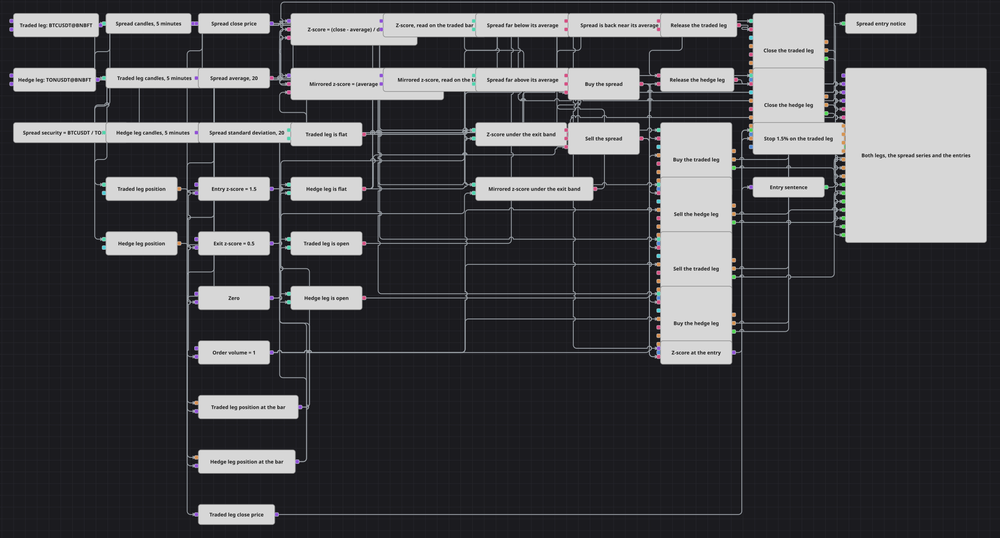

# Diagramm der Delta-neutralen Spread-Z-Score-Strategie
[English](README.md) | [Русский](README_ru.md) | [中文](README_zh.md) | [Español](README_es.md) | [Português](README_pt.md) | [日本語](README_ja.md)

Zwei Instrumente, die sich normalerweise gemeinsam bewegen, laufen manchmal auseinander, und der Abstand zwischen ihnen schließt sich in der Regel wieder. Das Diagramm teilt den einen Preis durch den anderen und erhält so ein synthetisches Instrument, misst, wie weit dieses Verhältnis von seinem eigenen Durchschnitt abgewichen ist – in Einheiten seiner eigenen Schwankungsbreite – und eröffnet beide Instrumente gleichzeitig in entgegengesetzter Richtung: long auf der billigen Seite gegen short auf der teuren. Kehrt das Verhältnis dorthin zurück, wo es üblicherweise liegt, werden beide Legs geschlossen. Jeder Einstieg wird zudem als Textzeile ausgegeben, die den auslösenden Messwert trägt.

## Strategieübersicht

- Ein Index-Block baut aus den beiden realen Instrumenten ein synthetisches Instrument, indem er den Preis des ersten durch den Preis des zweiten teilt; auf dieses synthetische Instrument wird eine Kerzenserie abonniert. Der Spread kommt damit als fertige Kerzen an, statt von Hand aus zwei Datenströmen zusammengesetzt zu werden.
- Über die Spread-Kerzen laufen ein gleitender Durchschnitt und eine Standardabweichung, und ein Konverter greift deren Schlusskurs ab. Diese drei Zahlen sind alles, was die Entscheidung braucht: wo der Spread steht, wo er üblicherweise liegt und wie weit er üblicherweise schwankt.
- Eine Formel macht daraus einen Z-Score – den Abstand vom Schlusskurs zum Durchschnitt, geteilt durch die Abweichung –, und eine gespiegelte Formel liefert denselben Wert mit umgekehrtem Vorzeichen. So genügen eine einzige Einstiegsschwelle und eine einzige Ausstiegsschwelle für beide Richtungen, ohne ein zweites Paar Konstanten.
- Zwei weitere Kerzenserien laufen auf den beiden Instrumenten, die tatsächlich gehandelt werden, und zwei Variablen koppeln die Messwerte an das gehandelte Instrument: Jede hält den letzten vom Spread erzeugten Wert fest und gibt ihn frei, sobald eine Kerze des gehandelten Instruments abgeschlossen ist. Damit trägt jede Entscheidung die Uhr des Instruments, an das die Orders gehen.
- Zwei Positions-Blöcke, einer je Instrument, melden, was offen ist. Ihre Werte werden auf derselben Kerze des gehandelten Instruments festgehalten und mit null verglichen; das liefert dem Diagramm vier einfache Antworten: Jedes Leg ist entweder flat (ohne Position) oder offen.
- Vergleiche gegen die Einstiegsschwelle sagen, ob der Spread weit unter oder weit über seinem Durchschnitt liegt, und eine logische Bedingung verknüpft das damit, dass beide Legs ohne Position sind. Erst dann lösen vier Positions-Blöcke gemeinsam aus, kaufen das eine Instrument und verkaufen das andere in derselben Größe.
- Zwei Vergleiche gegen die Ausstiegsschwelle, durch eine logische Bedingung verbunden, sagen, dass der Messwert betragsmäßig klein ist, der Spread also wieder nahe an seinem Durchschnitt liegt. Jedes Leg hat sein eigenes Freigabe-Gate, sodass ein Leg, das bereits ohne Position ist, nie zum Schließen aufgefordert wird und ein noch offenes Leg immer.
- Im Moment des Einstiegs hält eine Variable den auslösenden Z-Score fest, ein String-Formatter schreibt ihn in einen Satz, und ein Benachrichtigungs-Block stellt diesen Satz in das Strategieprotokoll. Das Chart-Panel zeichnet beide gehandelten Instrumente, die synthetische Spread-Serie, den Durchschnitt, die Abweichung sowie jede Order und jede Ausführung.

## Ein- und Ausstiegsregeln

- **Long-Einstieg**: Der gespiegelte Z-Score liegt über der Einstiegsschwelle – der Spread steht also um mehr als diese Anzahl Standardabweichungen unter seinem eigenen Durchschnitt – und beide Legs sind ohne Position. Das Diagramm kauft das gehandelte Instrument und verkauft das Hedge-Instrument, beides als Market-Order und beides im Ordervolumen.
- **Short-Einstieg**: Der Z-Score liegt über der Einstiegsschwelle – der Spread steht also um mehr als diese Anzahl Standardabweichungen über seinem eigenen Durchschnitt – und beide Legs sind ohne Position. Das Diagramm verkauft das gehandelte Instrument und kauft das Hedge-Instrument, beides als Market-Order und beides im Ordervolumen.
- **Ausstieg**: Beide Legs werden geschlossen, sobald der absolute Z-Score unter die Ausstiegsschwelle fällt, der Spread also in ein enges Band um seinen Durchschnitt zurückgekehrt ist. Die beiden schließenden Blöcke haben keine eigene Richtung und sind auf das Schließen der Position gesetzt: Jeder ermittelt selbst, in welche Richtung und in welcher Größe gehandelt wird, sodass dasselbe Blockpaar einen Long-Spread ebenso auflöst wie einen Short-Spread. Zusätzlich trägt das gehandelte Leg einen prozentualen Stop-Loss, gemessen vom Ausführungspreis. Dieser Stop deckt nur ein Leg ab: Eine gepaarte Position lässt sich nicht durch eine einzige Schutz-Order schließen, deshalb behält das Hedge-Leg sein eigenes Freigabe-Gate und wird geschlossen, wenn der Spread zurückkehrt.

## Parameter

| Parameter | Standard | Beschreibung |
|---|---|---|
| Index Expression | BTCUSDT@BNBFT/TONUSDT@BNBFT | Der Ausdruck, aus dem das synthetische Instrument gebaut wird: der Preis des gehandelten Instruments geteilt durch den Preis des Hedge-Instruments. Beide Instrumente müssen in den angebundenen Daten vorhanden sein, und beide werden gehandelt. |
| Spread Candles | 00:05:00 | Länge der Kerzen, auf denen die Spread-Serie aufgebaut wird, und damit der Bar, über die Durchschnitt und Abweichung gemessen werden. |
| Traded Leg Candles | 00:05:00 | Länge der Kerzen, auf denen das gehandelte Leg verfolgt wird. Das ist die Uhr, nach der das gesamte Diagramm läuft; halte sie gleich der Spread-Serie, sonst sind die festgehaltenen Messwerte älter als die Bar, auf der sie gelesen werden. |
| Hedge Leg Candles | 00:05:00 | Länge der Kerzen, auf denen das Hedge-Leg verfolgt wird. Die Serie existiert, damit die Preise des Hedge-Instruments in den Lauf gelangen und im Chart erscheinen; halte sie gleich den anderen beiden. |
| Average Length | 20 | Anzahl der Spread-Kerzen im gleitenden Durchschnitt, von dem aus der Z-Score gemessen wird. |
| Deviation Length | 20 | Anzahl der Spread-Kerzen in der Standardabweichung, durch die der Z-Score geteilt wird. Halte sie gleich der Durchschnittslänge, sofern nicht bewusst ein schnelles Niveau gegen eine langsame Breite gewünscht ist. |
| Entry Z-Score | 1.5 | Wie viele Standardabweichungen der Spread von seinem Durchschnitt entfernt sein muss, bevor das Paar eröffnet wird. Ein höherer Wert macht Einstiege seltener und die Abweichung, bei der sie erfolgen, größer. |
| Exit Z-Score | 0.5 | Wie nahe der Spread wieder an seinen Durchschnitt kommen muss, bevor beide Legs geschlossen werden. Es ist ein Betrag und deckt beide Seiten ab, sodass dieselbe Zahl einen Long-Spread wie einen Short-Spread schließt. |
| Order Volume | 1 | Größe jedes Legs in Lots. Beide Legs werden in derselben Größe gesendet. |
| Stop Loss, % | 1.5 | Stop-Loss für das gehandelte Leg, in Prozent des Preises, zu dem es ausgeführt wurde. Er schützt nur ein Leg; das Hedge-Leg hat keinen eigenen Stop. |

## Diagrammdetails

- Das synthetische Instrument ist ein Verhältnis und keine Differenz. Eine Differenz zwischen zwei Instrumenten mit sehr unterschiedlichem Preisniveau wird vom größeren dominiert; der Z-Score würde dann dieses eine Instrument messen statt der Beziehung zwischen beiden.
- Die beiden Serien enden nicht im selben Augenblick: Ein synthetisches Instrument wird aus zwei Datenströmen zusammengesetzt, und seine Kerze schließt etwas später als eine gewöhnliche. Das Festhalten der Messwerte auf der Kerze des gehandelten Instruments hält das gesamte Diagramm auf einer einzigen Uhr; gäbe man stattdessen beide Serien gemeinsam frei, erhielte jede Order den Zeitstempel der früheren der beiden – und eine Order mit einem Zeitstempel vor der aktuellen Zeit wird abgelehnt.
- Die Konstanten werden von der Kerze des gehandelten Instruments ausgelöst. Ein Vergleich braucht für jede Auswertung beide seiner Werte erneut; eine Konstante, die nie wieder gesendet wird, legt daher die von ihr gespeiste Bedingung stillschweigend lahm.
- Die Division, die den Z-Score erzeugt, ist nach unten auf eine sehr kleine positive Zahl begrenzt, damit eine Phase völlig unbewegter Preise nicht durch eine Abweichung von null teilt und den Lauf anhält.
- Jedes Leg wird von einem eigenen Positions-Block überwacht und separat freigegeben; nimmt der Stop zuerst das gehandelte Leg heraus, wird das Hedge-Leg dennoch über seine eigene Bedingung geschlossen und bleibt nicht bis zum nächsten Einstieg stehen.

## Verwendung

Importieren Sie die `.json`-Datei in Designer, testen Sie sie im Backtester mit historischen Daten und passen Sie danach Parameter oder Bausteine an Ihr Instrument an, bevor Sie live handeln.
