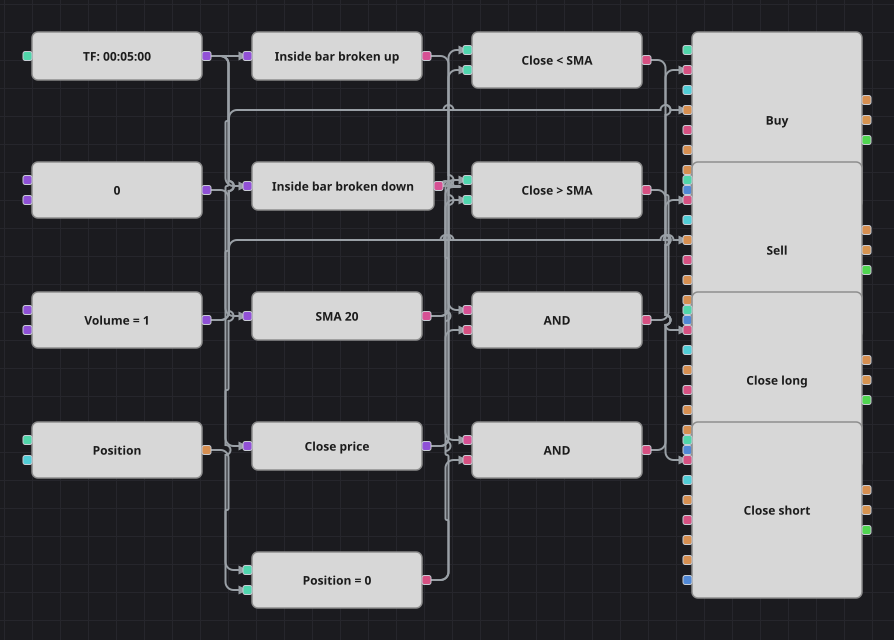

# Diagrama da estratégia de rompimento do inside bar
[English](README.md) | [Русский](README_ru.md) | [中文](README_zh.md) | [Español](README_es.md) | [Deutsch](README_de.md) | [日本語](README_ja.md)

Um inside bar é um candle cuja amplitude inteira cabe dentro da amplitude do candle anterior: compradores e vendedores pararam de pressionar e o mercado ficou comprimido. O diagrama espera que o candle imediatamente seguinte saia dessa faixa e entra no rompimento no sentido da saída; daí em diante uma média móvel simples conduz a operação e decide quando o movimento acabou.

## Visão geral da estratégia

- Dois blocos de padrão de candles carregam, cada um, uma fórmula de três candles: um primeiro candle sem restrições, um inside bar estritamente contido nele e um candle de rompimento.
- A fórmula comprada exige do candle de rompimento uma máxima acima da máxima do inside bar; a vendida, uma mínima abaixo da sua mínima.
- A média móvel simples do preço de fechamento é o único indicador: não participa da entrada e serve apenas como linha de saída.
- A verificação da posição garante que o rompimento só seja operado a partir do zero, então um padrão gera uma única operação.

## Regras de entrada e saída

- **Entrada comprada**: O bloco de padrão informa um inside bar cuja máxima acaba de ser rompida pelo candle seguinte e a posição está zerada. A ordem compra um lote e abre uma compra.
- **Entrada vendida**: O bloco de padrão informa um inside bar cuja mínima acaba de ser perdida pelo candle seguinte e a posição está zerada. A ordem vende um lote e abre uma venda.
- **Saída**: A compra é encerrada quando um candle fecha abaixo da média móvel e a venda quando fecha acima dela, ambas por blocos de modificação de posição em modo de fechamento, exatamente como na estratégia original. O que o diagrama não reproduz é a espera sem prazo do código: lá as extremidades do inside bar ficam guardadas e o rompimento é aceito muitos candles depois, enquanto aqui o bloco de padrão enxerga apenas uma janela de tamanho fixo, de modo que o rompimento precisa chegar no candle logo seguinte. Esse é o caso mais comum do padrão, mas os rompimentos tardios se perdem. A pausa de várias centenas de barras entre operações também não tem bloco próprio e foi omitida.

## Parâmetros

| Parâmetro | Padrão | Descrição |
|---|---|---|
| SMA Length | 20 | Período de suavização da média móvel simples que encerra as operações. |
| Volume | 1 | Volume da ordem, em lotes. |
| Candles | 00:05:00 | Tempo gráfico dos candles com que todo o diagrama trabalha. |

## Detalhes do diagrama

- O bloco de candles alimenta os dois blocos de padrão, a média móvel e um conversor que extrai o preço de fechamento do candle.
- Cada bloco de padrão contém três fórmulas, uma por candle do padrão, e responde verdadeiro apenas no candle que completa o rompimento.
- O bloco de posição é comparado com uma constante zero, e cada E lógico une essa proteção a um dos dois sinais de rompimento.
- Os dois blocos de entrada enviam ordens a mercado e tiram o volume de uma constante compartilhada; os dois blocos de saída são acionados diretamente pelas comparações com a média e só agem quando há algo a encerrar.

## Uso

Importe o arquivo `.json` no Designer, execute-o sobre dados históricos no backtester e depois ajuste os parâmetros ou os próprios blocos ao seu instrumento antes de operar ao vivo.
