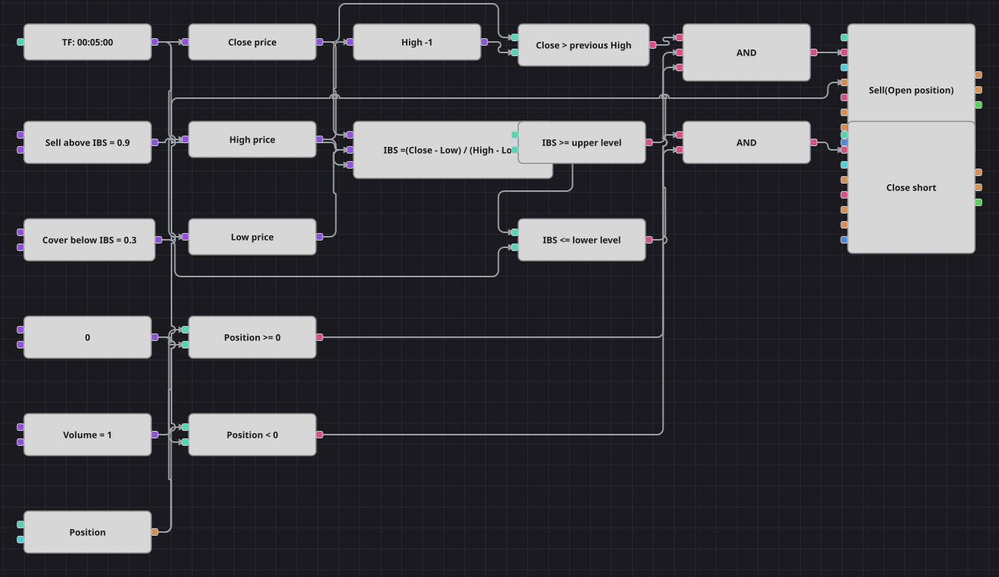

# Internal Bar Strength (IBS) Mean Reversion Strategy Diagram
[Русский](README_ru.md) | [中文](README_zh.md) | [Español](README_es.md) | [Deutsch](README_de.md) | [Português](README_pt.md) | [日本語](README_ja.md)

Internal Bar Strength asks a single question about a finished candle: where inside its own range did it close? Zero means it closed on the low, one means it closed on the high. This diagram sells only, and only into strength — a candle that breaks the previous high and still finishes pinned to the top of its range is treated as a stretched move that is about to give something back.

## Strategy Overview

- IBS is not an indicator block: it is one formula, (Close - Low) divided by the range of the same candle, so the whole measure fits in a single readable expression.
- A previous-value block keeps the high of the candle before, which is what the breakout condition is measured against.
- The strategy is short-only by design; the buy block exists purely to close the short and never opens a long.
- There is no stop and no target — the trade is handed entirely to the second IBS threshold.

## Entry and Exit Rules

- **Long entry**: There is no long entry. The diagram only sells, exactly as the original strategy does.
- **Short entry**: The candle closed above the high of the previous candle, its IBS is at or above the upper threshold, and the position is not already short. The order sells one lot and opens a short.
- **Exit**: The short is bought back when a candle's IBS drops to the lower threshold or below, that is when the close returns to the bottom part of its own range, and the buy runs in close mode so it flattens the position instead of reversing it. The original has neither a stop loss nor a take profit, and neither is added here. Two details differ from the code. The original works on four-hour candles, which would leave only a few hundred bars in the packaged one-month history, so the diagram runs on five-minute candles instead. And the original simply skips a candle whose high equals its low; the formula here divides by the range floored at one price step, which yields an IBS of zero on such a candle and keeps it out of both conditions. The SimpleMovingAverage the original creates is not reproduced, because its value never enters a single decision there.

## Parameters

| Parameter | Default | Description |
|---|---|---|
| Upper IBS Threshold | 0.9 | IBS level at or above which a breakout candle is sold. |
| Lower IBS Threshold | 0.3 | IBS level at or below which the short is bought back. |
| Volume | 1 | Order volume, in lots. |
| Candles | 00:05:00 | Candle time frame the whole diagram works on; the original uses four-hour candles, this diagram the five-minute candles of the packaged history. |

## Diagram Details

- Three converters read the close, the high and the low of every finished candle out of the candle block.
- One formula block turns those three numbers into Internal Bar Strength, with the range floored so a flat candle cannot divide by zero.
- A previous-value block delays the high by one candle, and a comparison checks the close against it — this is the breakout half of the entry.
- The position block is compared with a zero constant twice: one guard lets the entry through only when the diagram is not already short, the other lets the exit act only when a short exists.

## Usage

Import the `.json` file into Designer, run it in the backtester on historical data, then adjust the parameters or the blocks themselves to fit your instrument before trading it live.
